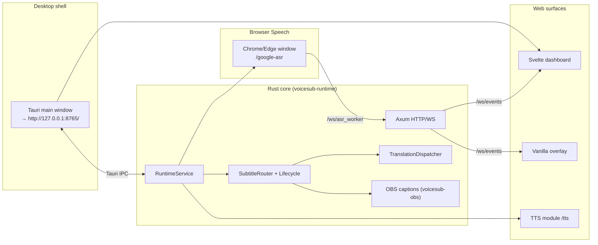

# VoiceSub 0.5.5 — Technical Architecture Document

Valid for the codebase where `voicesub-types::PROJECT_VERSION = "0.5.5"`.

This document describes the VoiceSub project layout, HTTP/WebSocket/Tauri IPC contracts, configuration schema, data flow through the Rust runtime, and frontend surfaces. It is the **canonical technical reference** for active development. README is a short product overview; CHANGELOG is release history; agent policy is `AGENTS.md`.

**Maintenance rule:** any change to API/WS/IPC contracts, config schema, subtitle/translation lifecycle, overlay renderer, browser worker, or NSIS installer bundle **updates the corresponding sections in the same task**. Outdated wording is removed or rewritten — not kept "for history".

## Table of Contents

- [Related Documentation](#related-documentation)
- [Quick Reference](#quick-reference)
- [1. Purpose and System Boundaries](#1-purpose-and-system-boundaries)
- [2. Technology Stack](#2-technology-stack)
- [3. High-Level Runtime Diagram](#3-high-level-runtime-diagram)
- [4. Repository Layout](#4-repository-layout)
- [5. Rust Workspace (crates)](#5-rust-workspace-crates)
- [6. RuntimeService: Orchestration and Lifecycle](#6-runtimeservice-orchestration-and-lifecycle)
- [7. Configuration and Migrations](#7-configuration-and-migrations)
- [8. HTTP API (local)](#8-http-api-local)
- [9. WebSocket Surface](#9-websocket-surface)
- [10. Tauri IPC](#10-tauri-ipc)
- [11. Logs, Diagnostics, Export](#11-logs-diagnostics-export)
- [12. Browser Speech Worker](#12-browser-speech-worker)
- [13. Translation: Lifecycle and Invariants](#13-translation-lifecycle-and-invariants)
- [14. Subtitle Lifecycle and Presentation](#14-subtitle-lifecycle-and-presentation)
- [15. Subtitle Styles and Overlay](#15-subtitle-styles-and-overlay)
- [16. OBS Closed Captions](#16-obs-closed-captions)
- [17. TTS Module](#17-tts-module)
- [18. Desktop Runtime and NSIS Release](#18-desktop-runtime-and-nsis-release)
- [19. Storage and Paths](#19-storage-and-paths)
- [20. Frontend: Dashboard (Svelte)](#20-frontend-dashboard-svelte)
- [21. Frontend: Overlay (vanilla)](#21-frontend-overlay-vanilla)
- [22. Frontend: Browser Worker (Svelte)](#22-frontend-browser-worker-svelte)
- [23. UI Localization (i18n)](#23-ui-localization-i18n)
- [24. Versioning and Update Checks](#24-versioning-and-update-checks)
- [25. Testing](#25-testing)
- [26. Product Invariants](#26-product-invariants)
- [27. Known Limitations & Technical Debt](#27-known-limitations--technical-debt)
- [28. Security & Privacy Model](#28-security--privacy-model)
- [29. Extension Points](#29-extension-points)
- [30. Glossary](#30-glossary)

## Related Documentation

| Document | Purpose |
| --- | --- |
| `docs/WIKI.en.md` | User guide (EN) |
| `docs/WIKI.ru.md` | User guide (RU) |
| `docs/TECHNICAL_ARCHITECTURE.en.md` | Technical architecture (English) |
| `docs/CHANGELOG.md` | Change history |
| `AGENTS.md` | Agent policy |

## Quick Reference

### Dev build and test

```bash
# Rust tests
cargo test --workspace

# Frontend build (dashboard + worker + TTS)
npm run build

# NSIS release (Windows)
build-release-msi.bat   # → build-release.ps1
```

Tauri dev: embedded HTTP on `http://127.0.0.1:8765`; main webview opens the dashboard at that URL.

### Key URLs (default bind)

| URL | Purpose |
| --- | --- |
| `http://127.0.0.1:8765/` | Svelte dashboard |
| `http://127.0.0.1:8765/overlay` | OBS Browser Source |
| `http://127.0.0.1:8765/google-asr?autostart=1` | Browser Speech worker |
| `http://127.0.0.1:8765/google-asr-edge` | Same worker (Edge smoke) |
| `http://127.0.0.1:8765/tts` | TTS module UI |

### Key API endpoints

| Endpoint | Purpose |
| --- | --- |
| `POST /api/runtime/start` | Start session + launch Chrome worker |
| `POST /api/runtime/stop` | Stop worker, translation, OBS |
| `GET /api/runtime/status` | Runtime snapshot + diagnostics |
| `GET /api/settings/load` | Load config + presets + fonts |
| `POST /api/settings/save` | Normalize + save `config.toml` |
| `POST /api/ui/sync` | UI theme/locale sync → `ui_config_sync` |
| `GET /api/exports/diagnostics` | Redacted diagnostics ZIP |
| `GET /api/obs/url` | `{ overlay_url }` for OBS |

### WebSocket channels

| Channel | Purpose |
| --- | --- |
| `/ws/events` | Dashboard, overlay, runtime/subtitle events |
| `/ws/asr_worker` | Browser Speech worker transport |

### Key files

| File | Purpose |
| --- | --- |
| `crates/voicesub-types/src/version.rs` | `PROJECT_VERSION` |
| `crates/voicesub-runtime/src/service.rs` | Orchestration, start/stop |
| `crates/voicesub-runtime/src/http/router.rs` | All HTTP/WS routes |
| `crates/voicesub-subtitle/src/lifecycle.rs` | Subtitle FSM/TTL |
| `crates/voicesub-translation/src/dispatcher.rs` | Translation queue + stale drop |
| `src-tauri/src/lib.rs` | Tauri shell + IPC |
| `bin/overlay/shared/js/subtitle-style.js` | Shared overlay renderer |

## 1. Purpose and System Boundaries

**VoiceSub** is a local Windows-first desktop app for real-time subtitles:

- speech capture via **Browser Speech worker** (separate Chrome/Edge window with visible address bar, Web Speech API);
- optional translation to 0..5 target languages with independent provider per slot;
- unified subtitle payload routing to Svelte dashboard, vanilla OBS overlay, and OBS Closed Captions;
- optional **TTS module** (subtitle speech, Twitch chat TTS);
- diagnostics ZIP export and client-side trace logs.

**Core ASR:** `browser_google` only — Web Speech at `/google-asr` and `/google-asr-edge`. Local ASR and experimental worker routes are not part of the product.

Hard boundaries:

- local-first runtime, default bind `127.0.0.1:8765`;
- no cloud backend, accounts, or hosted database;
- **Node.js forbidden in shipped runtime**; Vite/Node only on dev/build machines;
- dashboard and worker are Svelte (compile-time bundle); overlay is **vanilla HTML/JS** (no Svelte);
- **WebView2 Runtime** — required for the Tauri shell (`VoiceSub.exe`, dashboard, `/tts`); NSIS installer can run the bootstrapper if missing.
- Chrome is a separate system dependency for the Web Speech worker; core installer does not bundle Python/torch/Node.

## 2. Technology Stack

| Layer | Technologies |
| --- | --- |
| Core runtime | Rust 1.85+ (edition 2024), Tokio, Axum 0.8 |
| Desktop shell | Tauri 2 → `VoiceSub.exe` (NSIS `setup.exe`) |
| Dashboard UI | Svelte 5 + Vite → `bin/dashboard/` |
| Browser worker | Svelte 5 + Vite → `bin/worker/` |
| TTS UI | Svelte 5 + Vite → `bin/tts/` |
| OBS overlay | Vanilla HTML/CSS/JS → `bin/overlay/` |
| Config | TOML (`user-data/config.toml`), JSON-shaped document inside |
| HTTP client (providers) | `reqwest` + rustls |
| Logging | `tracing` + rotating files + opt-in JSONL |
| TTS sidecar | Embedded Python exe in `bin/modules/tts/runtime/` (not core Rust) |

**Forbidden in active tree:** React, Webpack, Electron, pywebview, FastAPI runtime, in-process NeMo/torch.

## 3. High-Level Runtime Diagram



**Hot path:** `external_asr_update` (WS) → transcript controller → subtitle lifecycle → translation dispatcher → `overlay_update` (WS live) → dashboard + OBS overlay. `subtitle_payload_update` is **Tauri IPC snapshot only** (not live on `/ws/events`; WS connect replay = `runtime_update` + `overlay_update`).

## 4. Repository Layout

```
F:\AI\VoiceSub\
├── Cargo.toml                  # workspace members, workspace.dependencies
├── Cargo.lock
├── package.json                # Vite/Svelte build scripts
├── vite.config.ts              # → bin/dashboard/
├── vite.worker.config.ts       # → bin/worker/
├── vite.tts.config.ts          # → bin/tts/
├── build-release-msi.bat       # back-compat → build-release.ps1
├── build-release.ps1           # NSIS release pipeline
├── build/release.config.json   # release_root for setup.exe copy
│
├── crates/                     # Rust domain + adapters (see §5)
├── src-tauri/                  # Tauri binary shell (thin)
├── src/                        # Svelte dashboard sources
├── src-worker/                 # Svelte browser worker sources
├── src-tts/                    # Svelte TTS module sources
│
├── bin/                        # Shipped static assets (NSIS resources)
│   ├── dashboard/              # Vite build output
│   ├── worker/                 # Worker bundle
│   ├── tts/                    # TTS UI bundle
│   ├── overlay/                # Vanilla OBS overlay
│   ├── fonts/                  # Project fonts
│   └── modules/                # Sidecar modules (tts)
│
├── tests/
│   ├── golden/                 # Regression fixtures
│   └── integration/
│
├── docs/
├── user-data/                  # runtime (gitignored)
└── logs/                       # runtime (gitignored)
```

### Source vs build artifacts

| Surface | In git | After `npm run build` / installer |
| --- | --- | --- |
| `crates/`, `src/`, `src-worker/`, `src-tts/` | yes | compiled into exe + static |
| `bin/dashboard`, `bin/worker`, `bin/tts` | build output | in NSIS `resources/bin/` |
| `bin/overlay/` | yes | in installer |
| `user-data/`, `logs/` | no | created at runtime |

## 5. Rust Workspace (crates)

Workspace members (`Cargo.toml`): 14 domain crates + `src-tauri` (no separate `xtask` crate).

### Dependency graph (simplified)

```
voicesub-types (Layer 0: DTO, WS types, errors)
    ↑
voicesub-config, voicesub-subtitle, voicesub-translation, voicesub-browser,
voicesub-ws, voicesub-logging, voicesub-export, voicesub-obs, voicesub-audio,
voicesub-tts, voicesub-twitch (Layer 1–2)
    ↑
voicesub-runtime (Layer 3: wiring, HTTP router, orchestration)
    ↑
src-tauri (Layer 4: IPC, window, bundle only)
```

### Crate reference

| Crate | Purpose |
| --- | --- |
| `voicesub-types` | `PROJECT_VERSION`, WS envelope types, ASR event DTO |
| `voicesub-config` | TOML store, defaults, legacy JSON import, paths, bind policy |
| `voicesub-subtitle` | `SubtitleLifecycleCore`, `SubtitleRouter`, presentation, overlay contract |
| `voicesub-translation` | `TranslationDispatcher`, `TranslationEngine`, 13 providers |
| `voicesub-browser` | Chrome supervisor, worker launch flags, operational FSM |
| `voicesub-ws` | `/ws/events` hub, `/ws/asr_worker` hub, event sequence |
| `voicesub-http` | Re-export `voicesub-runtime::http` (thin) |
| `voicesub-logging` | `tracing` backbone, rotation, session JSONL, deep trace flags |
| `voicesub-export` | Diagnostics ZIP, config redaction |
| `voicesub-obs` | OBS WebSocket closed captions client |
| `voicesub-audio` | WinAPI audio routing helpers (TTS) |
| `voicesub-tts` | TTS service, queue, Twitch IRC, OAuth bridge |
| `voicesub-twitch` | Twitch IRC (up to 5 channels), emotes, link/symbol filters, Lingua lang detect, `apply_settings` hot-apply |
| `voicesub-runtime` | `RuntimeService`, HTTP router, transcript controller, session wiring |

**Rule:** business logic does not live in `src-tauri/`; Tauri is IPC + lifecycle hooks only.

## 6. RuntimeService: Orchestration and Lifecycle

**File:** `crates/voicesub-runtime/src/service.rs`

`RuntimeService` is the single wiring point:

1. **Start** (`POST /api/runtime/start`):
   - merge optional inline `config_payload`;
   - apply live settings (translation, OBS, subtitle, logging);
   - launch Chrome worker → `{base}/google-asr?autostart=1[&locale=…]`;
   - start translation dispatcher, OBS captions, browser speech ingest;
   - broadcast `preflight_update`, `runtime_update`.

2. **Stop** (`POST /api/runtime/stop`):
   - send `browser_asr_control` stop on `/ws/asr_worker`;
   - kill Chrome process tree (`taskkill /T /F` on Windows);
   - stop translation, OBS; reset subtitle state/metrics.

3. **Tauri shutdown** (`src-tauri/src/lib.rs`):
   - TTS shutdown → `POST /api/runtime/stop` → runtime handle drop.

Embedded HTTP server: dedicated Tokio runtime in Tauri process; bind from `AppConfig` + `VOICESUB_ALLOW_LAN`.

**0.5.4 hot-path notes:**

- `browser_speech_source.rs` — sync `accept_update` + async `process_ingest_work` (ingest mutex not held across subtitle/WS work).
- `SubtitlePayloadForwarder` — TTS listener on dedicated ordered thread (`voicesub-subtitle-payload-forward`), not inside subtitle actor publish loop.
- Live subtitle WS fanout is **`overlay_update` only**; `subtitle_payload_update` is Tauri IPC snapshot / replay, not duplicated on `/ws/events`.

## 7. Configuration and Migrations

### Storage

- **Path:** `{project_root}/user-data/config.toml`
- **Format:** JSON-shaped document serialized as TOML (`voicesub-config::store`)
- **Current version:** `config_version = 8` (`defaults.rs`)

### Top-level keys

| Key | Role |
| --- | --- |
| `config_version` | Schema version (migrate on load) |
| `profile` | Active profile name |
| `ui` | `language`, `layout`, `theme`, `palette`, `show_translation_results` |
| `source_lang` | ASR source (`auto` default) |
| `targets` | Legacy target list (import compatibility) |
| `asr` | `mode` + `browser` tuning |
| `overlay` | `preset`, `compact` |
| `obs_closed_captions` | OBS WebSocket CC settings |
| `translation` | Provider, lines (up to 5), cache, limits, `provider_settings` |
| `subtitle_output` | Source/translation display order |
| `subtitle_lifecycle` | TTL, sync flags; deprecated timing keys normalized only |
| `source_text_replacement` | Find/replace pairs for ASR text |
| `logging` | `full_enabled` — master switch for deep diagnostics |

### ASR mode (VoiceSub 0.5.0)

| `asr.mode` | Status |
| --- | --- |
| `browser_google` | **Active default** |
| `browser_google_edge` | Preserved on import; same worker, different page URL |
| `local`, `browser_google_experimental*` (import) | Mapped → `browser_google` + `import_hint` |

### Legacy JSON import (SST Desktop `config.json`)

`ConfigStore::import_sst_json_file` / load with `config_version < 8`:

1. `migrate_sst_payload` — version steps, build `translation.lines` from old `targets`
2. `apply_voicesub_import_rules` — strip removed legacy ASR keys (model paths, GPU/VAD tuning, …)
3. `repair_legacy_keep_completed_false` + `normalize_config_payload`

Removed providers (e.g. `mymemory`) → fallback `google_translate_v2`.

### Profiles

`user-data/profiles/{name}.toml` — named snapshots via `/api/profiles/*`.

## 8. HTTP API (local)

**Router:** `crates/voicesub-runtime/src/http/router.rs`  
**Default bind:** `127.0.0.1:8765` (`voicesub-config::paths`)  
**LAN:** `VOICESUB_ALLOW_LAN=1` → bind `0.0.0.0`

**LAN security (OWASP ASVS V7):** with `VOICESUB_ALLOW_LAN=1`, HTTP `/api/*` still requires the per-session `x-voicesub-token`, but **WebSocket endpoints remain unauthenticated** — any host on the same network can connect to `/ws/events` (read subtitles/runtime) and `/ws/asr_worker` (send ASR/control). Use LAN bind only on trusted networks; for production streaming prefer default `127.0.0.1` + OBS Browser Source on localhost.

Global middleware: CSP header, `Cache-Control: no-store`.

### Health / Version

| Method | Path | Auth | Purpose |
| --- | --- | --- | --- |
| GET | `/live` | public | Minimal liveness probe (`{"ok":true}`) for OBS overlay |
| GET | `/api/health` | loopback token | Liveness + WS connections + worker connected |
| GET | `/api/version` | loopback token | Product metadata + `sync` (updates config, `update_available`, `latest_known_version`) |

**Loopback API auth:** trusted UI pages (dashboard, worker, TTS) receive a per-session `x-voicesub-token` via HTML injection; Tauri IPC `get_loopback_api_token`. OBS overlay does **not** call protected `/api/*` (only `/live` + WebSocket).

### Devices / OpenAI helpers

| Method | Path | Purpose |
| --- | --- | --- |
| GET | `/api/devices/audio-inputs` | Empty list (browser ASR uses `getUserMedia`) |
| GET | `/api/openai/recommended-models` | Static recommended models |
| POST | `/api/openai/models` | Static list (key not used yet) |
| POST | `/api/openai/usable-models` | Alias |

### Settings / Profiles

| Method | Path | Purpose |
| --- | --- | --- |
| GET | `/api/settings/load` | Config + subtitle presets + font catalog |
| POST | `/api/settings/save` | Merge/save + live apply |
| GET/POST/DELETE | `/api/profiles`, `/api/profiles/{name}` | Profile CRUD |
| POST | `/api/ui/sync` | Debounced UI-only sync → `ui_config_sync` on EventBus (theme/locale across dashboard + TTS) |

### Runtime / OBS

| Method | Path | Purpose |
| --- | --- | --- |
| POST | `/api/runtime/start` | Start session (`config_payload?`) |
| POST | `/api/runtime/stop` | Stop session |
| GET | `/api/runtime/status` | Full runtime snapshot |
| GET | `/api/obs/url` | `{ overlay_url }` |

### Logging / Exports

| Method | Path | Purpose |
| --- | --- | --- |
| POST | `/api/logs/client-event` | Client → `session-latest.jsonl` |
| POST | `/api/logs/ui-trace` | UI render trace → `ui-trace.jsonl` |
| GET | `/api/exports` | List export bundles |
| GET | `/api/exports/diagnostics` | Diagnostics ZIP |

### TTS / Twitch OAuth

| Method | Path | Purpose |
| --- | --- | --- |
| GET | `/api/tts/google` | Google Translate TTS proxy |
| GET | `/api/tts/python` | TTS via embedded Python module |
| GET | `/api/tts/python/status` | Python runtime probe |
| POST | `/api/tts/twitch/oauth-open` | Open Twitch OAuth in system browser |
| GET | `/api/tts/twitch/oauth-pending` | Poll pending token |
| POST | `/api/tts/twitch/oauth-complete` | Store OAuth token |

### Updates

| Method | Path | Purpose |
| --- | --- | --- |
| POST | `/api/updates/check` | Poll GitHub Releases (forced on dashboard bootstrap); persists `updates.latest_known_version`, `last_checked_utc` |

### HTML pages

| Method | Path | Handler |
| --- | --- | --- |
| GET | `/` | `bin/dashboard/index.html` |
| GET | `/overlay` | `bin/overlay/overlay.html` |
| GET | `/google-asr` | `bin/worker/index.html` |
| GET | `/google-asr-edge` | Same worker bundle |
| GET | `/tts` | `bin/tts/index.html` |
| GET | `/project-fonts.css` | Generated `@font-face` from `bin/fonts/` |

### Static mounts

| URL prefix | Disk path |
| --- | --- |
| `/overlay-assets` | `bin/overlay/` |
| `/static` | `bin/overlay/shared/` (legacy shared assets) |
| `/worker-assets` | `bin/worker/` |
| `/assets` | `bin/dashboard/assets/` |
| `/tts-assets` | `bin/tts/` |
| `/project-fonts` | `bin/fonts/` |

`bin/` resolved via `ProjectPaths::locate_bin_dir()` — workspace `bin/` or Tauri NSIS `resources/bin/`.

## 9. WebSocket Surface

**Authentication:** WS endpoints do **not** use `x-voicesub-token` (by design — OBS overlay and browser worker). With default bind `127.0.0.1` risk is limited to the local machine. With `VOICESUB_ALLOW_LAN=1` see the warning in §8.

### `/ws/events` — OBS overlay (+ optional external clients)

**Implementation:** `crates/voicesub-ws/src/events.rs`

- Client receive-only (inbound text ignored)
- On connect: `hello` (`type: "hello"`, `message: "connected"`)
- Replay last: `runtime_update`, `overlay_update`
- Bounded per-socket queue (default 128), dedupe by `type`

**Envelope:** `{ "type": "<channel>", "payload": {…} }`  
Payload enrichment: `event_sequence`, `created_at_ms`, `event_type` (`WsEventPublisher`).

| `type` | Purpose |
| --- | --- |
| `hello` | Handshake |
| `runtime_update` | Phase, ASR/worker state, metrics |
| `preflight_update` | `{ running: bool }` during start/stop |
| `diagnostics_update` | ASR diagnostics snapshot |
| `model_status_update` | Model/ASR readiness |
| `transcript_update` | ASR partial/final events (единственный live ASR channel с 0.5.4) |
| `subtitle_payload_update` | Subtitle presentation (**Tauri IPC snapshot only** — not published on `/ws/events`; live + WS replay use `overlay_update`) |
| `overlay_update` | Overlay render body (live + **replay on connect**) |
| `translation_update` | Per-sequence translation results |
| `twitch_chat_message` | Twitch chat for TTS |
| `twitch_connection_update` | Twitch connection state |
| `ui_config_sync` | `{ ui: … }` theme/locale sync (Tauri IPC + optional WS when published via `/api/ui/sync`) |

**Stale guard:** overlay (`overlay.js` + `ws-stale-guard-logic.js`) drops stale events after stop/start (timestamp-first on sequence reset).

### In-process runtime events — Tauri dashboard + TTS (0.5.2+)

**Implementation:** `RuntimeEventBus` (`crates/voicesub-ws/src/event_bus.rs`) + Tauri emit `runtime-event` (`src-tauri/src/lib.rs`).

- Main dashboard (`src/lib/runtime-events.ts`) and TTS module (`src-tts/App.svelte`) **do not** open `ws://127.0.0.1:8765/ws/events`; they receive the same `{ type, payload }` envelopes via Tauri events.
- On subscribe: IPC `get_runtime_state_snapshot` replays runtime/subtitle/overlay/translation/diagnostics without WS handshake race.
- `WsEventPublisher` mirrors broadcasts into the EventBus for shell clients; OBS overlay remains WS-only.

**Legacy:** `src/lib/ws.ts` (`EventsSocket`) for dev/external browser clients; production Tauri shell uses `runtime-events.ts`.

### `/ws/asr_worker` — browser worker

**Implementation:** `crates/voicesub-ws/src/asr_worker.rs`

**Server → worker:**

| `type` | Fields | Purpose |
| --- | --- | --- |
| `hello` | `message: "browser_asr_worker_connected"`, `transport_id` | Handshake |
| `browser_asr_control` | `action`, `reason?`, `issued_at_ms`, `transport_id` | Control (e.g. `stop`) |

**Worker → server:**

| `type` | Handler |
| --- | --- |
| `external_asr_update` | ASR text ingest (partial/final, generation guards) |
| `browser_asr_status` | Worker state snapshot |
| `browser_asr_heartbeat` | Same as status |
| `hello` | Recognized, no special handling |

## 10. Tauri IPC

**Registration:** `src-tauri/src/lib.rs` → `tauri::generate_handler!`

### Shell commands

| Command | Purpose |
| --- | --- |
| `voicesub_version` | Returns `PROJECT_VERSION` |
| `get_loopback_api_token` | Per-session token for protected `/api/*` (fallback when HTML injection unavailable) |
| `set_dashboard_layout` | Compact (390×844) vs standard (1280×900) window |
| `launch_browser_worker` | Launch Chrome to worker URL without full runtime start |
| `open_external_https_url` | Open validated HTTPS URL in system browser (update banner **Download**) |
| `open_local_http_url` | Open validated loopback HTTP URL in system browser |

### TTS commands (`src-tauri/src/tts.rs`)

| Command | Purpose |
| --- | --- |
| `tts_get_config` | Load TTS config |
| `tts_set_provider` / `tts_set_enabled` | Provider toggle |
| `tts_set_audio_device` / `tts_set_channel_audio_device` | Speech / Twitch audio output |
| `tts_set_playback_mode` | `native` (cpal @ 1.0×) or `sonic` (libsonic); legacy `browser` → `sonic` on load |
| `tts_play_audio` / `tts_stop_channel` | Native MP3 playback per channel |
| `tts_list_output_devices` | WASAPI enumeration (label-first for native) |
| `tts_get_audio_routing` / `tts_bind_window_audio` | Legacy WinAPI per-process routing (single device) |
| `tts_update_speech_settings` / `tts_update_voice_settings` | Speech params |
| `tts_speak_sample` | Manual Speak test → Rust `ChannelOrchestrator` (`speech` channel, `source: test`) |
| `tts_reset_subtitle_planner` | Reset subtitle dedupe planner |
| `tts_channel_clear` / `tts_channel_force_idle` | Drain or reset channel state |
| `tts_get_resource_telemetry` | Playback / queue resource metrics |
| `tts_report_webview_activity` | TTS webview heartbeat → `WebviewMemoryManager` suspend policy |
| `tts_twitch_*` | Twitch connect/disconnect/status/settings |
| `tts_open_window` | Open/focus `/tts` webview |
| `tts_open_system_url` | Open validated Twitch OAuth URL externally |
| `get_runtime_state_snapshot` | Replay runtime/subtitle/overlay/translation/diagnostics for Tauri shell on connect |

### `src-tauri/` modules (shell only)

| File | Role |
| --- | --- |
| `lib.rs` | Tauri setup, HTTP runtime bootstrap, IPC registration, EventBus pump |
| `event_routing.rs` | Per-window `runtime-event` routing + lagged snapshot resync |
| `webview_memory.rs` | WebView2 suspend/memory policy (`WebviewMemoryManager`) |
| `dashboard_nav.rs` | Main webview URL helpers |
| `webview2_gate.rs` | WebView2 runtime presence check before window create |
| `tts.rs` | TTS IPC adapter → `voicesub-tts` |
| `event_routing.rs` | Per-window `runtime-event` type filters + snapshot replay envelopes |
| `ipc_pump.rs` | Bus→IPC pump: overlay coalescing (dashboard only), lag-resync debounce |

**Tauri events (shell clients):** `runtime-event` (WS-shaped envelopes), `tts-speech-activity` (planned speech queue items for TTS UI log).

**`runtime-event` routing (per window):** the bus→IPC pump (`src-tauri/src/ipc_pump.rs`, filters in `event_routing.rs`) emits with `emit_to(label, …)`, not a global `emit`. The **main** dashboard window receives every envelope; the **tts** window receives only `twitch_chat_message`, `twitch_connection_update`, `runtime_update`, `runtime_status`, `ui_config_sync` (the types `handleRuntimeEvent` acts on). This keeps the high-frequency `transcript_update` / `overlay_update` stream off the TTS webview's IPC channel. Payloads are forwarded by reference (no per-event deep clone). **`overlay_update` IPC to the main dashboard is trailing-edge coalesced** (default 90 ms, env `VOICESUB_OVERLAY_IPC_MIN_INTERVAL_MS`); OBS `/ws/events` still receives every frame. `runtime_update` / `translation_update` flush any pending coalesced overlay immediately. On `broadcast::RecvError::Lagged`, the pump records metrics (`event_bus_consumer_lagged_*`), debounces full snapshot resync (200 ms), then re-emits envelopes (`snapshot_to_envelopes`).

**Partial coalescing:** `transcript_update` partials are leading-edge throttled in `TranscriptController` (default 90 ms, env `VOICESUB_TRANSCRIPT_PARTIAL_MIN_INTERVAL_MS`; new phrase/`sequence` and all finals bypass). Subtitle lifecycle and WS `overlay_update` still see every partial; ingest applies subtitle state **before** async transcript fanout. Only the redundant transcript IPC/WS channel is rate-limited.

**Lifecycle:** main webview → `http://{bind_addr}/` on setup; on close → TTS shutdown → runtime stop.

## 11. Logs, Diagnostics, Export

**Directory:** `{project_root}/logs/`

### Backbone (always)

| File | Purpose |
| --- | --- |
| `core.log` | `tracing` backbone (+ stderr); rotate → `core.old.log` on startup |
| `runtime-events.log` | Compact structured events (5 MB rotation) |
| `session-latest.jsonl` | Client events from `/api/logs/client-event` (max 5000 lines) |

### Opt-in JSONL traces

Master switch: `logging.full_enabled` in config **or** `VOICESUB_DEEP_DIAGNOSTICS`.

| File | Enable env |
| --- | --- |
| `subtitle-trace.jsonl` | `VOICESUB_TRACE_SUBTITLE` |
| `tts-trace.jsonl` | `VOICESUB_TRACE_TTS` |
| `browser-trace.jsonl` | `VOICESUB_TRACE_BROWSER` |
| `obs-trace.jsonl` | `VOICESUB_TRACE_OBS` |
| `ui-trace.jsonl` | `VOICESUB_TRACE_UI` |
| `ws-trace.jsonl` | `VOICESUB_TRACE_WS` |
| `pipeline-trace.jsonl` | `VOICESUB_TRACE_PIPELINE` |
| `session-lifecycle.json` | always (session marker); shutdown/panic steps also in `pipeline-trace.jsonl` when deep diagnostics on |

### Timestamp field formats (0.5.4+)

Several log and subtitle lifecycle fields that previously held **Unix epoch seconds as strings** now use **RFC 3339 UTC** strings (e.g. `2026-06-21T07:01:00Z`). Payload **keys are unchanged**; only the value format changed.

| Field | Where | Notes |
| --- | --- | --- |
| `timestamp_utc` | `session-latest.jsonl`, deep JSONL traces (`session.rs`, `jsonl_trace.rs`) | External tooling should accept both formats during transition |
| `finalized_at_utc`, `completed_expires_at_utc` | Subtitle lifecycle payload (`voicesub-subtitle/lifecycle.rs`) | Not parsed as numbers by overlay or dashboard render paths |

Helpers: `voicesub_types::utc_now_rfc3339()`, `epoch_secs_to_rfc3339()`. Example diagnostic script: `tools/_analyze_tts_session.py` (`ts()` accepts epoch and RFC 3339).

With deep diagnostics, `pipeline-trace.jsonl` ASR ingest records may include `ingest_latency_ms` (`trace.rs` + `transcript_controller.rs`).

Disable: same vars `=0` / `false`.  
Verbose runtime-events: `VOICESUB_TRACE_RUNTIME_EVENTS_VERBOSE`.

With `logging.full_enabled`, close steps (`shutdown_begin`, `shutdown_step`, `shutdown_complete`) go to `core.log` (`voicesub.lifecycle`) and `pipeline-trace.jsonl`. `session-lifecycle.json` is always updated: `running` → `graceful` or `panic`. If the next start still finds `running`, `core.log` gets `previous session exited without graceful shutdown` (even in compact mode).

### Other env vars

| Variable | Purpose |
| --- | --- |
| `VOICESUB_ALLOW_LAN` | Bind `0.0.0.0` |
| `VOICESUB_TRANSCRIPT_PARTIAL_MIN_INTERVAL_MS` | Min interval for partial `transcript_update` IPC/WS (default **90**; `0` = no coalescing; does not affect `overlay_update`) |
| `VOICESUB_OVERLAY_IPC_MIN_INTERVAL_MS` | Trailing-edge coalesce for dashboard `overlay_update` IPC only (default **90**; **`0`** = disabled; OBS WS unaffected) |
| `VOICESUB_BROWSER_AFFINITY` | Enable CPU affinity for browser worker (`1` / `true`) |
| `VOICESUB_BROWSER_AFFINITY_MASK` | Hex CPU affinity mask override |
| `VOICESUB_BROWSER_AFFINITY_EXCLUDE_LOW` | Exclude low-power cores from affinity mask (`1` default) |
| `RUST_LOG` | `tracing` filter override |
| `VOICESUB_TTS_PER_PROCESS_ROUTING` | WinAPI TTS audio routing |
| `VOICESUB_TTS_ALLOW_SYSTEM_PYTHON` | Allow system Python for TTS fetcher |

### Diagnostics ZIP

`GET /api/exports/diagnostics` bundles: `runtime_status.json`, `config_redacted.json`, `environment.txt`, `latest_session.jsonl`, `core.log`, `runtime-events.log`.

## 12. Browser Speech Worker

### URL and launch

| Constant | Value |
| --- | --- |
| `WORKER_PATH` | `/google-asr` |
| Edge alias | `/google-asr-edge` |
| Launch URL | `{base}/google-asr?autostart=1[&locale={ui.language}]` |

`worker_launch_browser`: `auto` | `google_chrome` (unknown → `auto`).

### Chrome launch invariants

- **Separate** Chrome/Edge window with **visible address bar**
- Isolated `--user-data-dir`: `{user-data}/browser-worker-profile-classic-{engine}/`
- Edge: `--disable-sync`, `--allow-browser-signin=false`; **never** `--disable-extensions` / `--bwsi`
- **No** `--app`, hidden windows, in-tab worker
- Anti-throttling Chrome flags + Windows EcoQoS opt-out (`launch_config.rs`, `ecoqos.rs`)
- Detached process at **`ABOVE_NORMAL_PRIORITY_CLASS`** when `use_high_priority` (default true): keeps ASR responsive without `HIGH_PRIORITY_CLASS` preempting foreground apps and starving the rest of the system. Falls back to normal priority on `ERROR_ACCESS_DENIED`. Stop via `taskkill /T /F` (only when real `pid > 0`)
- **Orphan reaping (`orphan_guard.rs`):** the live worker PID is persisted to `user-data/browser-worker.pid` on launch and cleared on graceful stop. `RuntimeService::start` reaps a leftover worker from a previous *crashed* session — but only if the persisted PID still maps to a Chromium-family image (`chrome.exe` / `msedge.exe`), guarding against PID reuse
- **Launch stability (0.5.2+):** `launch_stability.rs` (flag profile), `profile_bloat_guard.rs` (profile dir hygiene), `process_affinity.rs` (Windows CPU affinity); contract tests in `crates/voicesub-browser/tests/chrome_launch_contract.rs`

### Test harness (no Chrome spawn)

- `voicesub-browser::browser_worker_launch_skipped()` — `cfg(test)` in crate unit tests + env `VOICESUB_SKIP_BROWSER_WORKER=1`
- Integration tests (`voicesub-http/tests/`, `voicesub-runtime/tests/`) set skip in `integration_lock()` — dependencies build **without** `cfg(test)`
- Stub launch: `pid: 0`, `worker_pid = None`; optional `VOICESUB_FORCE_BROWSER_WORKER=1` for manual verification

### Worker frontend (`src-worker/`)

| Module | Role |
| --- | --- |
| `worker-controller.ts` | Autostart, recognition lifecycle |
| `socket-bridge.ts` | `/ws/asr_worker` connect, `browser_asr_control` |
| `session-manager.ts` | Session age, reconnect, watchdog |
| `long-segment-flush-logic.ts` | Post-monologue Web Speech buffer flush (≥200 chars) |
| `web-speech-policy.ts` | Strip on-device hints, overlap policy |

**Worker UI defaults:** lang `ru-RU`, interim/continuous on, force-finalization idle **1600 ms** (worker settings panel), max session age **180 s**.

### Long-segment flush (Web Speech buffer)

After a **committed** segment (natural or forced final) whose peak partial or final text reaches **≥200 characters**, the worker clears a bloated in-session `SpeechRecognition.results` buffer that otherwise causes the **next** utterances to finalize as many short fragments (observable in `pipeline-trace.jsonl` as rapid `asr_ingest_final_published` with small `text_len`).

| Mode | Action |
| --- | --- |
| `native_continuous` (`continuous=true`, default) | `requestRecognitionFlush` → `recognition.stop()` → restart with reason `long_segment_flush` (~150 ms delay, same as `session_cycle`) |
| Overlap (`continuous=false`) | `preStartNextOverlapInstance` first, then `stop()` on the **active** slot only → handoff to pre-warmed buddy |

**Not configurable** (hardcoded threshold `DEFAULT_LONG_SEGMENT_FLUSH_MIN_CHARS = 200` in `long-segment-flush-logic.ts`). State: `currentSegmentPeakPartialChars`, counter `longSegmentFlushCount`. Does **not** replace session-age rotation (`max_browser_session_age_ms`) or idle forced-final (`force_finalization_timeout_ms`).

### Advanced Web Speech settings (dashboard)

**UI:** Settings → More → Recognition → «Advanced Web Speech settings» (`WebSpeechAdvancedSettings.svelte`). Each numeric field has an **`!` help button** (`FieldHelpButton.svelte`) with a localized description (en, ru, ja, ko, zh); click opens a popover, hover shows `title`.

**Config mapping:**

| UI section | Config path | Runtime |
| --- | --- | --- |
| Forced-final thresholds | `asr.browser.force_final_min_*` | Browser worker (`transcript-logic.ts`) |
| Restart & recovery | `asr.browser.*_restart_delay_ms`, `minimum_reconnect_interval_ms`, `stuck_stopping_timeout_ms` | Worker session manager |
| Network reconnect | `asr.browser.network_reconnect_*` | Worker backoff |
| Session rotation | `asr.browser.max_browser_session_age_ms`, `prepare_cycle_before_ms` | Worker session cycle |
| Partial filtering | `asr.realtime.partial_min_delta_chars`, `partial_coalescing_ms` | Rust `partial_emit.rs` |

**Canonical defaults** (single source `src/lib/webspeech-advanced-defaults.ts`, mirrored in `defaults.rs`, `config-normalize.ts`, `worker-defaults.ts`):

| Key | Default |
| --- | ---: |
| `force_final_min_chars` | 8 |
| `force_final_min_stable_ms` | 750 |
| `minimum_reconnect_interval_ms` | 500 |
| `normal_restart_delay_ms` | 150 |
| `no_speech_restart_delay_ms` | 150 |
| `stuck_stopping_timeout_ms` | 2000 |
| `network_reconnect_initial_ms` | 500 |
| `network_reconnect_max_ms` | 30000 |
| `max_browser_session_age_ms` | 180000 |
| `prepare_cycle_before_ms` | 30000 |
| `partial_min_delta_chars` | 0 |
| `partial_coalescing_ms` | 0 |

**Not in this panel:** `asr.browser.force_finalization_timeout_ms` — forced-final **idle** timeout; edited in the **Web Speech worker window** UI. Reopen the worker after changing advanced lifecycle keys.

## 13. Translation: Lifecycle and Invariants

**Crate:** `voicesub-translation`  
**Entry:** `TranslationDispatcher` (`dispatcher.rs`)

### Providers (13)

`SUPPORTED_PROVIDERS` in `providers/mod.rs`:

| ID | Group |
| --- | --- |
| `google_translate_v2` | API (default) |
| `google_cloud_translation_v3` | API |
| `google_gas_url` | API |
| `google_web` | experimental |
| `azure_translator` | API |
| `deepl` | API |
| `libretranslate` | API/self-hosted |
| `openai` | llm |
| `openrouter` | llm |
| `lm_studio` | local_llm |
| `ollama` | local_llm |
| `public_libretranslate_mirror` | API |
| `free_web_translate` | experimental |

Up to **5 translation lines** (`translation_1`…`translation_5`). Test stub `stub` — not in production registry.

### Critical lifecycle invariant (non-negotiable)

- Completed subtitle block **stays on screen** until a **new** phrase is finalized
- Late translations **allowed** (no wall-clock stale drop on browser path)
- Preview supersession by `(segment_id, revision)`
- Stale drop for superseded **in-flight** jobs on new segment/revision

## 14. Subtitle Lifecycle and Presentation

**Crate:** `voicesub-subtitle`

| Component | File | Role |
| --- | --- | --- |
| `SubtitleLifecycleCore` | `lifecycle.rs` | FSM, TTL, relevance, expiry scheduling |
| `SubtitleRouter` | `router.rs` | Transcript + translation → presentation events |
| `SubtitlePresentation` | `presentation.rs` | Payload assembly |
| Overlay contract | `tests/overlay_contract.rs` | Golden regression |

**Config keys (`subtitle_lifecycle`):**

- `completed_block_ttl_ms` (default 4500, min 500)
- `completed_source_ttl_ms`, `completed_translation_ttl_ms`
- sync flags (`allow_early_replace_on_next_final`, `sync_source_and_translation_expiry`, `keep_completed_translation_during_active_partial`)

**Deprecated (normalized on load only; no runtime effect):**

- `subtitle_lifecycle.pause_to_finalize_ms` ↔ `asr.realtime.finalization_hold_ms` — use `asr.browser.force_finalization_timeout_ms` (worker UI) for forced-final idle timing
- `subtitle_lifecycle.hard_max_phrase_ms` ↔ `asr.realtime.max_segment_ms` — legacy; no active replacement

**Router actor** (`router_actor.rs`) — async publish path; live fanout is `overlay_update` only (`OverlayBroadcaster` dedupe). TTS and snapshot still receive the same presentation payload from the router callback. Overlay payloads may include `completed_sequence` when `lifecycle_state` is `completed_with_partial` (active partial uses `sequence`; completed block uses `completed_sequence` for TTS dedupe).

## 15. Subtitle Styles and Overlay

### Backend config

Subtitle style presets loaded via `/api/settings/load` together with config. Font catalog from `bin/fonts/` + `project-fonts.css`.

### Overlay presets

`overlay.preset`: `single` | `dual-line` | `stacked` | `compact`  
Query param override: `?preset=…&compact=1&profile=…&debug=…`

### Shared renderer

`bin/overlay/shared/js/subtitle-style.js` — fast/slow path invariants. Dashboard preview uses the same payload shape via WS (not necessarily the same JS file).

### OBS overlay URL (VoiceSub 0.5.0)

```
http://127.0.0.1:8765/overlay
```

**Query-param backward compatibility with older products is not guaranteed.** Users update OBS Browser Source manually when overlay URL or params change.

### Empty-state cleanup (caller responsibility)

After fast-path optimizations the renderer keeps DOM/state across frames. On an empty payload (TTL expiry, Stop, `lifecycle_state: idle`) the caller **must** call `disposeRenderContainer`:

| Surface | Caller |
| --- | --- |
| Dashboard preview | `src/lib/components/SubtitleOutputPreview.svelte` |
| OBS overlay | `bin/overlay/overlay.js` — after `render()`, when `result?.empty` |

Without cleanup the last subtitle frame can stick in OBS. Contract: `crates/voicesub-subtitle/tests/overlay_contract.rs` → `overlay_disposes_renderer_when_payload_is_empty`.

## 16. OBS Closed Captions

**Crate:** `voicesub-obs`  
**Config:** `obs_closed_captions` in config

- OBS WebSocket v5 client (`host`, `port`, `password`)
- `output_mode`: `disabled` | `source_live` | `source_final_only` | `translation_1..5` | `first_visible_line`
- `debug_mirror` — optional OBS Text Source mirror (`SetInputSettings`)
- `timing` — partial throttle, final replace delay, clear after ms, dedup
- Two inputs: ASR **source events** (`source_live` / `source_final_only`) and **subtitle payload** (`translation_*`, `first_visible_line`, debug mirror)
- Send/clear/dedup algorithm with 0.5.2 fixes (501 debug clear, supersede generation, partial native stop after 501)

Enabled when `obs_closed_captions.enabled = true` and connection succeeds. Native `SendStreamCaption` only during an active stream.

## 17. TTS Module

Shipped as **module** under `bin/modules/tts/` + Svelte UI at `/tts`.

### Manifest

`bin/modules/tts/module.toml` — `entry_url_path = "/tts"`, requires core `>=0.5.0`.

### Components

| Layer | Path |
| --- | --- |
| UI | `src-tts/` → `bin/tts/` |
| Rust service | `crates/voicesub-tts/` |
| Native playback | `crates/voicesub-audio/src/playback.rs` (`PlaybackHub`) |
| Twitch | `crates/voicesub-twitch/` |
| Python sidecar | `bin/modules/tts/runtime/win-x64/google_tts_fetch.exe` |

### UI tabs

`speech` | `twitch` (`src-tts/lib/types.ts`)

### Dual sink (speech + twitch) — Rust hot path (0.5.2+)

Two independent playback channels with separate Rust queues and WASAPI devices:

| Channel | Source | Orchestrator | Config device fields |
| --- | --- | --- | --- |
| `speech` | `subtitle_payload` → `TtsSpeechPipeline` | `ChannelOrchestrator` (speech) | root `audio_output_device_*` |
| `twitch` | IRC → `TwitchChatService` | `ChannelOrchestrator` (twitch) | `[twitch].audio_output_device_*` |

Live path: plan → **`google_fetch.rs`** (HTTP + **`upstream_retry.rs`** 3× retry on transport/5xx/429/408) → enqueue → prefetch → `PlaybackHub` (`tts_play_audio`). Long text: `assemble_ordered_chunks` preserves chunk order after parallel fetch. TTS WebView — settings UI + manual sample test via `tts_speak_sample` (Rust orchestrator; no JS queue pump).

**0.5.4 pipeline hardening:**

| Area | Module | Behavior |
| --- | --- | --- |
| Network | `upstream_retry.rs`, `google_fetch.rs`, `python_runtime.rs` | Shared retry helper; connect/read timeouts |
| Prefetch | `channel_orchestrator.rs` | Single in-flight prefetch per channel; `Notify` wait (no busy-poll); symmetric cancel on `clear` / `set_enabled(false)` |
| Config I/O | `config.rs` | In-memory cache; atomic save (temp + rename); corrupt backup |
| Planner | `subtitle_speech.rs` | `completed_with_partial` speech planning; `completed_sequence` for dedupe |
| Chat log UI | `src-tts/lib/twitch-chat-log.ts` | Dedupe by Twitch `id` / `event_sequence` before prepend |
| Voice gain | `voicesub-audio/playback.rs`, `config.rs` | `speech_volume` clamp **0–150%**; Twitch override inherits or overrides root |

**Removed in 0.5.4 TTS cleanup:** `speech-engine.ts`, browser HTMLAudio/WebAudio in `google-tts.ts`, deprecated IPC (`tts_enqueue`, `tts_plan_subtitle_speech`, `tts_channel_enqueue` / `begin_next` / `finish`, `tts_sync_source_text_replacement`).

### Playback modes (`playback_mode` in `user-data/modules/tts/config.toml`)

| Mode | Mechanism | When |
| --- | --- | --- |
| `native` (default) | `PlaybackHub` (cpal) @ 1.0×, IPC `tts_play_audio` | Lowest latency |
| `sonic` | libsonic tempo stretch, pitch-preserving rate | Queue / rate boost |
| `browser` (legacy) | — | **Migrates to `sonic`** on config load |

Tauri event: `playback-finished` `{ channel, item_id, ok, error? }`.

Devices: **label-first** (WASAPI friendly name → `cpal::Device`). List via `tts_list_output_devices`.

### Voice gain and rate (`speech_volume`, `speech_rate`)

| Field | Range | Application |
| --- | --- | --- |
| `speech_volume` (root) | **0.0–1.5** (0–150%) | `clamp_speech_volume` in `voicesub-audio`; native `PlaybackHub` via `rodio` `amplify()` |
| `[twitch].speech_volume` | **≥ 0** override, **−1** inherit | Same clamp when override active (`effective_speech_volume`) |
| `speech_rate` / `[twitch].speech_rate` | **0.5–2.0×** | Sonic/browser path only; native mode forces 1.0× |

Normalization on every config save/load (`normalize_tts_config`, `update_voice_settings` IPC). UI: `src-tts/lib/playback-format.ts` — `formatSpeechVolume` (`85%`, `150%`), `formatPlaybackRate` (`1.25×`); Speech tab + Twitch advanced overrides show live values next to range sliders.

**Playback implementation:** MP3 is decoded to `f32` PCM; `apply_speech_volume_to_pcm` applies linear gain ≤100%. Above 100%: gentle compression + makeup gain + brick-wall limit at 0 dBFS (standard limiter/input-gain pattern — Web Audio / mastering docs). Browser sample path uses the same algorithm on decoded `AudioBuffer` samples.

### Twitch IRC and filters (`voicesub-twitch`)

| Aspect | Behavior |
| --- | --- |
| Channels | Up to **5** logins in `TwitchTtsSettings.channels`; IRC `JOIN #a,#b,…`; legacy `channel` → `channels[0]` |
| Hot-apply | `TwitchChatService.apply_settings()` on `tts_update_twitch_settings` — no reconnect for filter changes |
| Reconnect | `run_session_with_reconnect()` — auto-retry on stream/TCP/TLS loss; backoff 1→30 s; auth/settings errors stop the loop |
| Emotes | Twitch IRC tag + BTTV/7TV/Twitch lexical; **pure numeric tokens** are not matched as emote codes |
| Emoji strip | `strip_unicode_emoji` preserves decimal digits (ASCII / Arabic-Indic / Fullwidth); `\p{Emoji}` does not eat `0–9` in chat text |
| Invisible chars | `strip_invisible_chat_characters` (U+034F, U+3164, `\p{Cf}`, …) before symbol/link/lang filters |
| Links | When **`strip_links=true`**: `links.rs` removes URLs; link-only → `speakable: false`. When **`strip_links=false`**: URLs stay in speak text; rejection only if no linguistic content without link stripping |
| Mentions | TTS path: `normalize_twitch_mentions` (`@user` → `user`, message text kept). Clean/detection path: `strip_twitch_mentions` |
| Symbols | `strip_symbols` — comma-separated tokens (default `@, &, $, _`); `&`/`$` between digits → space only (URL query `&` preserved); digit groups (`500&100`) stay speakable; optional `replace_underscore_with_space` |
| Lang | Lingua 1.8 subset + Unicode heuristics + whatlang; `strip_leading_speaker_label` (does not treat `https:` as speaker label) |
| UI | `TwitchPanel.svelte`: connection card, save queue (`saveNow` / debounce), “Settings applied” badge, `?` nick help (`popover-position.ts`); advanced overrides — live **rate/volume** numeric labels (`playback-format.ts`) |

Config: `user-data/modules/tts/config.toml` → `[twitch]` section.

### Legacy audio routing

- WinAPI per-process routing: `VOICESUB_TTS_PER_PROCESS_ROUTING` + `tts_bind_window_audio` — one device per WebView process; **do not use** for dual sink (use native/Sonic `PlaybackHub` instead).

## 18. Desktop Runtime and NSIS Release

### Tauri config

`src-tauri/tauri.conf.json`:

- `productName`: VoiceSub
- `identifier`: `com.voicesub.app`
- `frontendDist`: `../bin/dashboard`
- `beforeBuildCommand`: `npm run build`
- Bundle: **NSIS** (`targets: ["nsis"]`, `installMode: currentUser`, languages en/ru/ja/ko/zh)
- NSIS template: `src-tauri/windows/installer.nsi`, hooks: `src-tauri/windows/hooks.nsh`
- WebView2: `downloadBootstrapper` (silent=false)
- Resources: `bin/dashboard`, `overlay`, `worker`, `tts`, `fonts`, `modules`

Legacy WiX `src-tauri/wix/main.wxs` — **not used** (reference only).

### Release pipeline

```
build-release-msi.bat          # back-compat entry
  → build-release-msi.ps1
  → build-release.ps1
    1. npm run build (+ build:tts)
    2. bin\modules\tts\build_runtime.bat (if google_tts_fetch.exe missing)
    3. node scripts/validate-nsis-i18n.mjs
    4. cargo tauri build (NSIS)
    5. Copy VoiceSub_{version}_x64-setup.exe → release_root/v{version}/
```

Default `release_root`: `F:\AI\VoiceSub - release\v{version}\`

### Install layout

- Per-user install (`currentUser`) — typically `%LOCALAPPDATA%\Programs\VoiceSub\`
- `user-data/` and `logs/` — next to install dir / project root (`ProjectPaths`)

### Dev workflow

- `npm run dev` — Vite dashboard on port 5173 (optional; production path uses embedded server)
- Tauri loads `http://127.0.0.1:8765` (Axum serves built dashboard)

**End user install:** NSIS `setup.exe` only. No Python/Node/torch in core installer. Chrome is a system dependency for Web Speech.

## 19. Storage and Paths

| Path | Purpose |
| --- | --- |
| `user-data/config.toml` | Main config |
| `user-data/profiles/` | Named profiles |
| `user-data/browser-worker-profile-classic-*/` | Chrome isolated profiles |
| `user-data/translation-cache/` | Persistent translation cache |
| `logs/` | Runtime logs |
| `bin/` | Shipped static (workspace or NSIS resources) |

`ProjectPaths::discover(project_root)` resolves all paths relative to project root or Tauri resource dir.

## 20. Frontend: Dashboard (Svelte)

**Sources:** `src/`  
**Build:** `vite.config.ts` → `bin/dashboard/`

### Navigation (Material 3 shell, 0.5.3+)

Single-page app with **primary destinations** (`src/lib/navigation.ts`) — no SvelteKit router:

| Destination ID | Panel / hub |
| --- | --- |
| `live` | Live overview (`OverviewSection.svelte`) — compact layout primary pane |
| `translation` | `TranslationPanel.svelte` |
| `subtitles` | Hub → `SubtitlesPanel.svelte` + `StylePanel.svelte` |
| `obs` | `ObsPanel.svelte` |
| `modules` | `ModulesPanel.svelte` (TTS module launcher) |
| `more` | Hub → `ThemePanel`, `ReplacementPanel`, `ToolsPanel`, `SettingsPanel`, `HelpPanel` |

Standard layout uses the same destinations via `NavRail` / `BottomNav`. Command palette (`Ctrl+K`) resolves deep links via `NavTarget`.

### Key libs

| File | Role |
| --- | --- |
| `src/lib/api.ts` | REST helpers (prefer `loopback-api-client.ts` for authed fetch) |
| `src/lib/loopback-api.ts` | Token bootstrap (`get_loopback_api_token` + HTML injection) |
| `src/lib/runtime-events.ts` | **Production** Tauri `runtime-event` consumer + snapshot replay |
| `src/lib/ui-config-sync.ts` | Cross-window UI sync → `POST /api/ui/sync` + `ui_config_sync` |
| `src/lib/ws.ts` | Legacy `/ws/events` client (dev / external browser) |
| `src/lib/stores/app.ts` | App state + WS/event dispatch |
| `src/lib/config-*.ts` | Config normalize/save |

### Layout IPC

`set_dashboard_layout` Tauri command — compact vs standard window sizes.

### Idle subtitle preview (before Start)

**Files:** `src/lib/preview-payload.ts`, `src/lib/components/SubtitleOutputPreview.svelte` (embedded from `OverviewSection.svelte`)

While runtime is in `idle` phase, the dashboard shows **placeholder preview** (`preview.source_line`, translation labels) instead of live `overlay_update`. An empty `overlay_update` after Save **does not clear** the preview. When `running=true`, preview switches to live `overlay_update` (and `subtitle_payload_update` from Tauri snapshot on connect). Test: `src/lib/preview-payload.test.ts`.

## 21. Frontend: Overlay (vanilla)

**Path:** `bin/overlay/`

| File | Role |
| --- | --- |
| `overlay.html` | Shell |
| `overlay.js` | WS consumer, render loop; `disposeRenderContainer` on empty |
| `overlay.css` | Styles |
| `shared/js/subtitle-style.js` | Renderer |
| `shared/js/core/ws-stale-guard-logic.js` | Stale filter |
| `shared/js/i18n/` | Overlay i18n bundle |

**WS:** `ws(s)://{host}/ws/events` — **`overlay_update` only** (live subtitle frames + replay on connect). `transcript_update` is not consumed by OBS overlay (dashboard / external WS clients may still use it). Payloads are normalized in `overlay.js` (`normalizeOverlayPayload`, lifecycle allowlist aligned with `src/lib/overlay-normalizer.ts`).  
**Reconnect:** exponential backoff 1s → 10s max; last frame preserved on disconnect (OBS UX).  
**Debug:** `?debug=1` gates `writeDebug` buffer + `console.debug`; `?debug-subtitles=1` enables subtitle-effect trace ring (`window.__sstOverlaySubtitleTrace`). No production `console.log` on hot path.  
**Empty payload:** `disposeRenderContainer(linesContainer)` when render returns `empty: true` (TTL / Stop / idle). Idle TTL also requires `hasVisibleRenderedFrame()` so state-only clear does not skip DOM teardown. Pending RAF frames are cancelled on explicit clear. Cache-bust: `overlay.html` → `overlay.js?v=20260621a`.

## 22. Frontend: Browser Worker (Svelte)

**Sources:** `src-worker/`  
**Build:** `vite.worker.config.ts` → `bin/worker/` (`base: "/worker-assets/"`)

Entry: `main.ts` → `WorkerApp.svelte`  
Autostart: `?autostart=1` query param.

## 23. UI Localization (i18n)

**Locales:** `en`, `ru`, `ja`, `ko`, `zh`

| Surface | Catalog location |
| --- | --- |
| Dashboard | `src/lib/i18n/locales/{locale}.json` + `tts-{locale}.json` |
| Overlay | `bin/overlay/shared/js/i18n/` |
| Worker | via `locale` query param + worker i18n |

Merge: `src/lib/i18n/index.ts` — main + TTS catalogs per locale.  
**Source of truth:** `scripts/i18n-source/locales/*.js` + `dynamic-locales.js`.  
Export pipeline: `npm run i18n:export` → `scripts/export-i18n.mjs` → `src/lib/i18n/locales/*.json`.  
Overlay bundle: `npm run i18n:bundle` → `scripts/build-locale-bundle.mjs` → `scripts/i18n-source/locales-bundle.js` + `bin/overlay/shared/js/i18n/`.  
Config key: `ui.language` (empty = browser default).

## 24. Versioning and Update Checks

- **Single source (interim):** `voicesub-types::PROJECT_VERSION` = `"0.5.5"`
- Workspace `Cargo.toml` `[workspace.package].version` = `0.5.5`
- `package.json`, `tauri.conf.json` — aligned `0.5.5`
- `GET /api/version`, `POST /api/updates/check` — GitHub Releases poll (`update_service.rs`, `voicesub-types::version`)
- Config `updates.*` — defaults + `normalize_updates_config` for legacy `config.toml`
- Dashboard `UpdateBanner.svelte`; **Download** → Tauri `open_external_https_url` (`shell.rs`)

## 25. Testing

### Policy

- **No new Rust module without tests** in the same task
- Golden fixtures in `tests/golden/` — update when behavioral contracts change
- `cargo test --workspace` required before done

### Levels

| Level | Where | What |
| --- | --- | --- |
| Unit | `crates/*/src/**` | FSM, stale drop, normalization |
| Golden | `tests/golden/` + crate `tests/golden_*.rs` | Payload parity |
| Integration | `tests/integration/`, `voicesub-http/tests/` | HTTP/WS smoke |
| Frontend | `npm run test:frontend` (Vitest: `test:lib` + `test:worker` + `test:renderer`) | i18n, normalizers, worker, preview, twitch-chat-log, loopback-api |

### Key test files

- `voicesub-subtitle/tests/golden_subtitle.rs`, `golden_ttl_lifecycle.rs`
- `voicesub-translation/tests/golden_translation.rs`, `golden_stale_translation.rs`
- `voicesub-http/tests/http_ws_smoke.rs` — runtime start **without** Chrome (`VOICESUB_SKIP_BROWSER_WORKER`)
- `voicesub-twitch` — pipeline/links/lang/emoji digits/emotes/`apply_settings` (105+ unit tests)
- `voicesub-browser/tests/worker_svelte_contract.rs`, `launcher.rs` launch skip
- `voicesub-subtitle/tests/overlay_contract.rs` — overlay lifecycle + empty cleanup
- `src/lib/preview-payload.test.ts`, `tests/renderer/dashboard-panel.contract.test.ts` — idle/live preview + `SubtitleOutputPreview` renderer contract
- `src-tts/lib/twitch-chat-log.test.ts`, `src-tts/lib/popover-position.test.ts`, `twitch-channels.test.ts`

## 26. Product Invariants

1. **Local-first:** default localhost bind; no cloud assumptions.
2. **Browser worker visibility:** separate window, visible URL bar, no hidden/throttled-to-death modes.
3. **Subtitle lifecycle:** completed block persists until new phrase finalized; late translations allowed on browser path.
4. **Translation:** 13 providers, full dispatcher semantics (queue, stale drop, supersession).
5. **Overlay separation:** vanilla HTML for OBS; not bundled in dashboard Vite chunk.
6. **No Node in runtime:** only compile-time frontend toolchain.
7. **Config import:** legacy SST `config.json` import preserves user intent except explicitly removed modes.

## 27. Known Limitations & Technical Debt

### 27.1 Current limitations

- GitHub update **check + dashboard banner** implemented; installer auto-download not implemented (opens release page in system browser)
- `POST /api/openai/models` — static list; live OpenAI model fetch deferred
- Audio input enumeration empty (by design for browser ASR)

### 27.2 Technical debt

- `PROJECT_VERSION` scattered across Cargo/package/tauri — migrate to crate-only source of truth

## 28. Security & Privacy Model

- **Bind policy:** localhost default; LAN only via explicit `VOICESUB_ALLOW_LAN=1`
- **CSP** on all HTTP responses (restrictive `default-src 'self'`)
- **Diagnostics export:** config redaction before ZIP
- **No telemetry** to vendor servers by default
- Translation provider API keys stored locally in `config.toml` / `provider_settings`
- Twitch OAuth tokens stored locally in TTS bridge
- Browser worker uses isolated Chrome profile (no sync)

## 29. Extension Points

### Safe extension

| Extension | How |
| --- | --- |
| New translation provider | Add to `voicesub-translation/src/providers/`, register in `mod.rs`, golden tests |
| New WS event type | Add to `voicesub-ws`, document in §9, update dashboard/overlay consumers |
| New config key | `voicesub-config` defaults + migrate + normalize + TECH_ARCH §7 |
| New module | `bin/modules/{name}/module.toml` + sidecar |
| Dashboard panel | New `src/lib/panels/*.svelte` + register in `navigation.ts` (`NavRail` / `BottomNav`); optional `PanelListDetailLayout` for long panels |

### Unsafe (forbidden without contract update)

- Changing subtitle lifecycle semantics
- Adding Node.js to runtime
- Reintroducing experimental routes in core HTTP server
- Business logic in `src-tauri/`

## 30. Glossary

| Term | Meaning |
| --- | --- |
| **ASR** | Automatic Speech Recognition |
| **Browser worker** | Chrome/Edge window running Web Speech at `/google-asr` |
| **Completed block** | Finalized subtitle segment shown until next phrase finalizes |
| **Golden test** | Fixture-based regression test |
| **Overlay** | Vanilla OBS Browser Source page at `/overlay` |
| **Segment / revision** | Translation supersession identity `(segment_id, revision)` |
| **Sidecar module** | Optional feature (TTS) under `bin/modules/` |
| **Stale drop** | Discarding in-flight translation superseded by newer segment |
| **VoiceSub** | Product name for the 0.5.x line |
