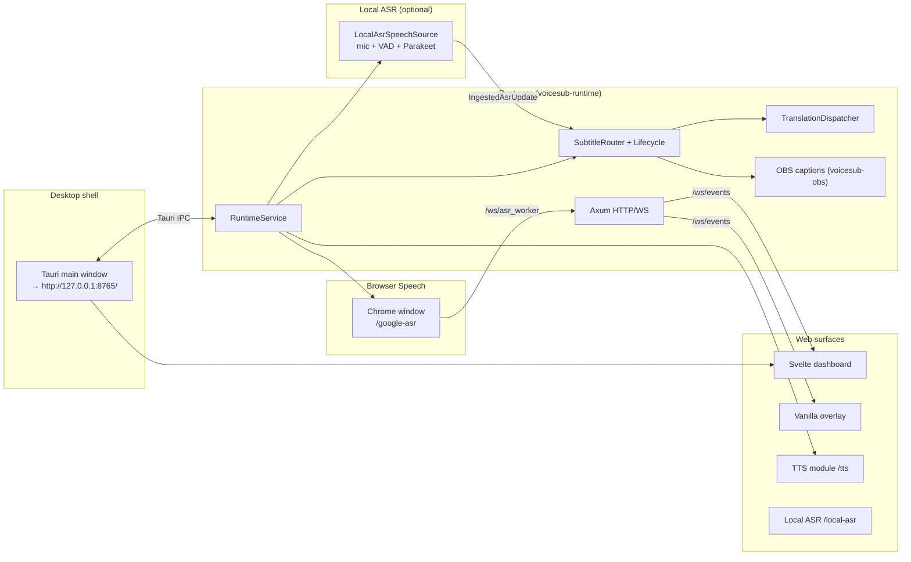

# VoiceSub 0.6.0 — Технический документ

Актуально для линии кода, где `voicesub-types::PROJECT_VERSION = "0.6.0"`.

Этот документ описывает layout проекта VoiceSub, контракт HTTP/WebSocket/Tauri IPC, схему конфигурации, поток данных через Rust runtime и поверхности frontend. Документ — **канонический technical reference** для активной разработки. README — обзор продукта; CHANGELOG — история релизов; политика агентов — `AGENTS.md`.

**Правило сопровождения:** любое изменение контрактов API/WS/IPC, config schema, subtitle/translation lifecycle, renderer overlay, browser worker или NSIS installer bundle **обновляет соответствующие разделы в той же задаче**. Устаревшие формулировки удаляют или переписывают, а не оставляют «для истории».

## Оглавление

- [Related Documentation](#related-documentation)
- [Quick Reference](#quick-reference)
- [1. Назначение и границы системы](#1-назначение-и-границы-системы)
- [2. Технологический стек](#2-технологический-стек)
- [3. Верхнеуровневая схема рантайма](#3-верхнеуровневая-схема-рантайма)
- [4. Layout репозитория](#4-layout-репозитория)
- [5. Rust workspace (crates)](#5-rust-workspace-crates)
- [6. RuntimeService: orchestration и lifecycle](#6-runtimeservice-orchestration-и-lifecycle)
- [7. Конфигурация и миграции](#7-конфигурация-и-миграции)
- [8. HTTP API (локальный)](#8-http-api-локальный)
- [9. WebSocket-поверхность](#9-websocket-поверхность)
- [10. Tauri IPC](#10-tauri-ipc)
- [11. Логи, диагностика, экспорт](#11-логи-диагностика-экспорт)
- [12. Browser Speech worker](#12-browser-speech-worker)
- [13. Перевод: lifecycle и инварианты](#13-перевод-lifecycle-и-инварианты)
- [14. Subtitle lifecycle и presentation](#14-subtitle-lifecycle-и-presentation)
- [15. Стили субтитров и overlay](#15-стили-субтитров-и-overlay)
- [16. OBS Closed Captions](#16-obs-closed-captions)
- [17. TTS-модуль](#17-tts-модуль)
- [18. Модуль Local ASR](#18-модуль-local-asr)
- [19. Desktop runtime и NSIS release](#19-desktop-runtime-и-nsis-release)
- [20. Хранилище и пути](#20-хранилище-и-пути)
- [21. Frontend: dashboard (Svelte)](#21-frontend-dashboard-svelte)
- [22. Frontend: overlay (vanilla)](#22-frontend-overlay-vanilla)
- [23. Frontend: browser worker (Svelte)](#23-frontend-browser-worker-svelte)
- [24. UI localization (i18n)](#24-ui-localization-i18n)
- [25. Версионирование и проверка обновлений](#25-версионирование-и-проверка-обновлений)
- [26. Тестирование](#26-тестирование)
- [27. Продуктовые инварианты](#27-продуктовые-инварианты)
- [28. Known Limitations & Technical Debt](#28-known-limitations--technical-debt)
- [29. Security & Privacy Model](#29-security--privacy-model)
- [30. Extension Points](#30-extension-points)
- [31. Glossary](#31-glossary)

## Related Documentation

| Документ | Назначение |
| --- | --- |
| `docs/WIKI.ru.md` | Пользовательский гайд (RU) |
| `docs/WIKI.en.md` | Пользовательский гайд (EN) |
| `docs/TECHNICAL_ARCHITECTURE.en.md` | Техническая архитектура (English) |
| `docs/CHANGELOG.md` | История изменений |
| `AGENTS.md` | Политика для агентов |

## Quick Reference

### Запуск и сборка (разработка)

```bash
# Rust tests
cargo test --workspace

# Frontend build (dashboard + worker + TTS + Local ASR)
npm run build

# NSIS release (Windows)
build-release-msi.bat   # → build-release.ps1
```

Tauri dev: embedded HTTP на `http://127.0.0.1:8765`; main webview открывает dashboard по этому URL.

### Ключевые URL (default bind)

| URL | Назначение |
| --- | --- |
| `http://127.0.0.1:8765/` | Svelte dashboard |
| `http://127.0.0.1:8765/overlay` | OBS Browser Source |
| `http://127.0.0.1:8765/google-asr?autostart=1` | Browser Speech worker |
| `http://127.0.0.1:8765/tts` | UI TTS-модуля |
| `http://127.0.0.1:8765/local-asr` | UI модуля Local ASR |

### Ключевые API endpoint-ы

| Endpoint | Назначение |
| --- | --- |
| `POST /api/runtime/start` | Старт сессии (Chrome worker **или** Local ASR) |
| `POST /api/runtime/stop` | Остановка worker, translation, OBS |
| `GET /api/runtime/status` | Runtime snapshot + diagnostics (`asr.local_module`) |
| `GET /api/settings/load` | Загрузка config + presets + fonts |
| `POST /api/settings/save` | Нормализация + сохранение `config.toml` |
| `POST /api/ui/sync` | UI theme/locale/font sync → `ui_config_sync` |
| `GET /api/exports/diagnostics` | Redacted diagnostics ZIP |
| `GET /api/obs/url` | `{ overlay_url }` для OBS |
| `GET /api/asr/local/status` | Готовность модуля Local ASR / deps / model |

### WebSocket каналы

| Channel | Назначение |
| --- | --- |
| `/ws/events` | Dashboard, overlay, runtime/subtitle события |
| `/ws/asr_worker` | Browser Speech worker transport |

### Ключевые файлы

| Файл | Назначение |
| --- | --- |
| `crates/voicesub-types/src/version.rs` | `PROJECT_VERSION` |
| `crates/voicesub-runtime/src/service.rs` | Orchestration, start/stop |
| `crates/voicesub-runtime/src/http/router.rs` | Все HTTP/WS routes |
| `crates/voicesub-subtitle/src/lifecycle.rs` | Subtitle FSM/TTL |
| `crates/voicesub-translation/src/dispatcher.rs` | Translation queue + stale drop |
| `src-tauri/src/lib.rs` | Tauri shell + IPC |
| `bin/overlay/shared/js/subtitle-style.js` | Общий renderer overlay |

## 1. Назначение и границы системы

**VoiceSub** — локальное Windows-first desktop-приложение для субтитров в реальном времени:

- захват речи через **Browser Speech worker** (отдельное окно Chrome с видимой адресной строкой, Web Speech API) **или** опциональный **Local ASR** (Parakeet ONNX, in-process mic);
- опциональный перевод на 0..5 целевых языков с независимым выбором провайдера на слот;
- единая маршрутизация subtitle payload в Svelte dashboard, vanilla OBS overlay и OBS Closed Captions;
- опциональный **TTS-модуль** (озвучка субтитров, Twitch chat TTS);
- опциональный **модуль Local ASR** (`/local-asr`, режим `local_parakeet` при `local_module.ready`);
- экспорт diagnostics ZIP и client-side trace logs.

**Режимы ASR:** `browser_google` (default Web Speech на `/google-asr`) и опциональный `local_parakeet` (модуль Local ASR, gate `asr.local_module.ready`). Legacy SST `local` и experimental worker routes в core нет.

Жёсткие границы:

- рантайм local-first, default bind `127.0.0.1:8765`;
- без cloud backend, accounts, hosted database;
- **Node.js запрещён в shipped runtime**; Vite/Node — только на машине разработчика/сборки;
- dashboard и worker — Svelte (compile-time bundle); overlay — **vanilla HTML/JS** (без Svelte);
- **WebView2 Runtime** — обязателен для Tauri shell (`VoiceSub.exe`, dashboard, `/tts`, `/local-asr`); NSIS installer может поставить bootstrapper.
- Chrome — отдельная system dependency для Web Speech worker; core installer не тянет Python/torch/Node. Deps ONNX/CUDA и веса модели Local ASR — **lazy-download** в `user-data/modules/local-asr/` (не в core installer).

## 2. Технологический стек

| Слой | Технологии |
| --- | --- |
| Core runtime | Rust 1.85+ (edition 2024), Tokio, Axum 0.8 |
| Desktop shell | Tauri 2 → `VoiceSub.exe` (NSIS `setup.exe`) |
| Dashboard UI | Svelte 5 + Vite → `bin/dashboard/` |
| Browser worker | Svelte 5 + Vite → `bin/worker/` |
| TTS UI | Svelte 5 + Vite → `bin/tts/` |
| Local ASR UI | Svelte 5 + Vite → `bin/local-asr/` |
| OBS overlay | Vanilla HTML/CSS/JS → `bin/overlay/` |
| Config | TOML (`user-data/config.toml`), JSON-shaped document inside |
| HTTP client (providers) | `reqwest` + rustls |
| Logging | `tracing` + rotating files + opt-in JSONL |
| TTS sidecar | Embedded Python exe в `bin/modules/tts/runtime/` (не в core Rust) |
| Local ASR inference | `parakeet-rs` + ONNX Runtime DLL (CPU / опционально CUDA EP) |

**Запрещено в active tree:** React, Webpack, Electron, pywebview, FastAPI runtime, in-process NeMo/torch.

## 3. Верхнеуровневая схема рантайма



**Hot path (browser):** `external_asr_update` (WS) → transcript controller → subtitle lifecycle → translation dispatcher → `overlay_update` (WS live + Tauri IPC) → dashboard + OBS overlay. **Hot path (local ASR):** mic → VAD/decode → `PartialEmitCoordinator` → тот же ingest, что и browser. `subtitle_payload_update` — только Tauri IPC snapshot/replay (не дублируется на live `/ws/events`). Partial `transcript_update` коалесится (default 90 ms); subtitle lifecycle и `overlay_update` видят каждый partial.

## 4. Layout репозитория

```
F:\AI\VoiceSub\
├── Cargo.toml                  # workspace members, workspace.dependencies
├── Cargo.lock
├── package.json                # Vite/Svelte build scripts
├── vite.config.ts              # → bin/dashboard/
├── vite.worker.config.ts       # → bin/worker/
├── vite.tts.config.ts          # → bin/tts/
├── vite.local-asr.config.ts    # → bin/local-asr/
├── build-release-msi.bat       # back-compat → build-release.ps1
├── build-release.ps1           # NSIS release pipeline
├── build/release.config.json   # release_root для setup.exe copy
│
├── crates/                     # Rust domain + adapters (см. §5)
├── src-tauri/                  # Tauri binary shell (тонкий)
├── src/                        # Svelte dashboard sources
├── src-worker/                 # Svelte browser worker sources
├── src-tts/                    # Svelte TTS module sources
├── src-local-asr/              # Svelte Local ASR module sources
│
├── bin/                        # Shipped static assets (в NSIS resources)
│   ├── dashboard/              # Vite build output
│   ├── worker/                 # Worker bundle
│   ├── tts/                    # TTS UI bundle
│   ├── local-asr/              # Local ASR UI bundle
│   ├── overlay/                # Vanilla OBS overlay
│   ├── fonts/                  # Project fonts
│   └── modules/                # Sidecar modules (tts, local-asr)
│
├── tests/
│   ├── golden/                 # Regression fixtures
│   └── integration/
│
├── docs/
├── user-data/                  # runtime (gitignored)
└── logs/                       # runtime (gitignored)
```

### Исходники vs артефакты сборки

| Поверхность | В git | После `npm run build` / installer |
| --- | --- | --- |
| `crates/`, `src/`, `src-worker/`, `src-tts/`, `src-local-asr/` | да | компилируется в exe + static |
| `bin/dashboard`, `bin/worker`, `bin/tts`, `bin/local-asr` | build output (tracked или CI) | в NSIS `resources/bin/` |
| `bin/overlay/` | да | в installer |
| `user-data/`, `logs/` | нет | создаётся при runtime |

## 5. Rust workspace (crates)

Workspace members (`Cargo.toml`): 16 domain crates + `src-tauri` (отдельного `xtask` нет).

### Граф зависимостей (упрощённо)

```
voicesub-types (Layer 0: DTO, WS types, errors)
    ↑
voicesub-config, voicesub-subtitle, voicesub-translation, voicesub-browser,
voicesub-ws, voicesub-logging, voicesub-export, voicesub-obs, voicesub-audio,
voicesub-tts, voicesub-twitch, voicesub-asr-local, voicesub-partial-emit (Layer 1–2)
    ↑
voicesub-runtime (Layer 3: wiring, HTTP router, orchestration)
    ↑
src-tauri (Layer 4: IPC, window, bundle only)
```

### Crate reference

| Crate | Назначение |
| --- | --- |
| `voicesub-types` | `PROJECT_VERSION`, WS envelope types, ASR event DTO |
| `voicesub-config` | TOML store, defaults, legacy JSON import, paths, bind policy |
| `voicesub-subtitle` | `SubtitleLifecycleCore`, `SubtitleRouter`, presentation, overlay contract |
| `voicesub-translation` | `TranslationDispatcher`, `TranslationEngine`, 17 providers |
| `voicesub-browser` | Chrome supervisor, worker launch flags, operational FSM |
| `voicesub-ws` | `/ws/events` hub, `/ws/asr_worker` hub, event sequence |
| `voicesub-http` | Re-export `voicesub-runtime::http` (thin) |
| `voicesub-logging` | `tracing` backbone, rotation, session JSONL, deep trace flags |
| `voicesub-export` | Diagnostics ZIP, config redaction |
| `voicesub-obs` | OBS WebSocket closed captions client |
| `voicesub-audio` | WinAPI audio routing helpers (TTS) |
| `voicesub-tts` | TTS service, queue, Twitch IRC, OAuth bridge |
| `voicesub-twitch` | Twitch IRC (до 5 каналов), emotes, links/symbols filters, Lingua lang detect, `apply_settings` hot-apply |
| `voicesub-asr-local` | Local ASR module: deps, model, Parakeet ONNX, VAD/pipeline, test bench, status |
| `voicesub-partial-emit` | Shared partial emit policy (`word_growth`, coalesce) для Local ASR |
| `voicesub-runtime` | `RuntimeService`, HTTP router, transcript controller, session wiring |

**Правило:** бизнес-логика не живёт в `src-tauri/`; Tauri — IPC + lifecycle hooks only.

## 6. RuntimeService: orchestration и lifecycle

**Файл:** `crates/voicesub-runtime/src/service.rs`

`RuntimeService` — единая точка wiring:

1. **Старт** (`POST /api/runtime/start`):
   - merge optional inline `config_payload`;
   - apply live settings (translation, OBS, subtitle, logging);
   - if `asr.mode = browser_google`: launch Chrome worker → `{base}/google-asr?autostart=1[&locale=…]` и browser speech ingest;
   - if `asr.mode = local_parakeet`: assert `asr.local_module.ready`, start `LocalAsrSpeechSource` (без Chrome worker);
   - start translation dispatcher, OBS captions;
   - broadcast `preflight_update`, `runtime_update`.

2. **Стоп** (`POST /api/runtime/stop`):
   - browser mode: `browser_asr_control` stop на `/ws/asr_worker`; kill Chrome process tree (`taskkill /T /F` on Windows);
   - local mode: stop `LocalAsrSpeechSource`;
   - stop translation, OBS; reset subtitle state/metrics.

3. **Tauri shutdown** (`src-tauri/src/lib.rs`):
   - TTS shutdown → `POST /api/runtime/stop` → runtime handle drop.

Embedded HTTP server: dedicated Tokio runtime в Tauri process; bind из `AppConfig` + `VOICESUB_ALLOW_LAN`.

**Hot path 0.5.4:**

- `browser_speech_source.rs` — sync `accept_update` + async `process_ingest_work` (ingest mutex не удерживается на subtitle/WS work).
- `SubtitlePayloadForwarder` — TTS listener на отдельном упорядоченном потоке (`voicesub-subtitle-payload-forward`).
- Live subtitle WS fanout — только **`overlay_update`**; `subtitle_payload_update` — Tauri IPC snapshot, не дублируется на `/ws/events`.

## 7. Конфигурация и миграции

### Хранение

- **Путь:** `{project_root}/user-data/config.toml`
- **Формат:** JSON-shaped document, сериализованный как TOML (`voicesub-config::store`)
- **Текущая версия:** `config_version = 8` (`defaults.rs`)

### Top-level keys

| Key | Роль |
| --- | --- |
| `config_version` | Schema version (migrate on load) |
| `profile` | Active profile name |
| `ui` | `language`, `layout`, `theme`, `palette`, `show_translation_results` |
| `source_lang` | ASR source (`auto` default) |
| `targets` | Legacy target list (import compatibility) |
| `asr` | `mode` + `browser` tuning |
| `overlay` | `preset`, `compact` |
| `obs_closed_captions` | OBS WebSocket CC settings |
| `translation` | Provider, lines (до 5), cache, limits, `provider_settings` |
| `subtitle_output` | Source/translation display order |
| `subtitle_lifecycle` | TTL, sync flags; deprecated timing keys только normalize |
| `source_text_replacement` | Find/replace для ASR текста (кастомные пары + builtin-корни/нормализация обходов; в `TranscriptController` до subtitle/translation) |
| `logging` | `full_enabled` — master switch deep diagnostics |

### ASR mode (VoiceSub 0.6.0)

| `asr.mode` | Статус |
| --- | --- |
| `browser_google` | **Active default** — Chrome Web Speech worker |
| `local_parakeet` | Опциональный Local ASR; селектор на Эфире только при `asr.local_module.ready` |
| `local`, `browser_google_edge`, `browser_google_experimental*` (import) | Mapped → `browser_google` + `import_hint` |

SST JSON import **сохраняет** `local_parakeet` (не мапит на `browser_google`). Ready — runtime gate, не remap при импорте.

### Legacy JSON import (SST Desktop `config.json`)

`ConfigStore::import_sst_json_file` / load с `config_version < 8`:

1. `migrate_sst_payload` — version steps, build `translation.lines` from old `targets`
2. `apply_voicesub_import_rules` — strip removed legacy ASR keys (model paths, GPU/VAD tuning, …)
3. `repair_legacy_keep_completed_false` + `normalize_config_payload`

Удалённые providers (например `mymemory`) → fallback `google_translate_v2`.

### Profiles

`user-data/profiles/{name}.json` — named snapshots via `/api/profiles/*`.

## 8. HTTP API (локальный)

**Router:** `crates/voicesub-runtime/src/http/router.rs`  
**Default bind:** `127.0.0.1:8765` (`voicesub-config::paths`)  
**LAN:** `VOICESUB_ALLOW_LAN=1` → bind `0.0.0.0`

**Безопасность LAN (OWASP ASVS V7):** при `VOICESUB_ALLOW_LAN=1` HTTP API `/api/*` по-прежнему требует per-session `x-voicesub-token`, но **WebSocket endpoints остаются без аутентификации** — любой хост в той же сети может подключиться к `/ws/events` (чтение субтитров/runtime) и `/ws/asr_worker` (отправка ASR/control). Используйте LAN bind только в доверенной сети; для production stream setup предпочтителен default `127.0.0.1` + OBS Browser Source на localhost.

Global middleware: CSP header, `Cache-Control: no-store`.

### Health / Version

| Method | Path | Auth | Назначение |
| --- | --- | --- | --- |
| GET | `/live` | public | Минимальный liveness probe (`{"ok":true}`) для OBS overlay |
| GET | `/api/health` | loopback token | Liveness + WS connections + worker connected |
| GET | `/api/version` | loopback token | Product metadata + `sync` (updates config, `update_available`, `latest_known_version`) |

**Loopback API auth:** trusted UI pages (dashboard, worker, TTS) получают per-session `x-voicesub-token` через HTML injection; Tauri IPC `get_loopback_api_token`. OBS overlay **не** вызывает protected `/api/*` (только `/live` + WebSocket).

### Devices / OpenAI helpers

| Method | Path | Назначение |
| --- | --- | --- |
| GET | `/api/devices/audio-inputs` | Empty list (browser ASR uses `getUserMedia`) |
| GET | `/api/openai/recommended-models` | Static recommended models |
| POST | `/api/openai/models` | Live OpenAI-compatible `GET {base}/models` (chat filter for api.openai.com) |
| POST | `/api/openai/usable-models` | Alias |

### Settings / Profiles

| Method | Path | Назначение |
| --- | --- | --- |
| GET | `/api/settings/load` | Config + subtitle presets + font catalog |
| POST | `/api/settings/save` | Merge/save + live apply |
| GET/POST/DELETE | `/api/profiles`, `/api/profiles/{name}` | Profile CRUD |
| POST | `/api/ui/sync` | Debounced UI-only sync → `ui_config_sync` на EventBus (theme/locale/`ui.font_family` между dashboard, Web ASR, TTS, Local ASR) |

### Runtime / OBS

| Method | Path | Назначение |
| --- | --- | --- |
| POST | `/api/runtime/start` | Start session (`config_payload?`) |
| POST | `/api/runtime/stop` | Stop session |
| GET | `/api/runtime/status` | Full runtime snapshot |
| GET | `/api/obs/url` | `{ overlay_url }` |

### Logging / Exports

| Method | Path | Назначение |
| --- | --- | --- |
| POST | `/api/logs/client-event` | Client → `session-latest.jsonl` |
| POST | `/api/logs/ui-trace` | UI render trace → `ui-trace.jsonl` |
| GET | `/api/exports` | List export bundles |
| GET | `/api/exports/diagnostics` | Diagnostics ZIP |

### TTS / Twitch OAuth

| Method | Path | Назначение |
| --- | --- | --- |
| GET | `/api/tts/google` | Google Translate TTS proxy |
| GET | `/api/tts/python` | TTS via embedded Python module |
| GET | `/api/tts/python/status` | Python runtime probe |
| POST | `/api/tts/twitch/oauth-open` | Open Twitch OAuth in system browser |
| GET | `/api/tts/twitch/oauth-pending` | Poll pending token |
| POST | `/api/tts/twitch/oauth-complete` | Store OAuth token |

### Local ASR (`/api/asr/local/*`)

Protected like other `/api/*`. Полная таблица в [§18 Модуль Local ASR](#18-модуль-local-asr).

### Updates

| Method | Path | Назначение |
| --- | --- | --- |
| POST | `/api/updates/check` | Poll GitHub Releases (`force` on dashboard bootstrap); persists `updates.latest_known_version`, `last_checked_utc` |

### HTML pages

| Method | Path | Handler |
| --- | --- | --- |
| GET | `/` | `bin/dashboard/index.html` |
| GET | `/overlay` | `bin/overlay/overlay.html` |
| GET | `/google-asr` | `bin/worker/index.html` |
| GET | `/tts` | `bin/tts/index.html` |
| GET | `/local-asr` | `bin/local-asr/index.html` |
| GET | `/project-fonts.css` | Generated `@font-face` from `bin/fonts/` |

### Static mounts

| URL prefix | Disk path |
| --- | --- |
| `/overlay-assets` | `bin/overlay/` |
| `/static` | `bin/overlay/shared/` (legacy shared assets) |
| `/worker-assets` | `bin/worker/` |
| `/assets` | `bin/dashboard/assets/` |
| `/tts-assets` | `bin/tts/` |
| `/local-asr-assets` | `bin/local-asr/` |
| `/project-fonts` | `bin/fonts/` |

`bin/` resolved via `ProjectPaths::locate_bin_dir()` — workspace `bin/` или Tauri NSIS `resources/bin/`.

## 9. WebSocket-поверхность

**Аутентификация:** WS endpoints **не** используют `x-voicesub-token` (by design — OBS overlay и browser worker). При default bind `127.0.0.1` риск ограничен локальной машиной. При `VOICESUB_ALLOW_LAN=1` см. предупреждение в §8.

### `/ws/events` — OBS overlay (+ optional external clients)

**Реализация:** `crates/voicesub-ws/src/events.rs`

- Клиент receive-only (inbound text ignored)
- On connect: `hello` (`type: "hello"`, `message: "connected"`)
- Replay last: `runtime_update`, `overlay_update`
- Bounded per-socket queue (default 128), dedupe by `type`

**Envelope:** `{ "type": "<channel>", "payload": {…} }`  
Payload enrichment: `event_sequence`, `created_at_ms`, `event_type` (`WsEventPublisher`).

| `type` | Назначение |
| --- | --- |
| `hello` | Handshake |
| `runtime_update` | Phase, ASR/worker state, metrics |
| `preflight_update` | `{ running: bool }` during start/stop |
| `diagnostics_update` | ASR diagnostics snapshot |
| `model_status_update` | Model/ASR readiness |
| `transcript_update` | ASR partial/final events (единственный live ASR channel с 0.5.4) |
| `subtitle_payload_update` | Subtitle presentation (**только Tauri IPC snapshot** — не публикуется на `/ws/events`; live + WS replay — через `overlay_update`) |
| `overlay_update` | Overlay render body (live + **replay on connect**) |
| `translation_update` | Per-sequence translation results |
| `twitch_chat_message` | Twitch chat for TTS |
| `twitch_connection_update` | Twitch connection state |
| `ui_config_sync` | `{ ui: … }` sync theme/locale/`font_family` (Tauri IPC; через `/api/ui/sync`) |

**Stale guard:** overlay (`overlay.js` + `ws-stale-guard-logic.js`) отбрасывает устаревшие события после stop/start (timestamp-first при reset sequence).

### In-process runtime events — Tauri dashboard + TTS (0.5.2+)

**Реализация:** `RuntimeEventBus` (`crates/voicesub-ws/src/event_bus.rs`) + Tauri emit `runtime-event` (`src-tauri/src/lib.rs`).

- Main dashboard (`src/lib/runtime-events.ts`) и TTS module (`src-tts/App.svelte`) **не открывают** `ws://127.0.0.1:8765/ws/events` — получают те же envelope `{ type, payload }` через Tauri event channel.
- On subscribe: сначала `listen(runtime-event)` (buffer live frames), затем IPC `get_runtime_state_snapshot`, затем drain buffer — чтобы stale snapshot не перезаписал более новый live event. Dashboard replay предпочитает `overlay_update` (fallback — `subtitle_payload_update`); TTS replay — только `runtime_update` + `twitch_connection_update`.
- WS publisher (`WsEventPublisher`) дублирует большинство broadcast в EventBus; OBS overlay по-прежнему только WS. **Twitch chat** — `publish_event_bus_only` (без fanout на `/ws/events`); connection updates идут в hub для snapshot replay.

**Legacy:** `src/lib/ws.ts` (`EventsSocket`) — dev/optional external browser clients; production Tauri shell использует `runtime-events.ts`.

### `/ws/asr_worker` — browser worker

**Реализация:** `crates/voicesub-ws/src/asr_worker.rs`

**Server → worker:**

| `type` | Поля | Назначение |
| --- | --- | --- |
| `hello` | `message: "browser_asr_worker_connected"`, `transport_id` | Handshake |
| `browser_asr_control` | `action`, `reason?`, `issued_at_ms`, `transport_id` | Control (e.g. `stop`) |

**Worker → server:**

| `type` | Handler |
| --- | --- |
| `external_asr_update` | ASR text ingest (partial/final, generation guards) |
| `browser_asr_status` | Worker state snapshot |
| `browser_asr_heartbeat` | Same as status |
| `hello` | Recognized, no special handling |

## 10. Tauri IPC

**Регистрация:** `src-tauri/src/lib.rs` → `tauri::generate_handler!`

**Capabilities (per window):** `src-tauri/capabilities/default.json` (main — полный `allow-voicesub-ipc`), `tts.json` (`allow-voicesub-tts-ipc`), `local-asr.json` (`allow-voicesub-local-asr-ipc`). `get_loopback_api_token` allowlisted на всех трёх.

### Shell commands

| Command | Назначение |
| --- | --- |
| `voicesub_version` | Returns `PROJECT_VERSION` |
| `get_loopback_api_token` | Per-session token для protected `/api/*` (fallback без HTML injection) |
| `set_dashboard_layout` | Compact (390×844) vs standard (1280×900) window |
| `launch_browser_worker` | Launch Chrome to worker URL without full runtime start |
| `open_external_https_url` | Открыть allowlisted HTTPS URL в system browser (update banner, setup-ссылки провайдеров перевода) |
| `open_local_http_url` | Открыть validated loopback HTTP URL в system browser |

### TTS commands (`src-tauri/src/tts.rs`)

| Command | Назначение |
| --- | --- |
| `tts_get_config` | Load TTS config |
| `tts_set_provider` / `tts_set_enabled` | Provider toggle |
| `tts_set_audio_device` / `tts_set_channel_audio_device` | Speech / Twitch audio output |
| `tts_set_playback_mode` | `native` (cpal @ 1.0×) или `sonic` (libsonic); legacy `browser` → `sonic` при load |
| `tts_play_audio` / `tts_stop_channel` | Native MP3 playback per channel |
| `tts_list_output_devices` | WASAPI enumeration (label-first for native) |
| `tts_get_audio_routing` / `tts_bind_window_audio` | Legacy WinAPI per-process routing (single device) |
| `tts_update_speech_settings` / `tts_update_voice_settings` | Speech params |
| `tts_speak_sample` | Ручной Speak test → Rust `ChannelOrchestrator` (`speech`, `source: test`) |
| `tts_reset_subtitle_planner` | Сброс dedupe planner субтитров |
| `tts_channel_clear` / `tts_channel_force_idle` | Очистка / сброс состояния канала |
| `tts_get_resource_telemetry` | Playback / queue resource metrics |
| `tts_report_webview_activity` | TTS webview heartbeat → `WebviewMemoryManager` suspend policy |
| `tts_twitch_*` | Twitch connect/disconnect/status/settings |
| `tts_open_window` | Open/focus `/tts` webview |
| `local_asr_open_window` | Open/focus `/local-asr` webview |
| `tts_open_system_url` | Open validated Twitch OAuth URL externally |
| `get_runtime_state_snapshot` | Replay runtime/subtitle/overlay/translation/diagnostics for Tauri shell on connect |

### `src-tauri/` modules (shell only)

| File | Роль |
| --- | --- |
| `lib.rs` | Tauri setup, HTTP runtime bootstrap, IPC registration, EventBus pump |
| `event_routing.rs` | Per-window `runtime-event` routing + lagged snapshot resync |
| `webview_memory.rs` | WebView2 suspend/memory policy (`WebviewMemoryManager`) |
| `dashboard_nav.rs` | Main webview URL helpers |
| `webview2_gate.rs` | WebView2 runtime presence check before window create |
| `tts.rs` | TTS IPC adapter → `voicesub-tts` |
| `local_asr.rs` | Local ASR window open/focus only |
| `event_routing.rs` | Per-window `runtime-event` type filters + snapshot replay envelopes |
| `ipc_pump.rs` | Bus→IPC pump: overlay coalescing (dashboard only), lag-resync debounce |

**Tauri events (shell clients):** `runtime-event` (WS-shaped envelopes), `tts-speech-activity` / `playback-finished` — только **`emit_to(tts)`** (не global `emit`).

**`runtime-event` routing (per window):** bus→IPC pump (`src-tauri/src/ipc_pump.rs`, фильтры в `event_routing.rs`) эмитит через `emit_to(label, …)`, не global `emit`. **Main** dashboard получает все envelope; **tts** window — только `twitch_chat_message`, `twitch_connection_update`, `runtime_update`, `runtime_status`, `ui_config_sync`; **local-asr** window — только `ui_config_sync` (живая тема/локаль/шрифт без Save). UI Local ASR и TTS **не** открывают `/ws/events` для UI sync (только BroadcastChannel + Tauri IPC) — иначе клиент всё равно получает overlay/runtime на полной частоте. `setLocale` идемпотентен, чтобы `sst:locale-changed` / BroadcastChannel не зацикливались. Высокочастотный `transcript_update` / `overlay_update` не флудит IPC модулей. Payload по ссылке (без deep-clone). **`overlay_update` IPC на main dashboard коалесится** (trailing-edge, default 90 ms, env `VOICESUB_OVERLAY_IPC_MIN_INTERVAL_MS`); OBS `/ws/events` получает каждый кадр. `runtime_update` / `translation_update` сбрасывают pending overlay немедленно. При `RecvError::Lagged` — метрики `event_bus_consumer_lagged_*`, pending snapshot resync (последний нужный sync не дропается; 200 ms coalesce между follow-up), затем `snapshot_to_envelopes` (overlay предпочтительнее raw subtitle).

**Partial coalescing:** partial `transcript_update` — leading-edge throttle в `TranscriptController` (default 90 ms, env `VOICESUB_TRANSCRIPT_PARTIAL_MIN_INTERVAL_MS`; новая фраза/`sequence` и все final — без задержки). Subtitle lifecycle и WS `overlay_update` видят каждый partial; ingest сначала обновляет subtitle, затем async fanout transcript. Коалесится только избыточный transcript IPC/WS канал.

**Lifecycle:** main webview → `http://{bind_addr}/` on setup; on close → TTS shutdown → runtime stop.

## 11. Логи, диагностика, экспорт

**Директория:** `{project_root}/logs/`

### Backbone (всегда)

| File | Назначение |
| --- | --- |
| `core.log` | `tracing` backbone (+ stderr); rotate → `core.old.log` on startup |
| `runtime-events.log` | Compact structured events (5 MB rotation) |
| `session-latest.jsonl` | Client events from `/api/logs/client-event` (max 5000 lines) |

### Opt-in JSONL traces

Master switch: `logging.full_enabled` in config **или** `VOICESUB_DEEP_DIAGNOSTICS`.

| File | Enable env |
| --- | --- |
| `subtitle-trace.jsonl` | `VOICESUB_TRACE_SUBTITLE` |
| `tts-trace.jsonl` | `VOICESUB_TRACE_TTS` |
| `browser-trace.jsonl` | `VOICESUB_TRACE_BROWSER` |
| `obs-trace.jsonl` | `VOICESUB_TRACE_OBS` |
| `ui-trace.jsonl` | `VOICESUB_TRACE_UI` |
| `ws-trace.jsonl` | `VOICESUB_TRACE_WS` |
| `pipeline-trace.jsonl` | `VOICESUB_TRACE_PIPELINE` |
| `session-lifecycle.json` | всегда (маркер сессии); шаги shutdown/panic дублируются в `pipeline-trace.jsonl` при deep diagnostics |

### Форматы timestamp-полей (0.5.4+)

Ряд полей в логах и subtitle lifecycle, ранее хранивших **Unix epoch seconds строкой**, теперь используют **RFC 3339 UTC** (например `2026-06-21T07:01:00Z`). **Ключи payload не менялись** — изменился только формат значения.

| Поле | Где | Примечание |
| --- | --- | --- |
| `timestamp_utc` | `session-latest.jsonl`, deep JSONL traces | Внешние скрипты должны принимать оба формата |
| `finalized_at_utc`, `completed_expires_at_utc` | Subtitle lifecycle payload | Overlay/dashboard не парсят их как числа |

Helpers: `voicesub_types::utc_now_rfc3339()`, `epoch_secs_to_rfc3339()`. Пример: `tools/_analyze_tts_session.py` (`ts()` принимает epoch и RFC 3339).

При deep diagnostics записи ASR ingest в `pipeline-trace.jsonl` могут включать `ingest_latency_ms` (`trace.rs` + `transcript_controller.rs`).

Disable: same vars `=0` / `false`.  
Verbose runtime-events: `VOICESUB_TRACE_RUNTIME_EVENTS_VERBOSE`.

При `logging.full_enabled` шаги закрытия (`shutdown_begin`, `shutdown_step`, `shutdown_complete`) пишутся в `core.log` (`voicesub.lifecycle`) и `pipeline-trace.jsonl`. `session-lifecycle.json` обновляется всегда: `running` → `graceful` или `panic`. Если при старте остался `running`, в `core.log` — `previous session exited without graceful shutdown` (даже в compact-режиме).

### Другие env vars

| Variable | Назначение |
| --- | --- |
| `VOICESUB_ALLOW_LAN` | Bind `0.0.0.0` |
| `VOICESUB_TRANSCRIPT_PARTIAL_MIN_INTERVAL_MS` | Мин. интервал partial `transcript_update` (default **90**; `0` = без коалесинга; не влияет на `overlay_update`) |
| `VOICESUB_OVERLAY_IPC_MIN_INTERVAL_MS` | Trailing-edge коалесинг `overlay_update` IPC dashboard (default **90**; **`0`** = выкл.; OBS WS без изменений) |
| `VOICESUB_BROWSER_AFFINITY` | CPU affinity browser worker (`1` / `true`) |
| `VOICESUB_BROWSER_AFFINITY_MASK` | Hex override маски affinity |
| `VOICESUB_BROWSER_AFFINITY_EXCLUDE_LOW` | Исключить low-power ядра из маски (default `1`) |
| `RUST_LOG` | `tracing` filter override |
| `VOICESUB_TTS_PER_PROCESS_ROUTING` | WinAPI TTS audio routing |
| `VOICESUB_TTS_ALLOW_SYSTEM_PYTHON` | Allow system Python for TTS fetcher |

### Diagnostics ZIP

`GET /api/exports/diagnostics` bundles: `runtime_status.json`, `config_redacted.json`, `environment.txt`, `latest_session.jsonl`, `core.log`, `runtime-events.log` (плюс deep JSONL traces при `logging.full_enabled`).

ZIP пишутся в `user-data/exports/` как `diagnostics-{unix}_{ms}.zip`. Экспортёр хранит не больше **12** свежих diagnostics ZIP и удаляет более старые.

## 12. Browser Speech worker

### URL и launch

| Constant | Value |
| --- | --- |
| `WORKER_PATH` | `/google-asr` |
| Launch URL | `{base}/google-asr?autostart=1[&locale={ui.language}]` |

`worker_launch_browser`: `auto` | `google_chrome` (unknown → `auto`).

### Chrome launch invariants

- **Отдельное окно** Chrome с **видимой адресной строкой**
- Isolated `--user-data-dir`: `{user-data}/browser-worker-profile-classic-{engine}/`
- **Never** `--disable-extensions` / `--bwsi` / `--app=`
- **No** hidden windows или in-tab worker
- Anti-throttling Chrome flags + Windows EcoQoS opt-out (`launch_config.rs`, `ecoqos.rs`)
- Detached process at **`ABOVE_NORMAL_PRIORITY_CLASS`** when `use_high_priority` (default true): ASR отзывчив без `HIGH_PRIORITY_CLASS`, вытесняющего foreground apps. Fallback на normal при `ERROR_ACCESS_DENIED`. Stop via `taskkill /T /F` (только при реальном `pid > 0`)
- **Orphan reaping (`orphan_guard.rs`):** live worker PID сохраняется в `user-data/browser-worker.pid` при launch и очищается после успешного kill. `RuntimeService::start` убивает осиротевший воркер прошлой *аварийной* сессии — только если PID всё ещё `chrome.exe`. При неудачном kill PID-файл сохраняется для retry.
- **Launch stability (0.5.2+):** `launch_stability.rs`, `profile_bloat_guard.rs`, `process_affinity.rs` (opt-in через `VOICESUB_BROWSER_AFFINITY`); contract tests in `crates/voicesub-browser/tests/chrome_launch_contract.rs`

### Test harness (без spawn Chrome)

- `voicesub-browser::browser_worker_launch_skipped()` — `cfg(test)` в unit-тестах crate + env `VOICESUB_SKIP_BROWSER_WORKER=1`
- Integration tests (`voicesub-http/tests/`, `voicesub-runtime/tests/`) выставляют skip в `integration_lock()` — зависимости собираются **без** `cfg(test)`
- Stub launch: `pid: 0`, `worker_pid = None`; опционально `VOICESUB_FORCE_BROWSER_WORKER=1` для ручной проверки

### Worker frontend (`src-worker/`)

| Module | Роль |
| --- | --- |
| `worker-controller.ts` | Autostart, recognition lifecycle |
| `socket-bridge.ts` | `/ws/asr_worker` connect, `browser_asr_control` |
| `session-manager.ts` | Session age, reconnect, watchdog |
| `long-segment-flush-logic.ts` | Сброс буфера Web Speech после длинного сегмента (≥200 символов) |
| `web-speech-policy.ts` | Strip on-device hints, overlap policy |

**Worker UI defaults:** lang `ru-RU`, interim/continuous on, force-finalization idle **1600 ms** (панель worker), max session age **180 s**.

### Long-segment flush (буфер Web Speech)

После **committed** сегмента (natural или forced final), если пик partial или длина final ≥ **200 символов**, worker сбрасывает раздутый in-session буфер `SpeechRecognition.results`. Иначе следующая речь стабильно финализируется короткими фрагментами (в `pipeline-trace.jsonl` — серия `asr_ingest_final_published` с малым `text_len`).

| Режим | Действие |
| --- | --- |
| `native_continuous` (`continuous=true`, по умолчанию) | `requestRecognitionFlush` → `recognition.stop()` → restart с reason `long_segment_flush` (~150 ms, как `session_cycle`) |
| Overlap (`continuous=false`) | сначала `preStartNextOverlapInstance`, затем `stop()` только **активного** слота → handoff на pre-warmed buddy |

**Не настраивается** (порог `DEFAULT_LONG_SEGMENT_FLUSH_MIN_CHARS = 200` в `long-segment-flush-logic.ts`). State: `currentSegmentPeakPartialChars`, счётчик `longSegmentFlushCount`. **Не заменяет** ротацию по возрасту сессии (`max_browser_session_age_ms`) и idle forced-final (`force_finalization_timeout_ms`).

### Расширенные настройки Web Speech (dashboard)

**UI:** Settings → More → Recognition → «Расширенные настройки Web Speech» (`WebSpeechAdvancedSettings.svelte`). У каждого числового поля — кнопка **`!`** (`FieldHelpButton.svelte`) с локализованным описанием (en, ru, ja, ko, zh); клик — popover, hover — `title`.

**Маппинг config:**

| Секция UI | Путь config | Runtime |
| --- | --- | --- |
| Пороги forced final | `asr.browser.force_final_min_*` | Browser worker (`transcript-logic.ts`) |
| Перезапуск и восстановление | `asr.browser.*_restart_delay_ms`, `minimum_reconnect_interval_ms`, `stuck_stopping_timeout_ms` | Worker session manager |
| Сеть | `asr.browser.network_reconnect_*` | Worker backoff |
| Ротация сессии | `asr.browser.max_browser_session_age_ms`, `prepare_cycle_before_ms` | Worker session cycle |
| Фильтрация partial | `asr.realtime.partial_min_delta_chars`, `partial_coalescing_ms` | Rust `partial_emit.rs` |

**Канонические defaults** (источник `src/lib/webspeech-advanced-defaults.ts`, зеркало в `defaults.rs`, `config-normalize.ts`, `worker-defaults.ts`):

| Ключ | Default |
| --- | ---: |
| `force_final_min_chars` | 8 |
| `force_final_min_stable_ms` | 750 |
| `minimum_reconnect_interval_ms` | 500 |
| `normal_restart_delay_ms` | 150 |
| `no_speech_restart_delay_ms` | 150 |
| `stuck_stopping_timeout_ms` | 2000 |
| `network_reconnect_initial_ms` | 500 |
| `network_reconnect_max_ms` | 30000 |
| `max_browser_session_age_ms` | 180000 |
| `prepare_cycle_before_ms` | 30000 |
| `partial_min_delta_chars` | 0 |
| `partial_coalescing_ms` | 0 |

**Не в этой панели:** `asr.browser.force_finalization_timeout_ms` — idle-таймаут forced final; настраивается в **окне Web Speech worker**. После изменения lifecycle-ключей переоткройте worker.

## 13. Перевод: lifecycle и инварианты

**Crate:** `voicesub-translation`  
**Entry:** `TranslationDispatcher` (`dispatcher.rs`)

### Providers (17)

`SUPPORTED_PROVIDERS` in `providers/mod.rs`:

| ID | Group |
| --- | --- |
| `google_translate_v2` | API (default) |
| `google_cloud_translation_v3` | API |
| `azure_translator` | API |
| `deepl` | API |
| `libretranslate` | API/self-hosted |
| `openai` | llm |
| `openrouter` | llm |
| `lm_studio` | local_llm |
| `ollama` | local_llm |
| `baidu_translate` | china (free-tier quota) |
| `youdao_translate` | china (free-tier quota) |
| `tencent_tmt` | china (free-tier quota) |
| `caiyun_translator` | china (zh/en/ja) |
| `google_gas_url` | experimental |
| `google_web` | experimental |
| `public_libretranslate_mirror` | experimental |
| `free_web_translate` | experimental |

Заметки: DeepL мапит UI-коды (`en`/`zh-cn`/`pt`) в API targets и выбирает Free vs Pro URL по ключу (`:fx` → free), если не задан custom `api_url`. Google v3 short model id раскрываются в full resource names. Azure предпочитает `zh-Hans`/`zh-Hant`; LibreTranslate — `zh`/`zt`. Китайские провайдеры: Baidu / Youdao / Tencent — бесплатные месячные квоты после регистрации; Caiyun — только zh/en/ja.

До **5 translation lines** (`translation_1`…`translation_5`). Test stub `stub` — не в production registry.

### Critical lifecycle invariant (non-negotiable)

- Completed subtitle block **остаётся на экране** до финализации **новой** фразы
- Late translations **разрешены** (не drop по wall-clock stale на browser path)
- Preview supersession по `(segment_id, revision)`
- Stale drop для устаревших **in-flight** jobs при новом segment/revision
- Persistent cache в `user-data/translation-cache/` переживает рестарт при неизменённых настройках (первый `apply_live_settings` не затирает диск)
- Per-request HTTP timeouts уважают `timeout_ms` (потолок клиента 300s); локальные LLM (`lm_studio` / `ollama`) получают floor ≥120s, чтобы JIT-загрузка модели не обрывалась; лимиты concurrency провайдеров обновляются при live apply настроек

## 14. Subtitle lifecycle и presentation

**Crate:** `voicesub-subtitle`

| Component | Файл | Роль |
| --- | --- | --- |
| `SubtitleLifecycleCore` | `lifecycle.rs` | FSM, TTL, relevance, expiry scheduling |
| `SubtitleRouter` | `router.rs` | Transcript + translation → presentation events |
| `SubtitlePresentation` | `presentation.rs` | Payload assembly |
| Overlay contract | `tests/overlay_contract.rs` | Golden regression |

**Config keys (`subtitle_lifecycle`):**

- `completed_block_ttl_ms` (default 4500, min 500)
- `completed_source_ttl_ms`, `completed_translation_ttl_ms`
- sync flags (`allow_early_replace_on_next_final`, `sync_source_and_translation_expiry`, `keep_completed_translation_during_active_partial`)

**Deprecated (только normalize при load; на runtime не влияют):**

- `subtitle_lifecycle.pause_to_finalize_ms` ↔ `asr.realtime.finalization_hold_ms` — для idle forced final используйте `asr.browser.force_finalization_timeout_ms` (UI worker)
- `subtitle_lifecycle.hard_max_phrase_ms` ↔ `asr.realtime.max_segment_ms` — legacy, без замены

**Router actor** (`router_actor.rs`) — async publish path; live fanout — только `overlay_update` (`OverlayBroadcaster` dedupe). TTS и snapshot получают тот же presentation payload из router callback. Overlay payloads могут включать `completed_sequence` при `lifecycle_state: completed_with_partial` (active partial — `sequence`; completed block — `completed_sequence` для TTS dedupe).

## 15. Стили субтитров и overlay

### Backend config

Subtitle style presets загружаются через `/api/settings/load` together with config. Font catalog from `bin/fonts/` + `project-fonts.css`.

### Overlay presets

`overlay.preset`: `single` | `dual-line` | `stacked` | `compact`  
Query param override: `?preset=…&compact=1&profile=…&debug=…`

### Shared renderer

`bin/overlay/shared/js/subtitle-style.js` — fast/slow path invariants. Dashboard preview uses same payload shape via WS (not necessarily same JS file).

### OBS overlay URL (VoiceSub 0.5.0)

```
http://127.0.0.1:8765/overlay
```

**Обратная совместимость query-params со старыми продуктами не гарантируется.** Пользователи обновляют Browser Source в OBS вручную при смене URL или параметров overlay.

### Empty-state cleanup (caller responsibility)

После fast-path оптимизаций рендерер держит DOM/state между кадрами. При пустом payload (TTL expiry, Stop, `lifecycle_state: idle`) caller **обязан** вызвать `disposeRenderContainer`:

| Surface | Caller |
| --- | --- |
| Dashboard preview | `src/lib/components/SubtitleOutputPreview.svelte` |
| OBS overlay | `bin/overlay/overlay.js` — после `render()`, если `result?.empty` |

Без cleanup последний кадр может остаться в OBS. Контракт: `crates/voicesub-subtitle/tests/overlay_contract.rs` → `overlay_disposes_renderer_when_payload_is_empty`.

## 16. OBS Closed Captions

**Crate:** `voicesub-obs`  
**Config:** `obs_closed_captions` in config

- OBS WebSocket v5 client (`host`, `port`, `password`)
- `output_mode`: `disabled` | `source_live` | `source_final_only` | `translation_1..5` | `first_visible_line`
- `debug_mirror` — optional OBS Text Source mirror (`SetInputSettings`)
- `timing` — partial throttle, final replace delay, clear after ms, dedup
- Два входа: ASR **source events** (`source_live` / `source_final_only`) и **subtitle payload** (`translation_*`, `first_visible_line`, debug mirror)
- Алгоритм send/clear/dedup с fixes 0.5.2 (501 debug clear, supersede generation, partial stream inactive after 501)

Enabled when `obs_closed_captions.enabled = true` and connection succeeds. Native `SendStreamCaption` только во время active stream.

## 17. TTS-модуль

Shipped as **module** under `bin/modules/tts/` + Svelte UI at `/tts`.

### Manifest

`bin/modules/tts/module.toml` — `entry_url_path = "/tts"`, requires core `>=0.5.0`.

### Components

| Layer | Path |
| --- | --- |
| UI | `src-tts/` → `bin/tts/` |
| Rust service | `crates/voicesub-tts/` |
| Native playback | `crates/voicesub-audio/src/playback.rs` (`PlaybackHub`) |
| Twitch | `crates/voicesub-twitch/` |
| Python sidecar | `bin/modules/tts/runtime/win-x64/google_tts_fetch.exe` |

### UI tabs

`speech` | `twitch` (`src-tts/lib/types.ts`)

### Dual sink (speech + twitch) — Rust hot path (0.5.2+)

Два независимых канала озвучивания с отдельными Rust-очередями и WASAPI-устройствами:

| Канал | Источник | Orchestrator | Config device fields |
| --- | --- | --- | --- |
| `speech` | `subtitle_payload` → `TtsSpeechPipeline` | `ChannelOrchestrator` (speech) | root `audio_output_device_*` |
| `twitch` | IRC → `TwitchChatService` | `ChannelOrchestrator` (twitch) | `[twitch].audio_output_device_*` |

Live path: plan → **`google_fetch.rs`** (HTTP + **`upstream_retry.rs`** 3× retry на transport/5xx/429/408) → enqueue → prefetch → `PlaybackHub` (`tts_play_audio`). Длинный текст: `assemble_ordered_chunks` сохраняет порядок чанков после parallel fetch. TTS WebView — настройки + ручной sample test через `tts_speak_sample` (Rust orchestrator; без JS pump).

**0.5.4 pipeline hardening:**

| Область | Module | Поведение |
| --- | --- | --- |
| Network | `upstream_retry.rs`, `google_fetch.rs`, `python_runtime.rs` | Shared retry helper; connect/read timeouts |
| Prefetch | `channel_orchestrator.rs` | Один in-flight prefetch на канал; `Notify` wait; symmetric cancel на `clear` / `set_enabled(false)` |
| Config I/O | `config.rs` | In-memory cache; atomic save; corrupt backup |
| Planner | `subtitle_speech.rs` | `completed_with_partial` speech planning; `completed_sequence` для dedupe |
| Chat log UI | `src-tts/lib/twitch-chat-log.ts` | Dedupe по Twitch `id` / `event_sequence` перед prepend |
| Voice gain | `voicesub-audio/playback.rs`, `config.rs` | clamp `speech_volume` **0–150%**; Twitch override наследует или переопределяет root |

**Удалено в 0.5.4 (чистка TTS):** `speech-engine.ts`, browser playback в `google-tts.ts`, deprecated IPC (`tts_enqueue`, `tts_plan_subtitle_speech`, `tts_channel_*` enqueue handshake, `tts_sync_source_text_replacement`).

### Playback modes (`playback_mode` in `user-data/modules/tts/config.toml`)

| Mode | Механизм | Когда |
| --- | --- | --- |
| `native` (default) | `PlaybackHub` (cpal) @ 1.0×, IPC `tts_play_audio` | Минимальная задержка |
| `sonic` | libsonic tempo stretch, pitch-preserving rate | Очередь / rate boost |
| `browser` (legacy) | — | **Мигрирует в `sonic`** при загрузке config |

Событие Tauri: `playback-finished` `{ channel, item_id, ok, error? }`.

Устройства: **label-first** (WASAPI friendly name → `cpal::Device`). Список — `tts_list_output_devices`.

### Громкость и скорость (`speech_volume`, `speech_rate`)

| Поле | Диапазон | Применение |
| --- | --- | --- |
| `speech_volume` (корень) | **0.0–1.5** (0–150%) | `clamp_speech_volume` в `voicesub-audio`; native `PlaybackHub` через `rodio` `amplify()` |
| `[twitch].speech_volume` | **≥ 0** override, **−1** inherit | Тот же clamp при активном override (`effective_speech_volume`) |
| `speech_rate` / `[twitch].speech_rate` | **0.5–2.0×** | Только sonic/browser path; native mode фиксирует 1.0× |

Нормализация при каждом save/load (`normalize_tts_config`, IPC `update_voice_settings`). UI: `src-tts/lib/playback-format.ts` — `formatSpeechVolume` (`85%`, `150%`), `formatPlaybackRate` (`1.25×`); вкладки Speech и Twitch advanced — live-числа у слайдеров.

**Реализация:** decode MP3 → `f32` PCM → `apply_speech_volume_to_pcm`: линейно ≤100%; **>100%** — compression + makeup gain + brick-wall limit на 0 dBFS. Browser sample — тот же алгоритм на `AudioBuffer`.

### Twitch IRC и фильтры (`voicesub-twitch`)

| Аспект | Поведение |
| --- | --- |
| Каналы | До **5** логинов в `TwitchTtsSettings.channels`; IRC `JOIN #a,#b,…`; legacy `channel` → `channels[0]` |
| Hot-apply | `TwitchChatService.apply_settings()` на `tts_update_twitch_settings` — без reconnect для фильтров |
| Reconnect | `run_session_with_reconnect()` — auto-retry при обрыве stream/TCP/TLS; backoff 1→30 s; auth/settings останавливают цикл |
| Emotes | Twitch IRC tag + BTTV/7TV/Twitch lexical; **чисто числовые токены** не матчатся как emote codes |
| Emoji strip | `strip_unicode_emoji` сохраняет decimal digits (ASCII / Arabic-Indic / Fullwidth); `\p{Emoji}` не съедает `0–9` в тексте |
| Invisible chars | `strip_invisible_chat_characters` (U+034F, U+3164, `\p{Cf}`, …) до symbol/link/lang фильтров |
| Links | При **`strip_links=true`**: `links.rs` удаляет URL; link-only → `speakable: false`. При **`strip_links=false`**: URL остаются в speak text; отказ только если нет лингвистического содержания без strip ссылок |
| Mentions | TTS path: `normalize_twitch_mentions` (`@user` → `user`, текст сообщения сохраняется). Clean/detection path: `strip_twitch_mentions` |
| Symbols | `strip_symbols` — comma-separated токены (default `@, &, $, _`); `&`/`$` между цифрами → пробел (URL query `&` сохраняется); digit groups (`500&100`) озвучиваются; optional `replace_underscore_with_space` |
| Lang | Lingua 1.8 subset + Unicode heuristics + whatlang; `strip_leading_speaker_label` (не трактует `https:` как метку спикера) |
| UI | `TwitchPanel.svelte`: connection card, save queue (`saveNow` / debounce), бейдж «Настройки применены», `?` nick help (`popover-position.ts`); advanced overrides — live **rate/volume** (`playback-format.ts`) |

Config: `user-data/modules/tts/config.toml` → секция `[twitch]`.

### Legacy audio routing

- WinAPI per-process routing: `VOICESUB_TTS_PER_PROCESS_ROUTING` + `tts_bind_window_audio` — один device на процесс WebView; **не использовать** для dual sink (используйте native/Sonic `PlaybackHub`).

## 18. Модуль Local ASR

Опциональный sidecar-модуль (паттерн TTS): офлайн **Parakeet TDT** через ONNX Runtime (`parakeet-rs`), без Python/NeMo/torch. Поставляется в VoiceSub **0.6.0**.

### Manifest

`bin/modules/local-asr/module.toml` — `entry_url_path = "/local-asr"`, `requires_core = ">=0.6.0"`, capabilities: ORT CPU/CUDA, streaming partials, захват микрофона.

### Компоненты

| Слой | Путь |
| --- | --- |
| UI | `src-local-asr/` → `bin/local-asr/` (`vite.local-asr.config.ts`, base `/local-asr-assets/`) |
| Rust-сервис | `crates/voicesub-asr-local/` — `LocalAsrModuleService` |
| Partial emit | `crates/voicesub-partial-emit/` — `PartialEmitCoordinator` (`word_growth`, coalesce) |
| Runtime ingest | `voicesub-runtime/src/local_asr_speech_source.rs` — `LocalAsrSpeechSource` |
| HTTP | `voicesub-runtime/src/http/local_asr.rs` — `/api/asr/local/*` |
| Tauri shell | `src-tauri/src/local_asr.rs` — только `local_asr_open_window` |

### Разделение config

| Файл | Содержимое | Кто редактирует |
| --- | --- | --- |
| `user-data/modules/local-asr/config.toml` | model, deps, EP, VAD, realtime presets, mic, recognition | Только UI модуля |
| `user-data/config.toml` → `asr.mode` | `browser_google` \| `local_parakeet` | Вкладка Эфир (когда ready) |

Lazy-download в `user-data/modules/local-asr/` (модели, ORT CPU/GPU DLL, CUDA redist). В core NSIS-установщик **не** входят.

### Gate готовности

`GET /api/runtime/status` → `asr.local_module`:

| Поле | Смысл |
| --- | --- |
| `ready` | CPU-путь usable (deps + model + warm load) — на Эфире доступен `local_parakeet` |
| `cuda_ready` | deps CUDA EP + probe OK |
| `phase` | setup / ready / error / … |
| `execution_provider` | выбранный `cpu` \| `cuda` |
| `active_execution_provider` | фактически используемый EP (возможен fallback на CPU) |

Карточка Modules и селектор режима на Эфире читают этот snapshot (HTTP / runtime status). Отдельного runtime-event `local_asr_module_update` в 0.6.0 **нет**.

### Runtime Start / Stop

При `asr.mode = local_parakeet`:

1. `POST /api/runtime/start` проверяет `local_module.ready`;
2. стартует `LocalAsrSpeechSource` (cpal mic → 16 kHz → VAD → Parakeet decode → partial/final);
3. **не** запускает Chrome Web Speech worker;
4. отдаёт typed partial/final в тот же путь `IngestedAsrUpdate`, что и browser ASR (subtitle FSM / translation / overlay без изменений).

Stop останавливает local pipeline (или browser path, если активен тот режим).

### HTTP API (`x-voicesub-token`)

| Method | Path | Purpose |
| --- | --- | --- |
| GET | `/api/asr/local/status` | deps + model + ready + cuda_ready + EP |
| GET | `/api/asr/local/config` | config модуля |
| POST | `/api/asr/local/config/save` | сохранить config модуля |
| POST | `/api/asr/local/deps/check` | повторный env check |
| POST | `/api/asr/local/deps/download` | `{ kind: ort_cpu \| ort_gpu \| cuda_redist \| vcruntime }` |
| POST | `/api/asr/local/deps/delete` | удалить скачанный kind |
| POST | `/api/asr/local/deps/probe` | `{ provider: cpu \| cuda }` |
| POST | `/api/asr/local/model/download` | `{ variant, family? }` |
| POST | `/api/asr/local/model/select` | выбрать установленный variant |
| POST | `/api/asr/local/model/delete` | удалить файлы модели |
| POST | `/api/asr/local/model/load` | warm ONNX session |
| POST | `/api/asr/local/model/unload` | освободить RAM сессии |
| POST | `/api/asr/local/test/start` | test bench модуля |
| POST | `/api/asr/local/test/stop` | остановить тест |
| GET | `/api/asr/local/test/status` | snapshot test bench |
| GET | `/api/asr/local/mics/list` | enumeration микрофонов (cpal) |
| GET | `/api/asr/local/transfer` | прогресс download |
| POST | `/api/asr/local/transfer/cancel` | отмена transfer |
| GET | `/api/asr/local/driver-url` | URL скачивания CUDA Toolkit 13 |

Страницы: `GET /local-asr`, static `/local-asr-assets`.

### Инвариант emit

Модуль отдаёт готовый **partial** или **final**. Core subtitle/translation/overlay и browser Web Speech **не** дорабатывают «плавность» Parakeet — тот же ingest-контракт, что у `browser_google`.

### Realtime UX (модуль)

- Пресеты latency: `low` / `balanced` / `quality`
- Partial policy: `word_growth` через `voicesub-partial-emit`
- VAD force-final потолок: `vad.max_segment_ms` по умолчанию **5500** (тишина — основной путь; потолок останавливает рост partial при «липком» speech)
- Hallucination filter, emit telemetry, checklist setup (deps → model → mic test → final)
- После смены realtime/VAD: нужен **Stop → Start** Live-сессии

### Тесты

- Golden: `tests/golden/local_asr/`
- Crate tests: `voicesub-asr-local`, `voicesub-partial-emit`

### Non-goals (v1)

- Другие model family / diarization / Sortformer
- Веса модели в core installer
- TensorRT EP
- Правки browser Web Speech или subtitle FSM ради local ASR

## 19. Desktop runtime и NSIS release

### Tauri config

`src-tauri/tauri.conf.json`:

- `productName`: VoiceSub
- `identifier`: `com.voicesub.app`
- `frontendDist`: `../bin/dashboard`
- `beforeBuildCommand`: `npm run build`
- Bundle: **NSIS** (`targets: ["nsis"]`, `installMode: currentUser`, languages en/ru/ja/ko/zh)
- NSIS template: `src-tauri/windows/installer.nsi`, hooks: `src-tauri/windows/hooks.nsh`
- WebView2: `downloadBootstrapper` (silent=false)
- Resources: `bin/dashboard`, `overlay`, `worker`, `tts`, `local-asr`, `fonts`, `modules`

Legacy WiX `src-tauri/wix/main.wxs` — **не используется** (reference only).

### Release pipeline

```
build-release-msi.bat          # back-compat entry
  → build-release-msi.ps1
  → build-release.ps1
    1. npm run build (+ build:tts)
    2. bin\modules\tts\build_runtime.bat (if google_tts_fetch.exe missing)
    3. node scripts/validate-nsis-i18n.mjs
    4. cargo tauri build (NSIS)
    5. Copy VoiceSub_{version}_x64-setup.exe → release_root/v{version}/
```

Default `release_root`: `F:\AI\VoiceSub - release\v{version}\`

### Install layout

- Per-user install (`currentUser`) — typically `%LOCALAPPDATA%\Programs\VoiceSub\`
- `user-data/` и `logs/` — рядом с install dir / project root (`ProjectPaths`)

### Dev workflow

- `npm run dev` — Vite dashboard on port 5173 (optional; production path uses embedded server)
- Tauri loads `http://127.0.0.1:8765` (Axum serves built dashboard)

**End user install:** NSIS `setup.exe` only. No Python/Node/torch in core installer. Chrome — system dependency для Web Speech.

## 20. Хранилище и пути

| Path | Назначение |
| --- | --- |
| `user-data/config.toml` | Main config |
| `user-data/profiles/` | Named profiles |
| `user-data/browser-worker-profile-classic-*/` | Chrome isolated profiles |
| `user-data/modules/tts/` | TTS module config + runtime state |
| `user-data/modules/local-asr/` | Local ASR config, models, ORT/CUDA runtime |
| `user-data/translation-cache/` | Persistent translation cache |
| `logs/` | Runtime logs |
| `bin/` | Shipped static (workspace or NSIS resources) |

`ProjectPaths::discover(project_root)` resolves all paths relative to project root or Tauri resource dir.

## 21. Frontend: dashboard (Svelte)

**Sources:** `src/`  
**Build:** `vite.config.ts` → `bin/dashboard/` (`base` implicit `/`)

### Navigation (Material 3 shell, 0.5.3+)

Single-page app с **primary destinations** (`src/lib/navigation.ts`) — без SvelteKit router:

| Destination ID | Panel / hub |
| --- | --- |
| `live` | Live overview (`OverviewSection.svelte`) — primary pane compact layout |
| `translation` | `TranslationPanel.svelte` |
| `subtitles` | Hub → `SubtitlesPanel.svelte` + `StylePanel.svelte` |
| `obs` | `ObsPanel.svelte` |
| `modules` | `ModulesPanel.svelte` (launcher TTS + Local ASR) |
| `more` | Hub → `ThemePanel`, `ReplacementPanel`, `ToolsPanel`, `SettingsPanel`, `HelpPanel` |

Standard layout использует те же destinations через `NavRail` / `BottomNav`. Command palette (`Ctrl+K`) — deep links через `NavTarget`.

### Key libs

| File | Роль |
| --- | --- |
| `src/lib/api.ts` | REST helpers (prefer `loopback-api-client.ts` для authed fetch) |
| `src/lib/loopback-api.ts` | Token bootstrap (`get_loopback_api_token` + HTML injection) |
| `src/lib/runtime-events.ts` | **Production** Tauri `runtime-event` consumer + snapshot replay |
| `src/lib/ui-config-sync.ts` | Cross-window UI sync → `POST /api/ui/sync` + `ui_config_sync` |
| `src/lib/ws.ts` | Legacy `/ws/events` client (dev / external browser) |
| `src/lib/stores/app.ts` | App state + WS/event dispatch |
| `src/lib/config-*.ts` | Config normalize/save |

### Layout IPC

`set_dashboard_layout` Tauri command — compact vs standard window sizes.

### Idle subtitle preview (до Start)

**Файлы:** `src/lib/preview-payload.ts`, `src/lib/components/SubtitleOutputPreview.svelte` (встроен из `OverviewSection.svelte`)

Пока runtime в фазе `idle`, dashboard показывает **placeholder preview** (`preview.source_line`, labels переводов) вместо live `overlay_update`. Пустой `overlay_update` после Save **не затирает** preview. При `running=true` preview переключается на live `overlay_update` (и `subtitle_payload_update` из Tauri snapshot при connect). Тест: `src/lib/preview-payload.test.ts`.

## 22. Frontend: overlay (vanilla)

**Path:** `bin/overlay/`

| File | Роль |
| --- | --- |
| `overlay.html` | Shell |
| `overlay.js` | WS consumer, render loop; `disposeRenderContainer` on empty |
| `overlay.css` | Styles |
| `shared/js/subtitle-style.js` | Renderer |
| `shared/js/core/ws-stale-guard-logic.js` | Stale filter |
| `shared/js/i18n/` | Overlay i18n bundle |

**WS:** `ws(s)://{host}/ws/events` — **только `overlay_update`** (live кадры + replay при connect). OBS overlay не потребляет `transcript_update` (dashboard / внешние WS-клиенты могут). Payload нормализуется в `overlay.js` (`normalizeOverlayPayload`, allowlist lifecycle как в `src/lib/overlay-normalizer.ts`).  
**Reconnect:** exponential backoff 1s → 10s max; последний кадр сохраняется при disconnect (OBS UX).  
**Debug:** `?debug=1` включает буфер `writeDebug` + `console.debug`; `?debug-subtitles=1` — ring trace эффектов (`window.__sstOverlaySubtitleTrace`). В production hot path нет `console.log`.  
**Empty payload:** `disposeRenderContainer(linesContainer)` when render returns `empty: true` (TTL / Stop / idle). Idle TTL также требует `hasVisibleRenderedFrame()` — иначе очистка state без `render()` оставляет последний кадр в OBS. Pending RAF отменяется при явной очистке. Cache-bust: `overlay.html` → `overlay.js?v=20260621a`.

## 23. Frontend: browser worker (Svelte)

**Sources:** `src-worker/`  
**Build:** `vite.worker.config.ts` → `bin/worker/` (`base: "/worker-assets/"`)

Entry: `main.ts` → `WorkerApp.svelte`  
Autostart: `?autostart=1` query param.

## 24. UI localization (i18n)

**Locales:** `en`, `ru`, `ja`, `ko`, `zh`

| Surface | Catalog location |
| --- | --- |
| Dashboard | `src/lib/i18n/locales/{locale}.json` + `tts-{locale}.json` |
| Overlay | `bin/overlay/shared/js/i18n/` |
| Worker | via `locale` query param + worker i18n |

Merge: `src/lib/i18n/index.ts` — main + TTS catalogs per locale.  
**Источник правды:** `scripts/i18n-source/locales/*.js` + `dynamic-locales.js`.  
Export pipeline: `npm run i18n:export` → `scripts/export-i18n.mjs` → `src/lib/i18n/locales/*.json`.  
Overlay bundle: `npm run i18n:bundle` → `scripts/build-locale-bundle.mjs` → `scripts/i18n-source/locales-bundle.js` + `bin/overlay/shared/js/i18n/`.  
Config key: `ui.language` (empty = browser default).

## 25. Версионирование и проверка обновлений

- **Single source (interim):** `voicesub-types::PROJECT_VERSION` = `"0.6.0"`
- Workspace `Cargo.toml` `[workspace.package].version` = `0.6.0`
- `package.json`, `tauri.conf.json` — aligned `0.6.0`
- `GET /api/version`, `POST /api/updates/check` — GitHub Releases poll (`voicesub-runtime/src/http/update_service.rs`, `voicesub-types::version`)
- Config `updates.*` — defaults in `voicesub-config::defaults`; legacy configs merge via `normalize_updates_config`
- Dashboard banner: `UpdateBanner.svelte`; download → Tauri `open_external_https_url` (`src-tauri/src/shell.rs`)

## 26. Тестирование

### Policy

- **No new Rust module without tests** in same task
- Golden fixtures in `tests/golden/` — update when behavioral contracts change
- `cargo test --workspace` required before done

### Levels

| Level | Where | What |
| --- | --- | --- |
| Unit | `crates/*/src/**` | FSM, stale drop, normalization |
| Golden | `tests/golden/` + crate `tests/golden_*.rs` | Payload parity |
| Integration | `tests/integration/`, `voicesub-http/tests/` | HTTP/WS smoke |
| Frontend | `npm run test:frontend` (Vitest: `test:lib` + `test:worker` + `test:renderer`) | i18n, normalizers, worker, preview, twitch-chat-log, loopback-api |

### Key test files

- `voicesub-subtitle/tests/golden_subtitle.rs`, `golden_ttl_lifecycle.rs`
- `voicesub-translation/tests/golden_translation.rs`, `golden_stale_translation.rs`
- `voicesub-http/tests/http_ws_smoke.rs` — runtime start **без** Chrome (`VOICESUB_SKIP_BROWSER_WORKER`)
- `voicesub-twitch` — pipeline/links/lang/emoji digits/emotes/`apply_settings` (105+ unit tests)
- `voicesub-browser/tests/worker_svelte_contract.rs`, `launcher.rs` launch skip
- `voicesub-subtitle/tests/overlay_contract.rs` — overlay lifecycle + empty cleanup
- `src/lib/preview-payload.test.ts`, `tests/renderer/dashboard-panel.contract.test.ts` — idle/live preview + контракт `SubtitleOutputPreview`
- `src-tts/lib/twitch-chat-log.test.ts`, `src-tts/lib/popover-position.test.ts`, `twitch-channels.test.ts`

## 27. Продуктовые инварианты

1. **Local-first:** default localhost bind; no cloud assumptions.
2. **Browser worker visibility:** separate window, visible URL bar, no hidden/throttled-to-death modes.
3. **Subtitle lifecycle:** completed block persists until new phrase finalized; late translations allowed on browser path.
4. **Translation:** 17 providers, full dispatcher semantics (queue, stale drop, supersession).
5. **Overlay separation:** vanilla HTML for OBS; not bundled in dashboard Vite chunk.
6. **No Node in runtime:** only compile-time frontend toolchain.
7. **Config import:** legacy SST `config.json` import preserves user intent except explicitly removed modes.

## 28. Known Limitations & Technical Debt

### 27.1 Текущие ограничения

- GitHub update **check + dashboard banner** реализованы; авто-скачивание installer — нет (только ссылка на release page)
- `POST /api/openai/models` — live OpenAI-compatible model list; official OpenAI host filters to chat models
- Browser ASR: audio input enumeration empty in core devices API (mic в Chrome). Local ASR: `GET /api/asr/local/mics/list` (cpal).

### 27.2 Технический долг

- `PROJECT_VERSION` scattered across Cargo/package/tauri — migrate to crate-only source of truth

## 29. Security & Privacy Model

- **Bind policy:** localhost default; LAN only via explicit `VOICESUB_ALLOW_LAN=1`
- **CSP** on all HTTP responses (restrictive `default-src 'self'`)
- **Diagnostics export:** config redaction before ZIP
- **No telemetry** to vendor servers by default
- Translation provider API keys stored locally in `config.toml` / `provider_settings`
- Twitch OAuth tokens stored locally in TTS bridge
- Browser worker uses isolated Chrome profile (no sync)

## 30. Extension Points

### Safe extension

| Extension | How |
| --- | --- |
| New translation provider | Add to `voicesub-translation/src/providers/`, register in `mod.rs`, golden tests |
| New WS event type | Add to `voicesub-ws`, document in §9, update dashboard/overlay consumers |
| New config key | `voicesub-config` defaults + migrate + normalize + TECH_ARCH §7 |
| New module | `bin/modules/{name}/module.toml` + sidecar |
| Dashboard panel | New `src/lib/panels/*.svelte` + register in `navigation.ts` (`NavRail` / `BottomNav`); optional `PanelListDetailLayout` for long panels |

### Unsafe (forbidden without contract update)

- Changing subtitle lifecycle semantics
- Adding Node.js to runtime
- Reintroducing experimental routes in core HTTP server
- Business logic in `src-tauri/`

## 31. Glossary

| Term | Meaning |
| --- | --- |
| **ASR** | Automatic Speech Recognition |
| **Browser worker** | Chrome window running Web Speech at `/google-asr` |
| **Completed block** | Finalized subtitle segment shown until next phrase finalizes |
| **Golden test** | Fixture-based regression test |
| **Overlay** | Vanilla OBS Browser Source page at `/overlay` |
| **Segment / revision** | Translation supersession identity `(segment_id, revision)` |
| **Sidecar module** | Optional feature (TTS, Local ASR) under `bin/modules/` |
| **Stale drop** | Discarding in-flight translation superseded by newer segment |
| **Local ASR** | Offline Parakeet module (`/local-asr`, mode `local_parakeet`) |
| **VoiceSub** | Product name for the 0.6.x line (baseline first release: 0.5.0) |
