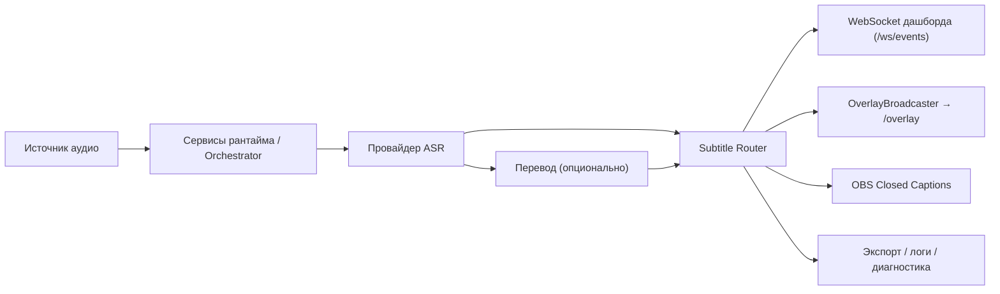

# SST Desktop 0.3.0 - Technical Architecture

Актуально для линии кода, где `backend/versioning.py` содержит `PROJECT_VERSION = "0.3.0"`, включая текущие post-release изменения в `main`.

## 1. Назначение и границы системы

`stream-sub-translator` — локальное Windows desktop-приложение для субтитров в реальном времени:

- захват речи:
  - локальный микрофон
  - browser speech worker
  - опциональная цепочка remote controller → worker (аудио)
- ASR:
  - локальный AI runtime
  - приём потока от browser speech worker
- опциональный перевод на 0..N целевых языков;
- единая маршрутизация subtitle payload в dashboard и OBS overlay;
- экспорт сессий и локальные runtime/client diagnostics.

Жёсткие границы:

- рантайм по умолчанию local-first и только localhost;
- без cloud backend, accounts, hosted database или SaaS assumptions;
- frontend без Node.js/React/bundler;
- browser pages, dashboard и overlay обслуживаются FastAPI;
- remote mode — отдельный explicit LAN scenario, а не интернет-facing deployment model.

## 2. Технологический стек

- Python 3.11+
- FastAPI + Uvicorn
- Pydantic schemas
- WebSocket для runtime-событий и мостов worker/controller
- `sounddevice`, `numpy`
- стек провайдеров AI/рантайма для локального ASR
- фронтенд на plain HTML/CSS/JavaScript

## 3. Верхнеуровневая архитектура

`RuntimeOrchestrator` физически расположен в `backend/core/runtime_orchestrator.py`. Маршрутизация субтитров остаётся локальной и детерминированной: `backend/core/subtitle_router.py` — фасад, ориентированный на публикацию (overlay + WebSocket дашборда), а правила жизненного цикла и сборка payload вынесены в отдельные модули.

## 4. Backend Structure

### 4.1 Верхнеуровневые модули

- `backend/app.py`
- `backend/run.py`
- `backend/run_controller.py`
- `backend/run_worker.py`
- `backend/config/`
- `backend/asr/`
- `backend/translation/`
- `backend/models.py`
- `backend/versioning.py`

### 4.2 Маршруты API

Внешний HTTP surface по-прежнему организован через routes:

- `backend/api/routes_runtime.py`
- `backend/api/routes_settings.py`
- `backend/api/routes_devices.py`
- `backend/api/routes_profiles.py`
- `backend/api/routes_exports.py`
- `backend/api/routes_logs.py`
- `backend/api/routes_version.py`
- `backend/api/routes_remote.py`
- `backend/api/routes_openai_models.py` (вспомогательные endpoints для UI: curated list моделей OpenAI-провайдера)

Обработчики в `0.3.0` должны оставаться тонким транспортным слоем и делегировать оркестрацию сервисам.

### 4.3 Сервисы

Новый слой сервисов:

- `backend/services/runtime_service.py`
- `backend/services/settings_service.py`
- `backend/services/config_state_service.py`
- `backend/services/asr_service.py`
- `backend/services/browser_asr_service.py`
- `backend/services/translation_service.py`
- `backend/services/diagnostics_service.py`
- `backend/services/export_service.py`
- `backend/services/overlay_service.py`
- `backend/services/model_manager_service.py`

Назначение:

- сосредоточить оркестрацию на границе маршрутов;
- централизовать active in-memory config state metadata;
- уменьшить объём логики внутри route handlers;
- сделать `app.state` dependencies более явными и тестируемыми.

### 4.4 Ядро (`core`)

`backend/core/` содержит shared runtime infrastructure, subtitle lifecycle logic и совместимые entrypoints поверх новых подмодулей:

- bootstrap:
  - `app_bootstrap.py`
- runtime entrypoint:
  - `runtime_orchestrator.py`
- контроллеры рантайма и координация (`backend/core/runtime/`):
  - `runtime_state_controller.py` (coalescing и упорядочивание broadcast статуса рантайма)
  - `asr_mode_controller.py` (разрешение и фиксация режима/провайдера ASR на сессию)
  - `translation_runtime_controller.py` (жизненный цикл TranslationEngine + TranslationDispatcher)
  - `subtitle_presentation_controller.py` (тонкая обёртка над SubtitleRouter)
  - `output_fanout_controller.py` (fanout публикации в WS/OBS)
  - `transcript_controller.py` (оркестрация конвейера partial/final транскриптов)
  - `runtime_lifecycle_coordinator.py` (упорядоченный start/stop ключевых компонентов рантайма)
  - абстракция источника речи:
    - `speech_source.py`, `speech_source_factory.py`
    - `browser_speech_source.py`
    - `local_parakeet_speech_source.py`
    - `remote_controller_speech_source.py`
    - `remote_worker_speech_source.py`
  - вынесенные вспомогательные контроллеры («учёт» состояния):
    - `runtime_reset_controller.py` (reset groups that must stay consistent)
    - `runtime_session_controller.py` (session ids/timestamps/sequence/generation)
    - `runtime_start_state_controller.py` / `runtime_stop_state_controller.py`
    - `runtime_export_controller.py` (stop-time export attempt + error capture)
    - `segment_state_controller.py` (active segment cleanup helpers)
    - `browser_worker_state_controller.py` (browser worker session bookkeeping)
    - `remote_audio_state_controller.py` (remote audio ingest + queue lifecycle)
    - `speech_source_state_controller.py` (active speech source selection/cleanup)
    - `processing_tasks_controller.py` (capture/asr task lifecycle)
    - `audio_capture_controller.py` (AudioCapture lifecycle)
- paths / logging / errors:
  - `paths.py`
  - `logging_setup.py`
  - `api_errors.py`
  - `redaction.py`
- config:
  - `config_migrations.py`
  - `config_schema_export.py`
- runtime / routing / diagnostics:
  - `subtitle_router.py` (фасад: публикация + связывание)
  - `subtitle_lifecycle_core.py` (КА жизненного цикла: promotion, TTL/релевантность, планирование истечения)
  - `subtitle_presentation.py` (сборка payload: порядок, слоты стилей, слияние partial и финала)
  - `overlay_broadcaster.py`
  - `session_logger.py`
  - `structured_runtime_logger.py`
- browser ASR:
  - `browser_asr_gateway.py`
- providers:
  - `parakeet_provider.py`
- remote:
  - `remote_mode.py`
  - `remote_session.py`
  - `remote_signaling.py`
  - `remote_diagnostics.py`

Практически это означает:

- `RuntimeOrchestrator` физически находится в `backend/core/runtime_orchestrator.py`;
- `backend/core/subtitle_router.py` — фасад публикации субтитров (overlay + WS) и сохраняет shim совместимости для старых импортов;
- жизненный цикл субтитров и сборка payload разнесены по:
  - `backend/core/subtitle_lifecycle_core.py`
  - `backend/core/subtitle_presentation.py`
- зона ответственности оркестрации постепенно выносится из одного крупного runtime hub в предметные помощники под `backend/core/runtime/`.

### 4.5 Config package

`backend/config/` теперь содержит config loading/normalization surface:

- `__init__.py`
- `defaults.py`
- `secrets.py`
- `normalizers/asr.py`
- `normalizers/browser.py`
- `normalizers/obs.py`
- `normalizers/remote.py`
- `normalizers/subtitles.py`
- `normalizers/translation.py`

Назначение:

- убрать риск дальнейшего роста одного монолитного `backend/config.py`;
- держать defaults, secret normalization и domain normalization раздельно;
- дать `LocalConfigManager` и тестам стабильные import entrypoints.

### 4.6 Пакеты ASR и перевода

Новые предметные пакеты:

- `backend/asr/parakeet/`
  - `model_installer.py`
  - `runtime_loader.py`
  - `device_diagnostics.py`
  - `providers/base.py`
  - `providers/official.py`
  - `providers/realtime.py`
  - `mock_provider.py`
- `backend/translation/`
  - `engine.py`
  - `registry.py`
  - `readiness.py`
  - `providers/google_v2.py`
  - `providers/google_v3.py`
  - `providers/azure.py`
  - `providers/deepl.py`
  - `providers/libretranslate.py`
  - `providers/public_mirrors.py`
  - `providers/google_gas.py`
  - `providers/openai_compatible.py`
  - `providers/experimental_google_web.py`

Текущее состояние пакета перевода:

- конкретные провайдеры перевода сосредоточены в `backend/translation/providers/`;
- `backend/translation/registry.py` строит реестр провайдеров по умолчанию напрямую из этих модулей;
- `backend/core/translation_engine.py` остаётся точкой совместимости и подготовки запросов, но не содержит реализаций провайдеров;
- подготовка рантайма перевода учитывает слоты: у каждой видимой линии свои `slot_id`, `target_lang` и выбор провайдера.

### 4.7 Схемы

`backend/schemas/` теперь содержит типизированные определения payload вместо разрастания ad hoc dict-контрактов:

- схемы конфигурации
- схемы рантайма
- схемы ASR
- схемы диагностики
- схемы, связанные с overlay и переводом

## 5. Bootstrap приложения

`backend/core/app_bootstrap.py` централизованно поднимает:

- project-local paths
- config manager
- active config state service
- profile manager
- session/runtime loggers
- WebSocket manager
- remote managers
- orchestrator/runtime dependencies
- app services

Практический эффект:

- `backend/app.py` перестаёт быть местом ручной сборки всего runtime graph;
- тесты могут стабильно ожидать `app.state.*` dependencies;
- следующий этап декомпозиции не требует повторного переписывания entrypoint.

### 5.1 Профили desktop-лаунчера

Пакетный desktop launcher сейчас явно показывает пять профилей:

- `Quick Start (Browser Speech)`
- `NVIDIA GPU (CUDA)`
- `CPU-only`
- `Remote Controller`
- `Remote Worker`

Ожидаемое поведение:

- Browser Speech quick start намеренно пропускает установку/подготовку локального AI-runtime (быстрее старт);
- Remote Controller остаётся «лёгким» и не должен форсировать установку локальных моделей/рантайма;
- Remote Worker включает LAN bind (явный opt-in) и держит worker только на локальном AI пути;
- поведение по умолчанию остаётся local-first, потому что remote роли — это явный профиль запуска, а не «дрейф» режима.

## 6. Конфигурация и миграции

Главный config path:

- постоянная конфигурация хранится в `user-data/config.json`

В `0.3.0`:

- код конфигурации живёт в `backend/config/` вместо одного монолитного `backend/config.py`;
- конфигурация проходит через явные шаги миграции;
- профили используют тот же pipeline миграции/нормализации;
- сгенерированная JSON Schema лежит в `backend/data/config.schema.json`.

Ключевые migration steps:

- переименование провайдера в `official_eu_parakeet_low_latency`;
- очистка удалённых/устаревших backend ASR настроек, чтобы старые конфиги падали на поддерживаемые Parakeet-дефолты;
- v6 переводческой конфигурации добавляет `translation.lines`, сохраняя legacy `translation.provider` и `translation.target_languages`;
- legacy `subtitle_output.display_order` на основе кодов языков мигрируется в стабильные slot id вроде `translation_1`.

Это важно для:

- стабильности save/load;
- совместимости desktop/runtime;
- воспроизводимых тестов;
- эволюции UI без «дрейфа» старых конфигов.

Дополнительный current-branch contract:

- `LocalConfigManager.normalize_profile_payload()` используется не только для save/load, но и для нормализации runtime-start snapshot (несохранённых изменений из UI).
- активное состояние конфигурации отслеживается явно через метаданные `source`, `persisted`, `hash`.

### 6.1 Практический pipeline нормализации (как реально обрабатывается конфиг)

1) При `load()`:
- читается JSON из `user-data/config.json` (если файла нет — создаётся дефолтный конфиг);
- выполняется `migrate_config()` (приведение shape/версии/legacy полей);
- затем доменные normalizers приводят секции к безопасным дефолтам и диапазонам:
  - `asr` (включая realtime и browser настройки),
  - `translation` (слоты `translation_1..translation_5`, provider settings),
  - `subtitle_output` (display order и max translation lines),
  - `subtitle_style` (пресеты/перекрытия слотов),
  - `subtitle_lifecycle` (TTL/паузы/инварианты),
  - `obs_closed_captions`, `remote`, `updates`.

2) При `save()`:
- входной payload тоже проходит тот же pipeline;
- на диск пишется уже нормализованный `ConfigSchema` (mode="json").

3) При `POST /api/runtime/start`:
- dashboard может передать `config_payload` snapshot (даже несохранённый);
- snapshot проходит нормализацию, применяется только в памяти, и помечается как `persisted=false`.

4) Проверка обновлений:

- конфиг секции `updates` нормализуется вместе с остальными (enabled/provider/github_repo/release_channel/check_interval_hours);
- backend surface:
  - `/api/version` возвращает version metadata + текущий `sync` статус из `updates.*` (последняя известная версия, время проверки и т.д.);
  - `POST /api/updates/check` выполняет live polling GitHub Releases и сохраняет `updates.latest_known_version` + `updates.last_checked_utc` в `user-data/config.json`;
- desktop bootstrap launcher surface:
  - на старте тихо проверяет GitHub Releases и показывает диалог только если remote версия новее embedded `manifest.app_version`;
  - если обновления нет (или сеть недоступна) — запуск идёт без дополнительного UI;
  - кнопка Download открывает страницу релиза и затем запуск продолжается.

## 7. Локальный HTTP API

Основные локальные endpoints:

- `/api/health`
- `/api/runtime/start`
- `/api/runtime/stop`
- `/api/runtime/status`
- `/api/settings/load`
- `/api/settings/save`
- `/api/devices/audio-inputs`
- `/api/obs/url`
- `/api/version`
- `/api/updates/check`
- `/api/profiles`
- `/api/profiles/{name}`
- `/api/exports`
- `/api/exports/diagnostics`
- `/api/logs/client-event`
- `/api/openai/recommended-models` (курируемый список; без обращения к OpenAI API)

Текущий контракт `POST /api/runtime/start`:

- принимает `device_id`;
- принимает опциональный `config_payload`;
- нормализует этот payload через config manager (если он доступен);
- применяет его в активное in-memory состояние только для текущего запуска runtime;
- может заранее подхватить remote-поля `remote.session_id`/`remote.pair_code`;
- помечает active config state как `runtime_start_snapshot` с `persisted = false`;
- не пишет `user-data/config.json`, пока пользователь явно не сохранит настройки.

### 7.1 События и контракты, важные для фронта

Типы сообщений, которые приходят в `/ws/events`:
- `runtime_update` (на фронте нормализуется в `runtime_status`);
- `subtitle_payload_update` (на фронте нормализуется в `overlay_update` для унификации);
- `overlay_update` (payload для overlay страницы, с `created_at_ms`).

Важно: dashboard фильтрует stale события по `event_sequence`/`created_at_ms`. Overlay страница должна делать то же самое (иначе после реконнекта возможны откаты текста).

Remote endpoints:

- `/api/remote/state`
- `/api/remote/pair/create`
- `/api/remote/pair/verify`
- `/api/remote/heartbeat`
- `/api/remote/worker/settings/sync`
- `/api/remote/worker/runtime/start`
- `/api/remote/worker/runtime/stop`
- `/api/remote/worker/runtime/status`
- `/api/remote/worker/health`

Примечание: Remote surface остаётся частью продукта как explicit LAN-only исключение, но подробные remote планы/roadmap документы не являются частью публичной документации по умолчанию.

## 8. Поверхность WebSocket

- `/ws/events`
- `/ws/asr_worker`
- `/ws/remote/signaling`
- `/ws/remote/audio_ingest`
- `/ws/remote/result_ingest`

## 9. WebSocket manager и устойчивость событий

`backend/ws_manager.py` в `0.3.0` отвечает за более безопасный lifecycle broadcast:

- снимок подключений перед broadcast;
- удаление мёртвых сокетов после сбоев;
- терпимость к ошибкам disconnect/close/send;
- без изменения множества подключений во время итерации;
- снижение риска, что один сломанный WebSocket «убьёт» весь путь broadcast.

Ожидания к рантайму и событиям:

- reconnect не должен бесконечно воспроизводить устаревшую историю browser worker;
- дубликаты снимков статуса рантайма должны схлопываться (coalescing);
- устаревшие generation worker-ов должны игнорироваться;
- мёртвые сокеты нужно очищать после сбоев, а не бесконечно порождать исключения.

## 10. Структура фронтенда

### 10.1 Dashboard

`frontend/index.html` загружает:

- `frontend/js/main.js`

Группы модулей:

- `frontend/js/i18n.js`
- `frontend/js/core/`
  - store
  - API client
  - WS client
  - event helpers
- `frontend/js/dashboard/`
  - actions
  - helpers
  - logging
  - constants
- `frontend/js/panels/`
  - runtime
  - ASR
  - translation
  - overlay
  - diagnostics
  - OBS captions
  - style editor
  - profiles
  - remote
- `frontend/js/normalizers/`
  - config
  - runtime
  - diagnostics
  - translation
  - overlay
  - model status

### 10.2 Страницы browser worker

- `frontend/google_asr.html`
- `frontend/google_asr_experimental.html`

### 10.3 Страницы remote bridge

- `frontend/remote_controller_bridge.html`
- `frontend/remote_worker_bridge.html`

### 10.4 Overlay

- `overlay/overlay.html`
- связанные JS/CSS ресурсы

### 10.5 Текущее состояние UX (dashboard)

- вкладка Translation показывает стабильные карточки слотов `translation_1 .. translation_5`, а не один плоский список порядка языков;
- у каждой карточки слота — редактирование `enabled`, `target_lang`, `provider`, `label` для этой линии;
- общий редактор настроек провайдера следует провайдеру выбранного слота, но может переключаться вручную, если слот не выбран;
- тексты диагностики и remote-инструментов проходят через тот же слой локализации `frontend/js/i18n.js`, что и остальной дашборд;
- после `Tools & Data` добавлена вкладка «Справка / Помощь»;
- справка — локальные topic-tabs внутри дашборда, одновременно видна только одна тема;
- темы справки отражают продуктовые поверхности: обзор, распознавание/тюнинг, перевод, субтитры/стиль, OBS, инструменты/диагностика, desktop/remote;
- в тюнинге кратко описаны только «ощущающие» ползунки распознавания и RNNoise; точные тайминги/гейты ASR задокументированы в `Tools & Data`;
- нормализация статусов UI сохраняет `experimental` как отдельный статус для экспериментальных провайдеров перевода, а не сводит его к `degraded`.

## 11. Классический путь Browser Speech

Маршрут classic browser worker (страница worker-а):

- `/google-asr`

Основной модуль жизненного цикла:

- `frontend/js/browser-asr-session-manager.js`

В `0.3.0` этот менеджер является владельцем FSM распознавания.

Состояния supervisor:

- `idle`
- `starting`
- `running`
- `stopping`
- `restarting`
- `backoff`
- `fatal`

Ключевое поведение:

- `start()` игнорируется или откладывается, если состояние жизненного цикла делает повторный `recognition.start()` небезопасным;
- `stop()` идемпотентен и учитывает generation;
- `onend` никогда напрямую не выполняет синхронный небезопасный перезапуск;
- для `no-speech` и `network` действуют отдельные политики перезапуска;
- здоровье микрофона и деградированные состояния учитываются явно;
- подавляются дубликаты partial/final и поздние принудительные финалы.

Поведение настроек:

- classic worker в приоритете использует значения из собственного `localStorage`;
- настройки бэкенда — fallback и цель зеркалирования;
- бэкенд не является жёстким переопределением локальных настроек classic worker.

## 12. Экспериментальный путь Browser Speech

Маршрут экспериментального browser worker (страница worker-а):

- `/google-asr-experimental`

Модуль жизненного цикла:

- `frontend/js/browser-asr-audio-track-session-manager.js`

Поведение:

- открывается живой `MediaStreamTrack`;
- вызывается `SpeechRecognition.start(audioTrack)`;
- при отказе браузера от experimental-пути выполняется откат на обычный `recognition.start()`.

В `0.3.0` этот subclass выровнен с базовым контрактом FSM и не опирается на удалённые legacy-методы старого API менеджера.

## 13. Интеграция Browser ASR с backend

WebSocket worker-а:

- `/ws/asr_worker`

Связанные части backend:

- `backend/services/browser_asr_service.py`
- `backend/core/browser_asr_gateway.py`
- `backend/services/asr_service.py`
- `backend/core/subtitle_router.py`

Зона ответственности:

- учёт identity сессии/generation browser worker;
- приём обновлений статуса, heartbeat и транскриптов;
- подавление устаревших generation worker-ов;
- экспонирование диагностики worker в статус рантайма;
- подача обновлений транскриптов в существующий конвейер субтитров/перевода.

## 14. Логи и client-event события

Маршрут client-event:

- `POST /api/logs/client-event`

Требование `0.3.0`:

- сбои записи лога не должны ронять маршруты backend.

`SessionLogger` и связанные пути логирования работают в best-effort режиме:

- проактивное создание каталогов;
- терпимость к `PermissionError`/`OSError`/`IOError`;
- отбрасывание и учёт событий при неудачной записи файла;
- блокировки файлов не превращаются в фатальные ошибки рантайма.

`StructuredRuntimeLogger` пишет структурированную диагностику рантайма в стиле JSONL и применяет редактирование чувствительных полей.

## 14.1 Диагностический экспорт (пакет диагностики)

Экспорт `GET /api/exports/diagnostics` собирает локальный ZIP и кладёт туда:
- `runtime_status.json` (снимок рантайма),
- `preflight_report.json`,
- `config_redacted.json` (конфиг с редактированием чувствительных полей),
- `latest_session.jsonl` (ограниченный по объёму client-event лог),
- `runtime-events.jsonl` (структурированный лог рантайма),
- `backend.log` (с редактированием по строкам),
- `environment.txt` и `diagnostics-manifest.json`.

Цель: чтобы пользователь мог отправить архив для разбора проблем, не раскрывая ключи/токены/пароли.

## 15. Маршрутизация overlay и перевода

`backend/core/subtitle_router.py` остаётся основной точкой координации субтитров и событий как фасад, а жизненный цикл и сборка payload принадлежат:

- `backend/core/subtitle_lifecycle_core.py`
- `backend/core/subtitle_presentation.py`

Ключевые обязанности:

- приём событий ASR источника;
- управление жизненным циклом partial/final сегментов источника;
- интеграция результатов перевода;
- публикация payload дашборда и overlay;
- координация диагностики и хуков экспорта.

В `0.3.0` дополнительно:

- подавление дубликатов шума рантайма;
- снижение риска несоответствия устаревшего перевода и источника;
- согласование обновлений overlay с жизненным циклом сегмента источника.

Инварианты слотов перевода:

- идентичность перевода в первую очередь по `slot_id`, а не по `target_lang`;
- дубликаты целевых языков допустимы, если слоты различаются;
- порядок overlay/отображения использует стабильные id слотов вроде `translation_1 .. translation_5`;
- настройки провайдера остаются глобальными на провайдера в `translation.provider_settings`, каждый слот выбирает, какой провайдер эти настройки использует.

## 16. Поверхность провайдеров ASR

Поддерживаемые пути ASR:

- локальный рантайм Parakeet через аудиоконвейер backend;
- classic browser speech worker (`/google-asr`);
- experimental browser speech worker (`/google-asr-experimental`).

## 17. Remote-режим

Remote-режим подключается только явным выбором пользователя (opt-in).

Артефакты controller/worker сохранены:

- `backend/core/remote_mode.py`
- `backend/core/remote_session.py`
- `backend/core/remote_signaling.py`
- `frontend/js/remote.js`
- страницы bridge и файлы audio worklet

Ограничения:

- remote worker не должен работать в режиме browser speech;
- синхронизация remote worker закрепляет локальный AI-путь, не допуская ухода в провайдеры browser worker.

Задокументированный порядок действий оператора:

1. Сначала запустить роль worker (`Remote Worker` или `start-remote-worker.bat`).
2. Затем запустить роль controller (`Remote Controller` или `start-remote-controller.bat`).
3. На controller задать `Worker Base URL` и выполнить `Check Worker Health`.
4. Создать/проверить pairing, обновить remote state.
5. Выполнить синхронизацию настроек worker перед подготовкой или стартом удалённого запуска.
6. Подготовить удалённый запуск, запустить/проверить рантайм worker, держать открытыми bridge-окна controller/worker.
7. Запустить рантайм дашборда controller для захвата микрофона и потока удалённого аудио/результатов.

## 18. Запуск и локальные данные

Ожидаемые корни локальных данных:

- `user-data/`
- `logs/`
- `user-data/models/`
- пути моделей/кэша/экспорта/профилей под этим локальным корнем рантайма

Установки, где ещё есть `user-data/logs/`, при старте лаунчера/рантайма мигрируются в корневой `logs/`, чтобы оболочка desktop и backend использовали один локальный корень логов.

Целевой адрес привязки по умолчанию:

- `127.0.0.1`

Ожидаемые локальные страницы:

- дашборд
- overlay
- страницы browser worker
- страницы remote bridge

Все по-прежнему обслуживаются Python-приложением.

## 19. Тестирование

Ручные шаги, ориентированные на релиз: [RELEASE_HARDENING_CHECKLIST.md](./RELEASE_HARDENING_CHECKLIST.md).

`0.3.0` расширяет детерминированное локальное тестовое покрытие для:

- архитектуры backend
- миграций конфига
- экспорта схемы конфига
- контракта browser worker
- browser ASR service/gateway
- coalescing событий рантайма
- очистки в WebSocket manager
- устойчивости session logger к сбоям
- модульной архитектуры frontend
- контракта логирования дашборда
- выбора провайдера ASR и очистки legacy-конфига
- remote-потока
- версионирования

Актуальный набор команд проверки при работе над релизом:

- `python -m compileall backend desktop tests`
- `.\.venv\Scripts\python.exe -m unittest discover -s tests -p "test_*.py"`
- `cmd /c build-desktop.bat`
- `cmd /c build-bootstrap-launcher.bat`
- `powershell -NoProfile -ExecutionPolicy Bypass -File .\publish-desktop-releases.ps1`

Наблюдаемый результат:

- `231 tests`
- `OK`
- обновлённые артефакты:
  - `dist\Stream Subtitle Translator\Stream Subtitle Translator.exe`
  - `dist\bootstrap-launcher\Stream Subtitle Translator.exe`
  - `F:\AI\stream-sub-translator-desktop-release\Stream Subtitle Translator.exe`
  - `F:\AI\stream-sub-translator-desktop-release-clean\Stream Subtitle Translator.exe`

## 20. Продуктовые инварианты, сохранённые в 0.3.0

- запуск desktop по умолчанию остаётся local-first;
- Browser Speech по-прежнему есть;
- `browser_google` остаётся доступным для выбора;
- Parakeet остаётся доступным;
- визуальная вёрстка дашборда не заменена мастером или новым UI-стеком;
- overlay остаётся отдельной лёгкой страницей для OBS;
- не введён стек Node.js/bundler/frontend framework.
