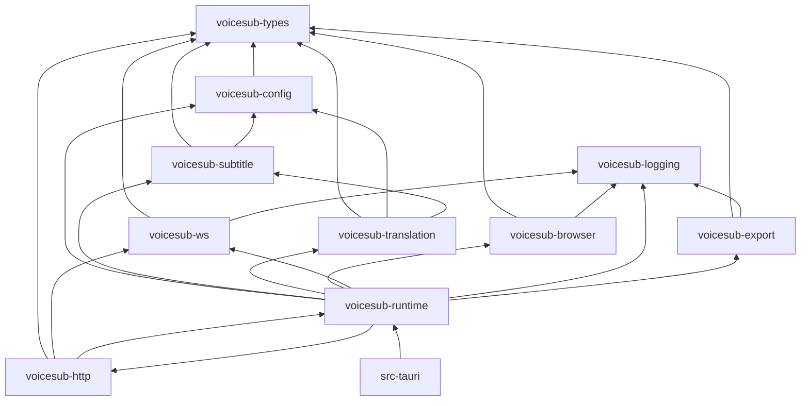

# VoiceSub — инженерный контракт (обязателен для агентов и разработки)

**Статус:** non-negotiable  
**Приоритет:** выше roadmap-фаз; любая задача должна ему соответствовать  
**Связь:** `AGENTS.md` (краткая выжимка), `docs/plans/voicesub_roadmap.ru.md` (фазы)

---

## 1. Главный принцип — полный перенос без поломок

### 1.1 Что переносим

**Весь текущий функционал SST `0.4.4` как есть** — та же логика, те же алгоритмы, те же контракты данных и порядок побочных эффектов.

Источник истины поведения:

| Область | SST reference (не исчерпывающе) |
| --- | --- |
| Browser ASR transport + ingress | `BrowserAsrService`, `BrowserSpeechSource`, `BrowserAsrGateway`, `BrowserAsrOperationalFsm` |
| Subtitle lifecycle | `SubtitleLifecycleCore`, `SubtitleRouter`, `SubtitlePresentation`, `OverlayBroadcaster` |
| Translation | `TranslationDispatcher`, `TranslationEngine`, все `translation/providers/*` |
| Config | `ConfigSchema`, `config_migrations.py`, normalizers |
| Overlay payload | `overlay-normalizer.js`, `subtitle-style.js` invariants |
| OBS captions | `obs_closed_captions` config + timing |
| Diagnostics export | diagnostics ZIP + redaction (`session-latest.jsonl` in bundle only) |
| Desktop worker launch | `browser_worker_launcher.py` flags + EcoQoS |
| i18n | 5 локалей, merge rules |

### 1.2 Явные исключения (единственные допустимые «поломки»)

| Убрано из active VoiceSub | Куда | Почему |
| --- | --- | --- |
| Parakeet / `local` ASR | `legacy/modules-source/parakeet/` → модуль | по продуктовому решению |
| Experimental browser | `legacy/experimental-browser/` | по продуктовому решению |
| pywebview / PyInstaller / FastAPI runtime | замена на Rust/Tauri | смена стека, не смена продукта |

**Запрещено:** «упростить» translation providers, lifecycle, browser FSM, overlay contract, config semantics под предлогом рефакторинга.

### 1.3 Критерий приёмки порта

Перед merge/релизом фазы:

1. Golden fixtures из SST `tests/` проходят на Rust (subtitle, translation, browser WS, config).
2. Ручной soak browser worker (30+ min, OBS overlap) — без регрессии «quiet worker».
3. Нет намеренных изменений контрактов без записи в CHANGELOG + обновления этого документа.

---

## 2. Структура репозитория (с первого коммита Rust)

Основано на: [Cargo Workspaces](https://doc.rust-lang.org/book/ch14-03-cargo-workspaces.html), [Tauri v2 Project Structure](https://v2.tauri.app/start/project-structure/), [Microsoft Rust crate architecture](https://microsoft.github.io/RustTraining/rust-patterns-book/ch15-crate-architecture-and-api-design.html), layered monorepo practice (dependency inversion, one-way edges).

### 2.1 Принципы layout

1. **Virtual workspace** в корневом `Cargo.toml` — один `Cargo.lock`, `[workspace.dependencies]`.
2. **Плоский `crates/`** — без `crates/libs/` nesting; имя crate = назначение.
3. **Однонаправленные зависимости** — нижние слои не знают о HTTP/Tauri/Chrome.
4. **`src-tauri/` тонкий** — только IPC, window, bundle; бизнес-логика в `crates/*`.
5. **Статика отдельно:** `bin/overlay/`, `src-worker/` → `bin/worker/`, `bin/dashboard/` — не смешивать с Rust sources.
6. **`legacy/`** — только архив; не импортируется из active crates.
7. **Новый файл** — только в согласованном дереве (§2.2); ad-hoc `misc/`, `utils2.rs` запрещены.

### 2.2 Целевое дерево (канон)

```
F:\AI\VoiceSub\
├── Cargo.toml                      # [workspace] members, workspace.dependencies
├── Cargo.lock
├── .cargo/config.toml              # optional: target, aliases (xtask)
│
├── crates/
│   ├── voicesub-types/             # Layer 0: DTO, enums, WS/API payload types, errors
│   ├── voicesub-config/            # Layer 1: TOML, migrations, SST JSON import, validation
│   ├── voicesub-subtitle/          # Layer 1: lifecycle FSM, router, presentation (pure + ports)
│   ├── voicesub-translation/       # Layer 1: dispatcher, engine, 13 providers, cache
│   ├── voicesub-browser/           # Layer 2: Chrome supervisor, worker protocol, FSM port
│   ├── voicesub-ws/                # Layer 2: /ws/events, /ws/asr_worker fanout
│   ├── voicesub-http/              # Layer 2: axum routes, static file mount
│   ├── voicesub-logging/           # Layer 2: tracing setup, rotation, session jsonl
│   ├── voicesub-export/            # Layer 2: diagnostics zip, redaction
│   └── voicesub-runtime/           # Layer 3: orchestration, start/stop, wiring (no Tauri)
│
├── src-tauri/                      # Layer 4: Tauri binary shell only
│   ├── Cargo.toml
│   ├── tauri.conf.json             # productName VoiceSub, icons SST
│   ├── capabilities/
│   └── src/{main.rs, lib.rs}
│
├── tests/                          # Layer 5: cross-crate integration + golden harness
│   ├── golden/                     # JSON fixtures exported from SST tests
│   ├── integration/
│   └── helpers/
│
├── xtask/                          # optional: migrate-config, export-golden, dev soak helpers
│
├── bin/
│   ├── overlay/                    # vanilla OBS (не Svelte)
│   ├── dashboard/                  # vite dashboard build
│   ├── worker/                     # /google-asr
│   ├── tts/                        # /tts UI
│   ├── fonts/
│   └── modules/                    # shipped module runtimes (tts, parakeet later)
├── src/                            # Svelte dashboard
├── src-worker/                     # Svelte worker sources
│
├── legacy/                         # read-only archive (experimental, parakeet)
├── docs/
├── logs/                           # runtime (gitignored)
└── user-data/                      # runtime (gitignored)
```

### 2.3 Граф зависимостей (строго)



**Правила:**

- `voicesub-types` — **zero** IO crates (no tokio full, no axum).
- `voicesub-subtitle` / `voicesub-translation` — domain; HTTP только через traits/ports при необходимости.
- `voicesub-runtime` — единственный **wiring**; Tauri не дублирует orchestration.
- Циклические зависимости между crates — **запрещены** (компилятор + review).

### 2.4 Именование и API surface

- Crates: `voicesub-<domain>` (kebab in path, snake in Rust).
- Публичный API каждого crate — через `lib.rs` re-exports; внутреннее `pub(crate)`.
- Ошибки: typed `thiserror` per crate, convert at boundaries.
- Config keys: 1:1 с SST semantics (TOML names documented in `voicesub-config`).

### 2.5 Когда дробить crate

Добавлять crate только если:

- compile/test цикл `cargo test -p X` должен быть изолирован; или
- граница IO vs pure logic требует enforcement.

Не плодить crates «на будущее».

---

## 3. Тестирование — с первого дня, без исключений

### 3.1 Политика

| Правило | Деталь |
| --- | --- |
| **Нет кода без теста** | Новый модуль/алгоритм в `crates/*` → unit tests в том же crate в той же задаче |
| **Golden-first port** | Сначала экспорт fixture из SST `tests/test_*.py`, потом Rust impl до green |
| **Regression parity** | Subtitle + translation: **100%** критических tests из SST (см. список в roadmap) |
| **Integration** | `tests/integration/`, `voicesub-http/tests/` — HTTP/WS smoke; `integration_lock()` выставляет `VOICESUB_SKIP_BROWSER_WORKER=1` (Chrome не spawn) |
| **CI local** | `cargo test --workspace` must pass перед «done»; integration harness выставляет `VOICESUB_SKIP_BROWSER_WORKER=1` — Chrome worker не spawn в тестах |

### 3.2 Уровни тестов

| Уровень | Где | Что |
| --- | --- | --- |
| Unit | `crates/*/src/**` inline `#[cfg(test)]` | FSM transitions, stale drop, normalization |
| Golden | `tests/golden/*.json` + `tests/integration/golden_*.rs` | Byte-level или semantic equality payload |
| Contract | `tests/integration/` | WS handshake, overlay payload shape |
| Soak | manual + `docs/plans/voicesub_poc_report.md` | browser worker 30 min |
| Frontend | Vitest (dashboard/worker) | i18n keys, normalizers — по мере появления Svelte |

### 3.3 Golden fixtures (обязательный минимум)

Экспорт из SST (скрипт `xtask export-golden` — создать в Фазе 0):

- `test_subtitle_router.py`
- `test_subtitle_lifecycle_relevance.py`
- `test_translation_dispatcher.py`
- `test_browser_asr_service.py`
- `test_ws_manager.py`
- `test_config_migrations.py` (import path)

Каждый fixture: `input` + `expected` + `source_test` metadata.

### 3.4 Тесты и логи

- Использовать `test-log` + `tracing` в тестах (`RUST_LOG=debug cargo test -- --nocapture`).
- Падающий golden test должен печатать **diff** expected vs actual (структурированно).

---

## 4. Логирование — детальное, структурированное, с первого дня

### 4.1 Стек

| Компонент | Выбор |
| --- | --- |
| Rust core | **`tracing`** + **`tracing-subscriber`** (JSON + human-readable layers) |
| Запрещено | `println!`, `eprintln!`, `dbg!` в production paths |
| Tauri | `tauri-plugin-log` и/или bridge `tracing` → log plugin / webview (dashboard debug) |
| Frontend | structured client events → Rust (`/api/logs/client-event` port) |

### 4.2 Файлы логов (совместимость с SST где разумно)

| Файл | Содержание |
| --- | --- |
| `logs/core.log` | backbone (аналог `backend.log`) |
| `logs/runtime-events.log` | lifecycle, runtime start/stop, coalesced status |
| `logs/session-latest.jsonl` | transcript/session export stream |
| `logs/ws-trace.jsonl` | opt-in: WS ingress/egress samples |
| `logs/translation-trace.jsonl` | opt-in: dispatch, stale drop, supersession |
| `logs/subtitle-trace.jsonl` | opt-in: lifecycle transitions |
| `logs/browser-asr.jsonl` | opt-in: generation, session, FSM phase |

### 4.3 Opt-in deep diagnostics

Порт семантики `backend/core/diagnostic_flags.py`:

| Env | Эффект |
| --- | --- |
| `VOICESUB_DEEP_DIAGNOSTICS=1` | master switch |
| `VOICESUB_TRACE_WS=1` | ws jsonl |
| `VOICESUB_TRACE_TRANSLATION=1` | translation jsonl |
| `VOICESUB_TRACE_SUBTITLE=1` | subtitle jsonl |
| `VOICESUB_TRACE_BROWSER_ASR=1` | browser jsonl |
| `VOICESUB_TRACE_API=1` | HTTP middleware jsonl |

Без флагов — только backbone (`core.log`, `runtime-events.log`, `session-latest.jsonl`), как SST 0.4.1 baseline.

### 4.4 Spans на hot path (обязательные точки)

Каждое событие должно быть коррелируемо:

- `session_id`, `generation`, `segment_id`, `revision` (browser + subtitle)
- `slot_id`, `provider`, `stale_reason` (translation)
- `lifecycle_state`, `event_sequence` (subtitle → overlay)

Использовать `tracing::span!` на:

- WS message accept/reject (stale)
- Translation dispatch start/skip/publish
- Subtitle lifecycle transition
- Chrome worker spawn/restart/exit
- Config load/save/migrate

### 4.5 Ротация

- При старте: rename → `*.old.log` (как SST desktop bootstrap).
- JSONL: size-based rotation opt-in для deep traces.
- Diagnostics export: redaction обязателен (port `redaction.py`).

---

## 5. Порядок работы агента (workflow)

Для **каждой** задачи:

1. **Найти SST reference** — файл(ы) с текущим поведением.
2. **Зафиксировать контракт** — test или golden fixture **до** или **вместе с** портом.
3. **Разместить код** в правильном crate (§2.3); не в `src-tauri` business logic.
4. **Добавить tracing** на границах модуля.
5. **Прогнать** `cargo test -p <crate>` + затронутые golden tests.
6. **Обновить** `TECHNICAL_ARCHITECTURE.md` если меняется контракт API/WS/config.

**Запрещённый порядок:** «сначала заработает в прототипе, тесты потом».

---

## 6. Чеклист Definition of Done (дополнение к AGENTS.md)

- [ ] Поведение сверено с SST reference (не только с roadmap текстом)
- [ ] Код в правильном crate, зависимости по графу §2.3
- [ ] Unit tests добавлены/обновлены
- [ ] Golden tests green (если затронут subtitle/translation/browser/ws/config)
- [ ] `tracing` spans/events на новых hot paths
- [ ] Deep trace за флагом, backbone не раздувается
- [ ] `cargo test --workspace` выполнен локально
- [ ] TECH_ARCH / CHANGELOG при смене контракта

---

## 7. Ссылки

- Roadmap: `docs/plans/voicesub_roadmap.ru.md`
- SST TECH: `F:\AI\stream-sub-translator\docs\TECHNICAL_ARCHITECTURE.md`
- Tauri process model: https://v2.tauri.app/concept/process-model/
- Tauri logging plugin: https://v2.tauri.app/plugin/logging/

---

*Любое отступление от этого контракта требует явного решения пользователя и записи в CHANGELOG.*
