# VoiceSub Wiki

Операционный гайд по интерфейсу VoiceSub **`0.6.0`** — зачем каждый элемент, как он работает и что чаще всего ломается.

  <a href="../README.ru.md">README</a> ·
  <a href="./WIKI.en.md">English</a> ·
  <a href="./TECHNICAL_ARCHITECTURE.md">Архитектура</a> ·
  <a href="./CHANGELOG.md">Changelog</a>

> [!TIP]
> На GitHub откройте **Outline** (иконка списка в шапке файла) — боковое оглавление строится из заголовков автоматически. Ниже — jump bar и оглавление со ссылками внутри страницы.

## Jump bar

  <a href="#быстрый-старт"><code>Старт</code></a> ·
  <a href="#диагностика"><code>Фикс</code></a> ·
  <a href="#вкладки-dashboard"><code>Вкладки</code></a> ·
  <a href="#browser-speech-web-speech"><code>Web Speech</code></a> ·
  <a href="#local-asr"><code>Local ASR</code></a> ·
  <a href="#перевод"><code>Перевод</code></a> ·
  <a href="#субтитры"><code>Субтитры</code></a> ·
  <a href="#obs"><code>OBS</code></a> ·
  <a href="#tts-модуль"><code>TTS</code></a> ·
  <a href="#инструменты-и-данные"><code>Инструменты</code></a> ·
  <a href="#настройки"><code>Настройки</code></a> ·
  <a href="#глоссарий"><code>Глоссарий</code></a>

## Содержание

<strong>Развернуть / свернуть оглавление</strong>

1. [О продукте](#о-продукте)
2. [Быстрый старт](#быстрый-старт)
3. [Диагностика](#диагностика)
4. [Вкладки dashboard](#вкладки-dashboard)
5. [Browser Speech (Web Speech)](#browser-speech-web-speech)
6. [Local ASR](#local-asr)
7. [Перевод](#перевод)
8. [Субтитры](#субтитры)
9. [Стиль субтитров](#стиль-субтитров)
10. [Тема UI](#тема-ui)
11. [OBS](#obs)
12. [Замена слов](#замена-слов)
13. [TTS-модуль](#tts-модуль)
14. [Инструменты и данные](#инструменты-и-данные)
15. [Настройки](#настройки)
16. [Справка](#справка)
17. [Приватность и local-first](#приватность-и-local-first)
18. [Глоссарий](#глоссарий)
19. [Архивные возможности](#архивные-возможности)

---

## О продукте

VoiceSub — активная линия `0.6.0` (Rust + Tauri + Svelte). Baseline первого релиза: `0.5.0`. SST Desktop `0.4.4` — frozen predecessor: настройки импортируются, но legacy local ASR и experimental browser в core не поднимаются.

> [!IMPORTANT]
> Overlay URL: `http://127.0.0.1:8765/overlay`. После апгрейда с SST обновите Browser Source в OBS вручную.

### Системные требования

| Требование | Заметки |
| --- | --- |
| Windows 10/11 x64 | Обязательно |
| WebView2 Runtime | Нужен для `VoiceSub.exe`, `/tts`, `/local-asr`. На Win11 чаще уже есть; на Win10 установщик может предложить bootstrapper |
| Google Chrome | Только для Web Speech worker (`/google-asr`). Не нужен при одном Local ASR |
| Микрофон | Chrome worker **или** нативный захват Local ASR |
| Интернет | Опционально для облачного перевода; также для первой загрузки модели / ORT Local ASR |

### Установка и обновление (NSIS)

- Установщик: `VoiceSub_0.6.0_x64-setup.exe` → `VoiceSub.exe` + ресурсы (dashboard, overlay, worker, tts, local-asr).
- Без Python/Node в runtime; WebView2 через Tauri `downloadBootstrapper` при отсутствии.
- **Обновление:** закройте приложение → новый `setup.exe` поверх → `user-data/` и `logs/` сохраняются.
- **Проверка обновлений:** dashboard опрашивает GitHub Releases (`POST /api/updates/check`). Баннер при более новом теге; **Скачать** открывает страницу release. Конфиг: `user-data/config.toml` → `[updates]`.
- Разработчикам: `build-release-msi.bat` → `build-release.ps1` → `F:\AI\VoiceSub - release\v{version}\`.

### Локальные URL

| URL | Назначение |
| --- | --- |
| `/` | Svelte dashboard |
| `/overlay` | OBS Browser Source |
| `/google-asr` | Browser Speech worker |
| `/tts` | UI TTS-модуля |
| `/local-asr` | UI модуля Local ASR |

<a href="#jump-bar">↑ Jump bar</a> · <a href="#содержание">↑ Содержание</a>

---

## Быстрый старт

  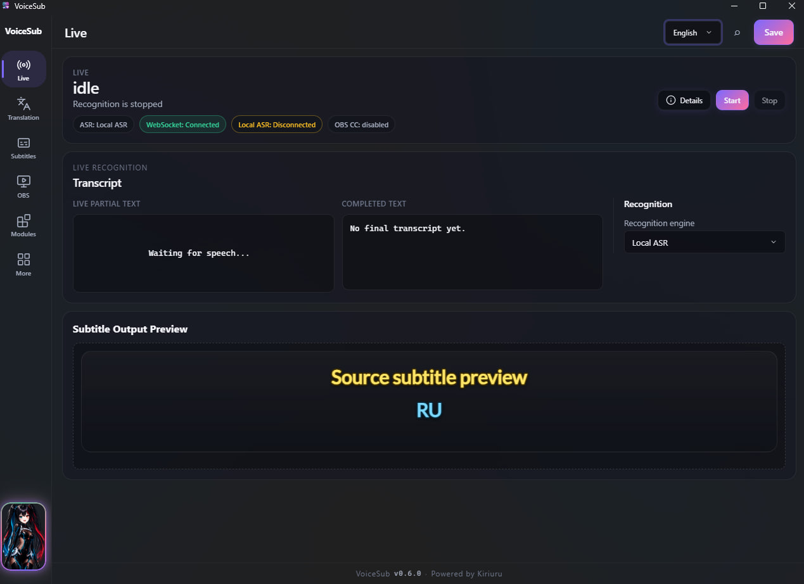 
  <em><strong>Live</strong> — Start/Stop, статус распознавания, транскрипт, превью субтитров</em>

### Первый запуск

1. Запустите **VoiceSub.exe**.
2. Dashboard откроется в главном окне Tauri (`http://127.0.0.1:8765/`).
3. Добавьте в OBS Browser Source: `http://127.0.0.1:8765/overlay`.
4. При необходимости настройте язык UI (**Settings**) и перевод (**Translation**).
5. Нажмите **Start** — откроется Chrome с `/google-asr?autostart=1` (Web Speech) **или** стартует Local ASR in-process, если выбран `local_parakeet` и модуль ready.
6. Разрешите микрофон в Chrome (Web Speech) **или** выберите mic в модуле Local ASR и говорите.

### Панель runtime (Start / Stop)

| Действие | Поведение |
| --- | --- |
| **Start** | `POST /api/runtime/start` — worker, translation, OBS CC, ingest ASR |
| **Stop** | Останавливает worker (включая kill Chrome), сбрасывает subtitle state |

> [!NOTE]
> Start отправляет текущий config snapshot, включая несохранённые правки с момента последнего Save.

### Предпросмотр субтитров

Верхняя область «Предпросмотр субтитров» показывает placeholder до Start и live payload после. Нужна для калибровки стиля без ASR. Пустой `overlay_update` после Save не затирает preview. Подробно: [Архитектура §21](./TECHNICAL_ARCHITECTURE.md).

### Компактный макет

Переключает окно Tauri (~390×844) с pane **Live** + вкладками настроек. Кнопка layout или command palette (`Ctrl+K`). IPC: `set_dashboard_layout`.

<a href="#jump-bar">↑ Jump bar</a> · <a href="#содержание">↑ Содержание</a>

---

## Диагностика

> [!TIP]
> Идите сверху вниз: Start → путь распознавания → перевод → URL overlay.

### Нет вообще никакого текста

- [ ] Runtime запущен (**Start**)?
- [ ] **Web Speech:** окно Chrome `/google-asr` открыто и **видимо**? Микрофон разрешён в **Chrome**?
- [ ] **Local ASR:** выбран `local_parakeet` и модуль `ready`? Mic выбран в `/local-asr`?
- [ ] **Tools & Data** → diagnostics: `browser_worker_connected` или статус Local ASR

### Исходный текст есть, перевода нет

- [ ] **Translation** → перевод включён
- [ ] Хотя бы одна линия `translation_N` с `enabled`
- [ ] Блок результатов / diagnostics — ошибки ключа, endpoint, квоты

### В OBS пусто

- [ ] Browser Source URL = `/overlay` (не dashboard `/`)
- [ ] **Subtitles** → видимость source/translation включена
- [ ] TTL не слишком короткий (текст может мелькать и исчезать)
- [ ] После reconnect overlay держит последний кадр (stale-guard + backoff 1–10 с) — это нормально
- [ ] Текст не исчезает после TTL/Stop → обновите приложение и перезагрузите Browser Source

<strong>Worker отваливается</strong>

- Проверьте сеть (Web Speech идёт через Google).
- `VOICESUB_TRACE_BROWSER=1` → `logs/browser-trace.jsonl`.
- Перезапуск: **Stop** → **Start** или relaunch worker из Tools.

<a href="#jump-bar">↑ Jump bar</a> · <a href="#содержание">↑ Содержание</a>

---

## Вкладки dashboard

| Вкладка | Назначение | Раздел |
| --- | --- | --- |
| **Translation** | Провайдеры, линии, кэш, лимиты диспетчера | [Перевод](#перевод) |
| **Subtitles** | Пресет overlay, видимость, порядок, TTL | [Субтитры](#субтитры) |
| **Style** | Шрифты, цвета, эффекты, слот-стили | [Стиль субтитров](#стиль-субтитров) |
| **UI Theme** | Тёмная/светлая тема, accent palette | [Тема UI](#тема-ui) |
| **OBS** | Overlay URL, Closed Captions | [OBS](#obs) |
| **Word Replace** | Замена текста до перевода | [Замена слов](#замена-слов) |
| **Tools & Data** | Профили, диагностика, ZIP export | [Инструменты и данные](#инструменты-и-данные) |
| **Settings** | Язык, layout, импорт SST, Web Speech advanced | [Настройки](#настройки) |
| **Help** | Встроенные темы справки | [Справка](#справка) |

**Command palette** (`Ctrl+K` / поиск в header): быстрый переход, Start/Stop, Save, export diagnostics.

<table>
  <tr>
    <td align="center" width="33%">
      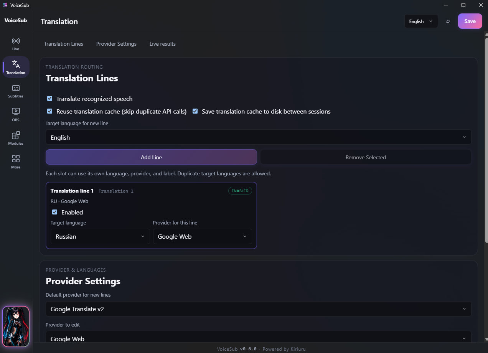 
      <a href="#перевод">Перевод</a>
    </td>
    <td align="center" width="33%">
      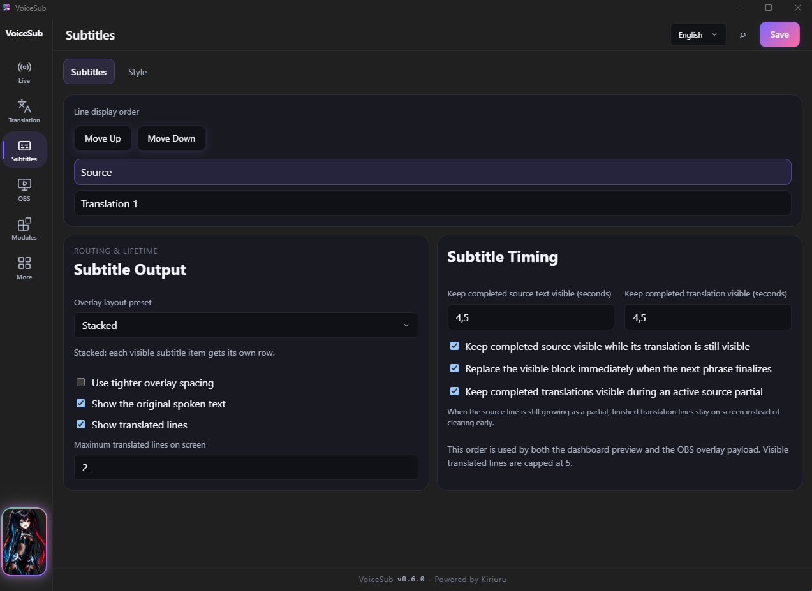 
      <a href="#субтитры">Субтитры</a>
    </td>
    <td align="center" width="33%">
      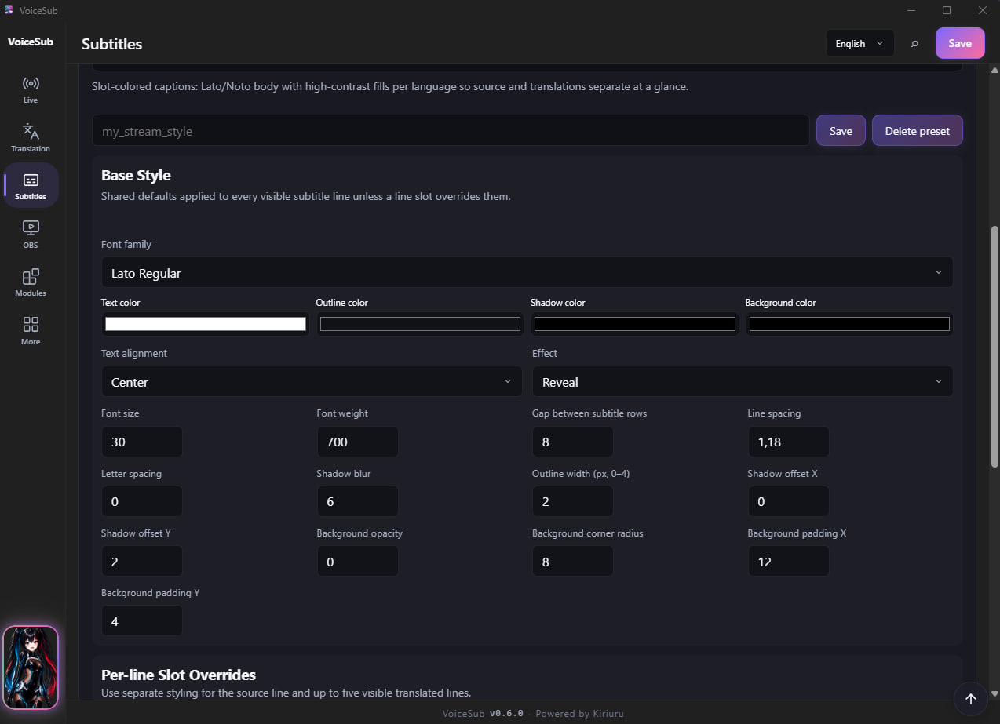 
      <a href="#стиль-субтитров">Стиль</a>
    </td>
  </tr>
  <tr>
    <td align="center">
      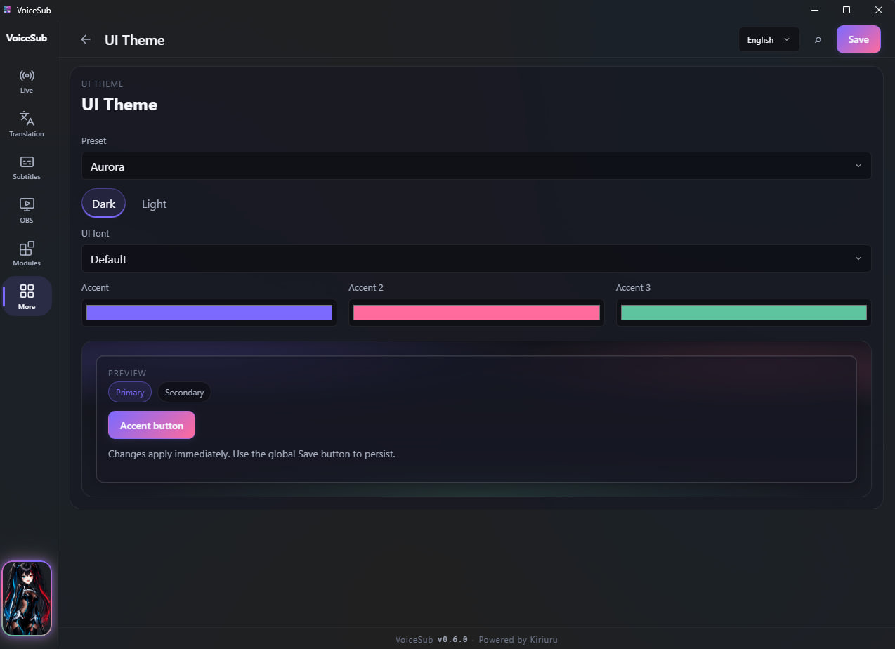 
      <a href="#тема-ui">Тема UI</a>
    </td>
    <td align="center">
      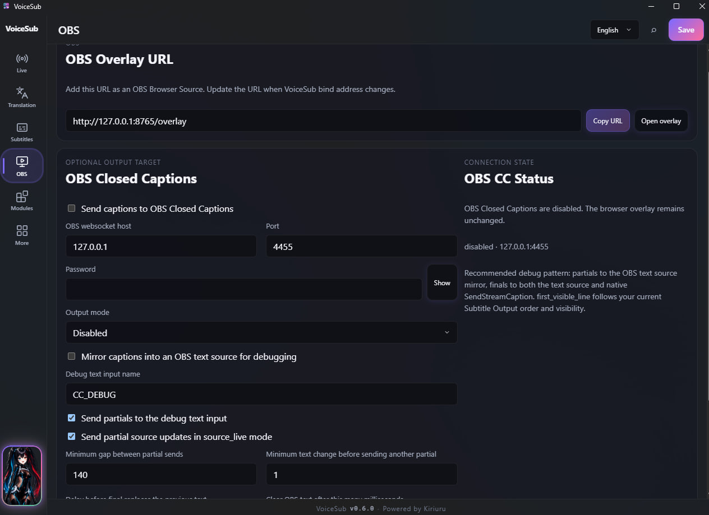 
      <a href="#obs">OBS</a>
    </td>
    <td align="center">
      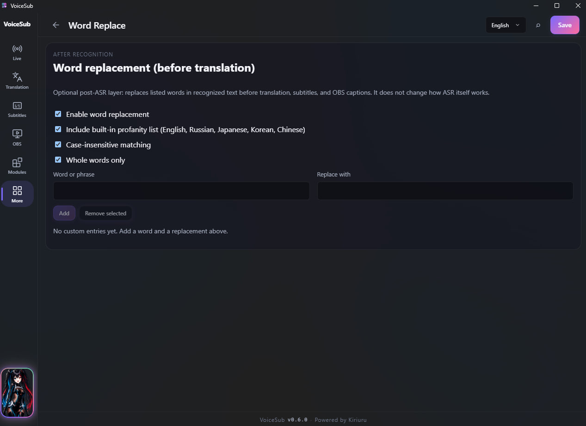 
      <a href="#замена-слов">Замена слов</a>
    </td>
  </tr>
</table>

<a href="#jump-bar">↑ Jump bar</a> · <a href="#содержание">↑ Содержание</a>

---

## Browser Speech (Web Speech)

  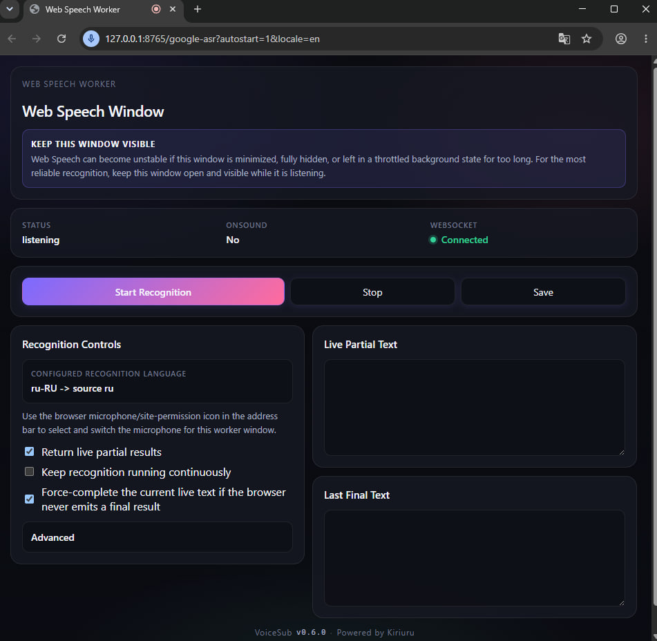 
  <em><strong>Web Speech</strong> — язык распознавания и расширенные опции worker</em>

### Режим

- Production-режим: **`browser_google`** — Web Speech в отдельном окне Chrome.
- Микрофон выбирается **в Chrome** (`getUserMedia`), не в dashboard.
- `/api/devices/audio-inputs` пустой — by design.

### Окно browser worker

- Отдельное окно с **видимой адресной строкой** (не app-mode, не скрытая вкладка).
- URL: `http://127.0.0.1:8765/google-asr?autostart=1[&locale=…]`.
- Изолированный Chrome profile: `user-data/browser-worker-profile-classic-*`.
- Anti-throttle flags + EcoQoS opt-out (Windows).

### Язык распознавания

**Settings** → Web Speech / `asr.browser.recognition_language`. Worker показывает live/final и диагностику WS. Если worker показывает текст, а dashboard пуст — проблема на стороне ingest/WS, не Chrome.

<strong>Расширенные настройки Web Speech</strong>

- **Settings** → «Расширенные настройки Web Speech» (`asr.browser.*`, partial-фильтры `asr.realtime`).
- Группы: forced final, restart, network reconnect, session rotation, partial filtering.
- У каждого поля — кнопка **`!`**.
- **Defaults (0.5.4+):** рестарты 150 ms, порог forced final 8 символов, ранняя подготовка ротации (30 s до лимита 3 min). См. [Архитектура §12](./TECHNICAL_ARCHITECTURE.md).
- **Deprecated:** `pause_to_finalize_ms` / `finalization_hold_ms`, `hard_max_phrase_ms` / `max_segment_ms` — для idle forced final используйте **`force_finalization_timeout_ms`**.
- После изменений: Save → **Stop/Start** и переоткрытие worker при необходимости.

<strong>Устойчивость worker</strong>

- Screen Wake Lock при активном распознавании.
- Session rotation `max_browser_session_age_ms` (default 180000 ms).
- Network preflight → terminal `recognition_network_unreachable` после серии network errors.
- Force-finalization при залипшем partial.
- **Long-segment flush (0.5.4+):** после committed final ≥200 символов worker сбрасывает буфер Web Speech `results`. См. [Архитектура §12](./TECHNICAL_ARCHITECTURE.md).

> [!WARNING]
> Legacy SST `asr.mode: local` и experimental `/google-asr-experimental` **нет** в core. Используйте модуль [Local ASR](#local-asr) (`local_parakeet`).

<a href="#jump-bar">↑ Jump bar</a> · <a href="#содержание">↑ Содержание</a>

---

## Local ASR

  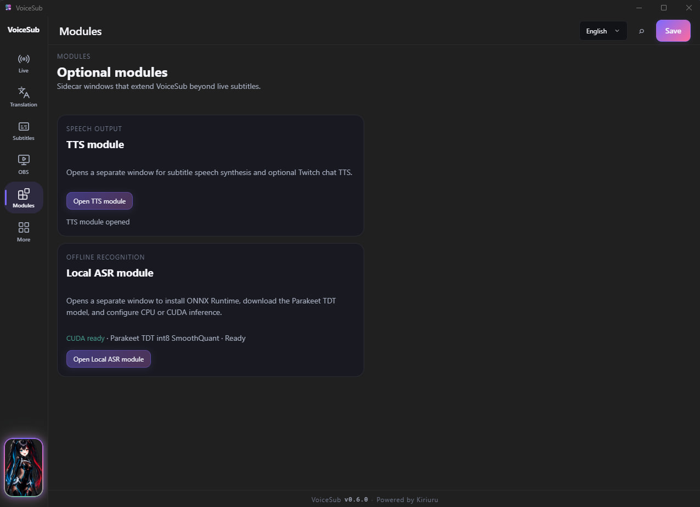
  &nbsp;
  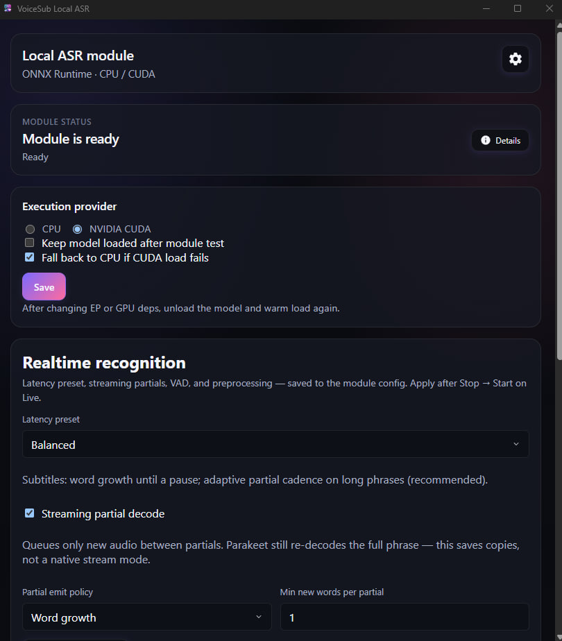 
  <em><strong>Модули</strong> / <strong>Local ASR</strong> — sidecar и setup до ready</em>

  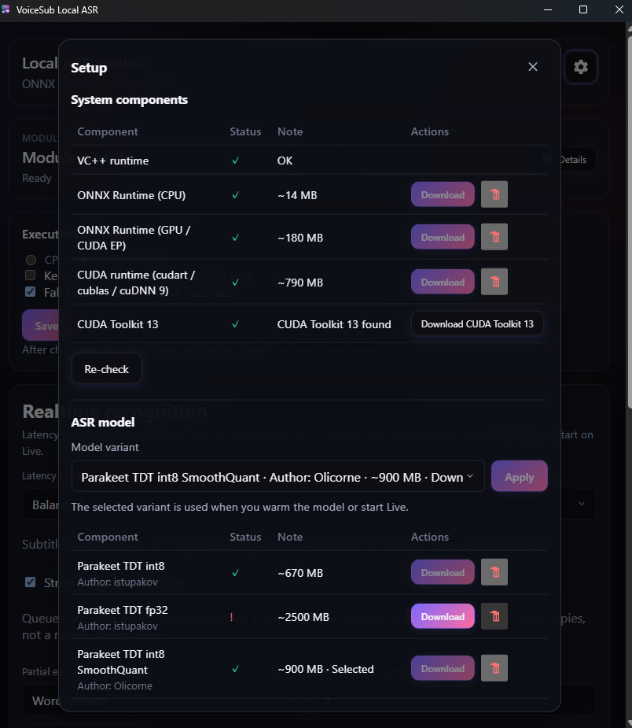 
  <em><strong>Компоненты</strong> — ORT, модель Parakeet, опционально CUDA</em>

### Окно модуля (`/local-asr`)

Отдельный UI (как TTS): deps, download модели, EP CPU/CUDA, realtime-пресеты, mic test bench. Открытие: **Модули** или Tauri IPC `local_asr_open_window`. Настройки: `user-data/modules/local-asr/config.toml` (окно можно закрыть).

### Gate готовности

- На Эфире **Local ASR** появляется только при `asr.local_module.ready` (CPU: ORT + model + warm load).
- `cuda_ready` — badge для NVIDIA CUDA EP; для Live достаточно CPU.
- После смены realtime/VAD: **Stop → Start** Live-сессии.

### Эфир с Local ASR

Выберите `local_parakeet` на Live → **Start** — без Chrome worker; захват mic нативный (cpal). Текст идёт в тот же путь subtitle/translation/overlay. Подробно: [Архитектура §18](./TECHNICAL_ARCHITECTURE.md).

<a href="#jump-bar">↑ Jump bar</a> · <a href="#содержание">↑ Содержание</a>

---

## Перевод

   
  <em><strong>Перевод</strong> — pipeline, провайдеры и до 5 линий</em>

### Основные переключатели

| Контрол | Поведение |
| --- | --- |
| Включение перевода | Вкл/выкл translation pipeline. ASR работает и без перевода (source-only). |
| Кэш (память) | Не дублировать запросы к провайдеру |
| Кэш (диск) | `user-data/translation-cache/` между сессиями |

> [!NOTE]
> Старый disk-кэш при смене промпта LLM может давать устаревший стиль.

### Линии перевода (`translation_1`…`translation_5`)

До **5** независимых линий: `enabled`, `target_lang`, `provider`, `label`. Каждая активная линия — нагрузка на dispatcher. Порядок отображения — вкладка **Subtitles**.

### Провайдеры (17)

`google_translate_v2` (default), `google_cloud_translation_v3`, `google_gas_url`, `google_web`, `azure_translator`, `deepl`, `libretranslate`, `openai`, `openrouter`, `lm_studio`, `ollama`, `public_libretranslate_mirror`, `free_web_translate`, `baidu_translate`, `youdao_translate`, `tencent_tmt`, `caiyun_translator`.

- OpenAI-compatible helpers: `/api/openai/recommended-models`, `/api/openai/models`.
- Credentials в `translation.provider_settings` — только локальный `config.toml`.

### Диспетчер и результаты

- Таймаут, очередь, max concurrent; per-provider `provider_limits`.
- **Lifecycle:** завершённый блок остаётся до финализации новой фразы; late translations разрешены; stale drop только для устаревших in-flight jobs.
- Блок результатов показывает переводы и ошибки. Задержка ≠ всегда ошибка (supersession / stale protection).

<a href="#jump-bar">↑ Jump bar</a> · <a href="#содержание">↑ Содержание</a>

---

## Субтитры

   
  <em><strong>Субтитры</strong> — пресет overlay, видимость, порядок, TTL</em>

| Тема | Детали |
| --- | --- |
| Пресет overlay | `single`, `dual-line`, `stacked`, `compact`; query `?preset=…&compact=1` |
| Видимость | Source / translation toggles; max visible translation lines |
| TTL / lifecycle | `completed_block_ttl_ms`, source/translation TTL; держать source пока виден перевод |
| Порядок строк | Влияет на preview, OBS overlay и OBS CC `first_visible_line` |

> [!IMPORTANT]
> Завершённый перевод виден, пока новая фраза ещё partial; замена — после final новой фразы.

<a href="#jump-bar">↑ Jump bar</a> · <a href="#содержание">↑ Содержание</a>

---

## Стиль субтитров

   
  <em><strong>Стиль</strong> — шрифты, цвета, эффекты, overrides по слотам</em>

- Built-in и custom presets.
- Base controls: font, size, weight, color, outline, shadow, background, alignment, spacing.
- Effects: `none`, `fade`, `subtle_pop`, `slide_up`, `zoom_in`, `blur_in`, `glow`.
- Per-slot overrides: `source`, `translation_1`…`translation_5`.
- **Единый payload** для dashboard preview и OBS overlay — сохраняйте config/profile после правок.

<a href="#jump-bar">↑ Jump bar</a> · <a href="#содержание">↑ Содержание</a>

---

## Тема UI

   
  <em><strong>Тема UI</strong> — dark/light и accent palette</em>

Влияет только на **dashboard chrome**. OBS overlay использует subtitle-style config, не тему UI.

<a href="#jump-bar">↑ Jump bar</a> · <a href="#содержание">↑ Содержание</a>

---

## OBS

   
  <em><strong>OBS</strong> — URL overlay и Closed Captions</em>

### Overlay URL

Копируется из вкладки **OBS** (`GET /api/obs/url`). Default: `http://127.0.0.1:8765/overlay`. При смене bind (LAN) обновите URL в OBS.

### Closed Captions

- WebSocket host/port/password (OBS v5).
- Output mode: source live/final, translation slots, first visible line.
- Timing: partial throttle, min delta, clear after ms, dedupe.
- Debug mirror — текстовый источник для отладки CC.

<a href="#jump-bar">↑ Jump bar</a> · <a href="#содержание">↑ Содержание</a>

---

## Замена слов

   
  <em><strong>Word Replace</strong> — find/replace до перевода и вывода</em>

- Правила применяются **до** перевода и вывода (`TranscriptController`).
- Built-in списки + **корни** (en/ru) и нормализация обходов (leet, разделители, повтор букв).
- Case-insensitive / whole words (CJK — substring, без `\b`).
- Twitch chat TTS использует свой флаг `include_builtin_profanity` (не кастомные пары dashboard).

<a href="#jump-bar">↑ Jump bar</a> · <a href="#содержание">↑ Содержание</a>

---

## TTS-модуль

  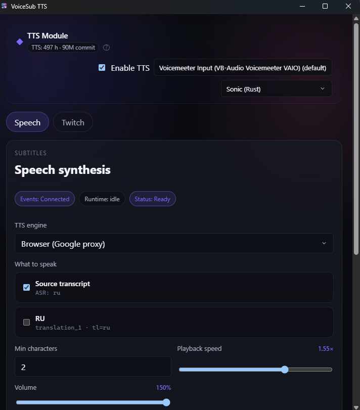 
  <em><strong>TTS</strong> — вкладки Speech и Twitch в sidecar-окне</em>

Открытие: **Модули** или Tauri IPC `tts_open_window`. Конфиг: `user-data/modules/tts/config.toml`.

### Speech

- Провайдер, голос, rate/pitch/volume.
- **Громкость:** 0–**150%** (native `amplify`); слайдер с подписью (`85%`, `150%`).
- **Воспроизведение:** **Native** (cpal @ 1.0×) или **Sonic** (libsonic); отдельные WASAPI-устройства для speech и Twitch.
- Планировщик речи в Rust; sample test — `tts_speak_sample`; playback через in-process `PlaybackHub` (без HTMLAudio в браузере).

<strong>Twitch chat TTS</strong>

- OAuth через system browser; implicit grant + poll token.
- **До 5 каналов** на одно подключение (логины без `#`); бейдж `IRC: connected #channel` или `3/5 каналов`.
- IRC chat → очередь озвучки; фильтры emotes/links/symbols/lang — **без переподключения**.
- **Auto-reconnect** при обрыве IRC/TLS — backoff 1→30 s; OAuth/auth без retry; ручной Disconnect останавливает цикл.
- **«Не озвучивать символы»** — comma-separated токены.
- **Advanced:** override скорости/громкости; `@mentions` без `@`; `strip_links=false` оставляет URL.
- Цифры сохраняются при strip emoji/emote; невидимые filler chars удаляются до фильтров.
- **?** у «Ник бота» — IRC-логин для `JOIN` (не ник зрителя).

### Python sidecar

`bin/modules/tts/runtime/` — embedded fetcher для Google TTS proxy. Probe: `/api/tts/python/status`.

<a href="#jump-bar">↑ Jump bar</a> · <a href="#содержание">↑ Содержание</a>

---

## Инструменты и данные

   
  <em><strong>Tools & Data</strong> — профили, диагностика, ZIP export</em>

| Функция | Детали |
| --- | --- |
| Runtime diagnostics | Phase, worker, translation queue, OBS CC, metrics |
| Логи | `logs/core.log`, `runtime-events.log`, `session-latest.jsonl` |
| Профили | CRUD → `user-data/profiles/{name}.toml` |
| Export diagnostics | ZIP (redacted config + logs) через `GET /api/exports/diagnostics` |

<strong>Глубокая диагностика (env)</strong>

- `VOICESUB_DEEP_DIAGNOSTICS=1` или `logging.full_enabled` в config.
- Per-channel: `VOICESUB_TRACE_SUBTITLE`, `_BROWSER`, `_WS`, `_TTS`, …

<a href="#jump-bar">↑ Jump bar</a> · <a href="#содержание">↑ Содержание</a>

---

## Настройки

  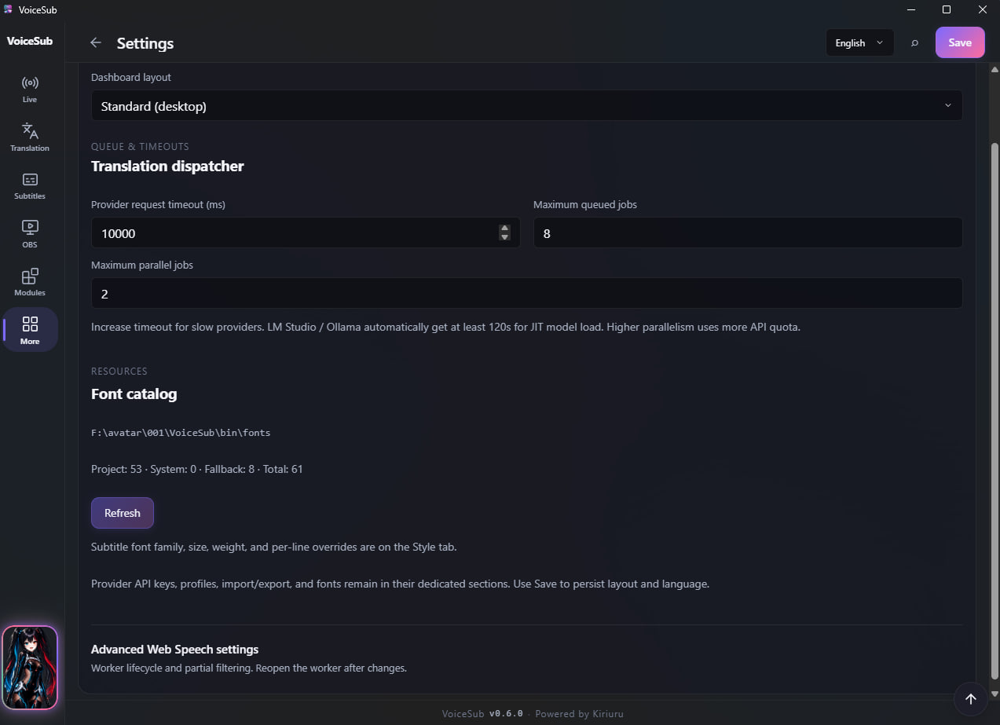 
  <em><strong>Settings</strong> — язык, layout, импорт SST, Web Speech advanced</em>

### Язык интерфейса (EN / RU / JA / KO / ZH)

Сохраняется в `ui.language` → Save config. Worker получает `locale` при launch. Overlay i18n: `npm run i18n:bundle`. Подробно: [Архитектура §24](./TECHNICAL_ARCHITECTURE.md).

### Импорт SST `config.json`

Миграция в `config.toml`, `config_version` → 8. Legacy `local` / experimental → `browser_google`. `local_parakeet` **сохраняется** (для Live всё равно нужен `ready` модуля).

### Layout

`standard` vs `compact` — размер окна Tauri.

<a href="#jump-bar">↑ Jump bar</a> · <a href="#содержание">↑ Содержание</a>

---

## Справка

  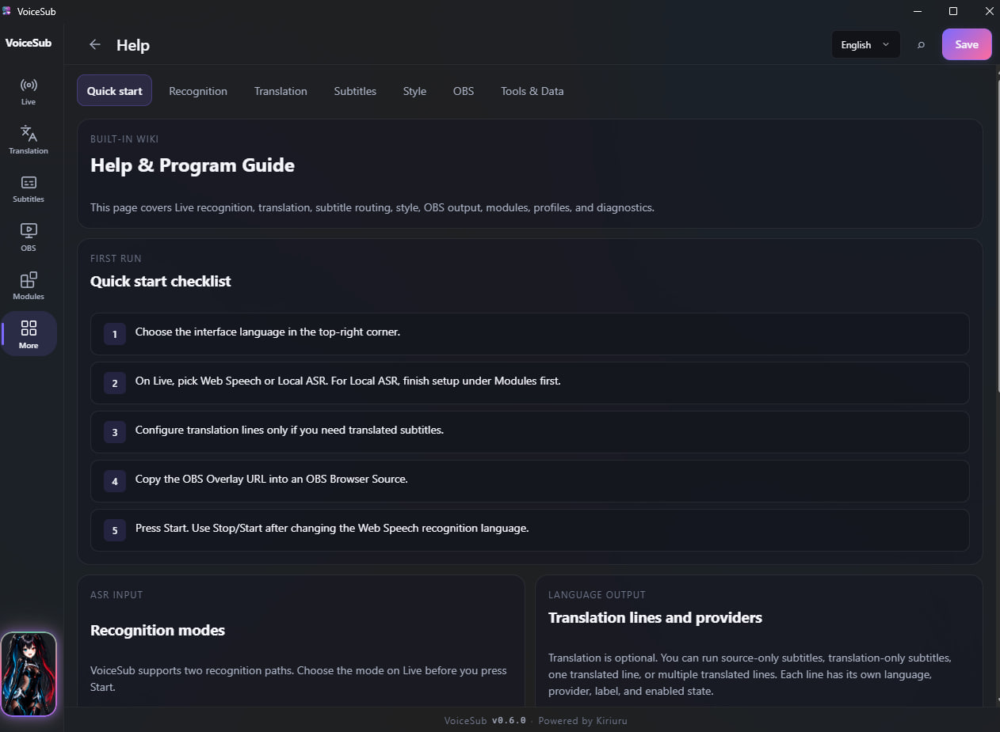 
  <em><strong>Help</strong> — встроенные темы внутри приложения</em>

Темы: обзор, распознавание, перевод, субтитры/стиль, OBS, инструменты.

<a href="#jump-bar">↑ Jump bar</a> · <a href="#содержание">↑ Содержание</a>

---

## Приватность и local-first

- Bind по умолчанию `127.0.0.1`; LAN только с `VOICESUB_ALLOW_LAN=1`.
- API keys и Twitch tokens — только на локальном диске.
- Diagnostics export — redacted secrets.
- Chrome worker — isolated profile, без sync.

<a href="#jump-bar">↑ Jump bar</a> · <a href="#содержание">↑ Содержание</a>

---

## Глоссарий

| Термин | Значение |
| --- | --- |
| **partial** | Черновой распознанный текст |
| **final** | Зафиксированная фраза |
| **translation slot** | Линия `translation_1`…`translation_5` |
| **overlay** | Vanilla страница `/overlay` для OBS |
| **browser worker** | Окно Chrome с Web Speech |
| **completed block** | Финальный субтитр до следующей финализации |
| **TTS module** | Sidecar `/tts` + Rust service |
| **Local ASR** | Sidecar `/local-asr` + Parakeet ONNX (`local_parakeet`) |

<a href="#jump-bar">↑ Jump bar</a> · <a href="#содержание">↑ Содержание</a>

---

## Архивные возможности

| Было в SST | Статус в VoiceSub |
| --- | --- |
| Legacy local ASR (`asr.mode: local`) | Удалено из core; SST import → `browser_google`. Преемник: модуль Local ASR |
| Experimental browser | Routes удалены (`legacy/experimental-browser/`) |
| PyInstaller bootstrap | Заменён Tauri NSIS installer |
| Splash startup profiles | Нет — единый `VoiceSub.exe` |

Для parity browser/translation/subtitle см. golden tests в `tests/golden/`.

---

  <a href="#jump-bar">↑ Наверх</a> ·
  <a href="../README.ru.md">README</a> ·
  <a href="./WIKI.en.md">English</a> ·
  <a href="./TECHNICAL_ARCHITECTURE.md">Архитектура</a>

